# GitHub 版本发布与云原生 GitOps 实战教程

**从 Commit、Tag、Release 到 GitHub Actions、Docker、Kubernetes 与 Argo CD**

作者：**jason.wa**  
版本：**0.02**  
日期：**2026 年 6 月**  
开本：**正度 16 开，185 × 260 mm**

---

# 前言

把代码推到 GitHub 并不等于完成软件发布。一个专业发布系统必须回答：发布对应哪次提交、产物如何构建、如何验证、如何部署、失败后如何恢复，以及谁有权限改变生产状态。

本书从 Git 基础对象出发，逐步进入 GitHub Actions、Docker、Kubernetes、Argo CD、ApplicationSet 和 Argo Rollouts。内容以 OrbStack 本地实验为主线，同时明确区分学习演示与生产实践。

## v0.02 版本说明

- 扩展为 30 章，覆盖 Kubernetes 生产配置与高级 GitOps。
- 增加 16 幅流程图和结构图。
- 每章包含目标、原理、示例、生产注意事项和练习。
- 增加综合案例、故障演练、术语表和官方资料索引。

## 推荐学习方法

1. 先阅读对象关系和工作原理。
2. 在测试仓库与 OrbStack Namespace 中执行示例。
3. 故意制造失败，再按排障路径恢复。
4. 把每次实验的命令、结果和复盘提交到 Git。

---

# 第一部分 版本发布基础

# 第 1 章 软件发布的完整地图

> **学习目标：** 从代码到用户可用版本的全过程

## 核心知识

软件发布不是把代码推到 GitHub 后就结束，而是把一个明确的源码状态转换为可验证、可分发、可部署和可回滚的产品版本。完整链路通常包含源码管理、版本标记、自动测试、构建产物、发布说明、部署、监控与回滚。

工程上最重要的四个目标是：**可追溯**，能回答版本来自哪个 Commit；**可重复**，相同输入能得到相同产物；**可验证**，发布前后都有自动检查；**可回滚**，失败时能恢复到已知稳定状态。

CI 负责持续验证代码，CD 负责把已验证产物交付或部署到目标环境。Continuous Delivery 允许生产发布保留人工批准，Continuous Deployment 则在质量门禁通过后自动进入生产。

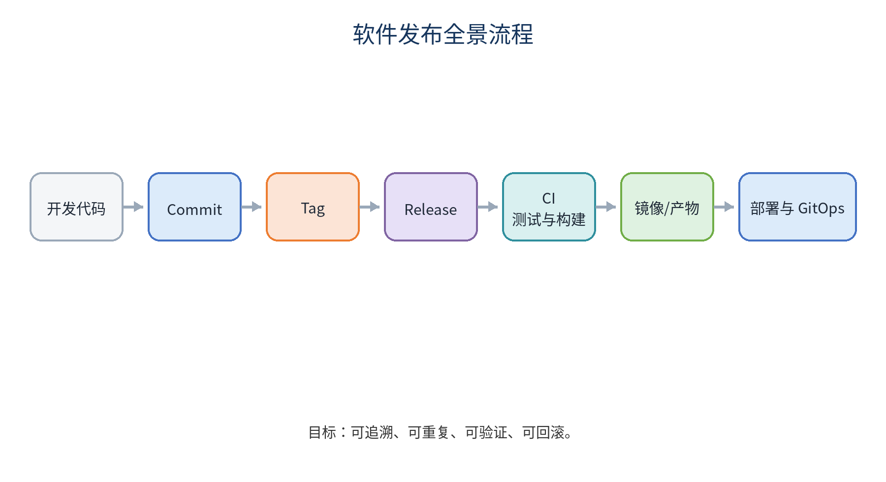


| 阶段 | 主要目标 | 典型对象 |
|---|---|---|
| 版本 | 固定源码位置 | Commit、Tag |
| 验证 | 证明可交付 | Lint、Test、Build |
| 分发 | 提供不可变产物 | Release、Artifact、Image |
| 运行 | 部署和维持状态 | Deployment、Argo CD |

: 软件发布阶段与主要对象

## 操作与示例

```text
开发代码 -> Commit -> Tag -> Release
        -> CI: Lint / Test / Build
        -> Artifact / Image -> Deploy -> Observe -> Rollback
```

## 生产实践检查

- 变更是否可以追溯到明确 Commit 和责任人？
- 是否存在自动检查、超时、最小权限和失败恢复？
- 是否区分本地实验与生产环境？
- 是否记录版本、配置、镜像 Digest 和部署结果？

## 本章小结

本章围绕“从代码到用户可用版本的全过程”建立了对象关系、操作路径和生产边界。实际应用时，应先在隔离环境验证，再通过 Pull Request、自动检查和审计流程进入下一环境。

## 章末练习

1. 为什么 git push 不等于软件发布？
2. 列出你所在项目中可以作为审计证据的五类对象。

# 第 2 章 Commit、Tag 与 GitHub Release

> **学习目标：** 理解版本对象之间的关系

## 核心知识

Commit 是不可变的代码快照；Tag 是指向 Git 对象的命名引用；GitHub Release 是基于 Tag 的发布页面，包含标题、发布说明和附件。常见关系是 `Commit -> Tag -> Release`。

正式版本推荐使用附注标签，因为附注标签包含创建者、时间和说明。正式 Tag 发布后不应移动到另一个 Commit，否则相同版本号会代表不同代码，破坏审计与供应链可信度。

Release 附件可以是 PDF、ZIP、二进制、容器清单或 SHA256 文件。源码压缩包由 GitHub 自动生成，但它通常不等于经过 CI 构建的正式产物。

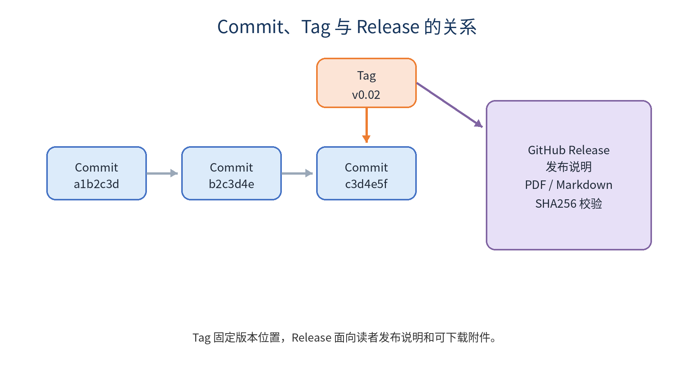


## 操作与示例

```bash
git tag -a v0.02 -m "Release v0.02"
git push origin v0.02

git show v0.02
git ls-remote --tags origin
```

## 生产实践检查

- 变更是否可以追溯到明确 Commit 和责任人？
- 是否存在自动检查、超时、最小权限和失败恢复？
- 是否区分本地实验与生产环境？
- 是否记录版本、配置、镜像 Digest 和部署结果？

## 本章小结

本章围绕“理解版本对象之间的关系”建立了对象关系、操作路径和生产边界。实际应用时，应先在隔离环境验证，再通过 Pull Request、自动检查和审计流程进入下一环境。

## 章末练习

1. 轻量 Tag 与附注 Tag 的差异是什么？
2. 误把 Tag 打在错误 Commit 上时，正式发布前后分别应如何处理？

# 第 3 章 语义化版本与发布纪律

> **学习目标：** 用版本号表达兼容性变化

## 核心知识

语义化版本使用 `MAJOR.MINOR.PATCH`。破坏兼容性的变更提升 MAJOR；向后兼容的新功能提升 MINOR；向后兼容的修复提升 PATCH。预发布版本可使用 `alpha`、`beta`、`rc` 标识。

版本号不是营销文案，而是对兼容性的承诺。数据库 Schema、API、配置文件和命令行参数的兼容性都应纳入版本判断。正式版本应关联变更日志、升级说明、已知问题和校验文件。

发布纪律包括：版本 Tag 不重写、产物不覆盖、依赖锁定、构建环境记录、签名或 Provenance、变更审批和回滚预案。

| 变化类型 | 版本升级 | 示例 |
|---|---|---|
| 兼容修复 | PATCH | 1.4.2 -> 1.4.3 |
| 兼容功能 | MINOR | 1.4.3 -> 1.5.0 |
| 不兼容变化 | MAJOR | 1.5.0 -> 2.0.0 |

: 语义化版本升级规则

## 操作与示例

```text
v1.4.2 -> v1.4.3  修复缺陷
v1.4.3 -> v1.5.0  增加兼容功能
v1.5.0 -> v2.0.0  存在不兼容变化
v2.0.0-rc.1      发布候选版本
```

## 生产实践检查

- 变更是否可以追溯到明确 Commit 和责任人？
- 是否存在自动检查、超时、最小权限和失败恢复？
- 是否区分本地实验与生产环境？
- 是否记录版本、配置、镜像 Digest 和部署结果？

## 本章小结

本章围绕“用版本号表达兼容性变化”建立了对象关系、操作路径和生产边界。实际应用时，应先在隔离环境验证，再通过 Pull Request、自动检查和审计流程进入下一环境。

## 章末练习

1. 为 API 删除字段、增加可选字段、修复错误分别选择版本升级类型。
2. 为什么同一个 Tag 不应重新构建出不同内容的附件？

# 第 4 章 第一次手动发布

> **学习目标：** 建立最小可用发布流程

## 核心知识

手动发布适合用来理解对象关系。发布前应确认工作区干净、分支正确、远程已同步、测试通过、版本未被占用。随后创建 Tag、推送 Tag、填写 Release Notes 并上传产物。

Release Notes 至少包含新增、修复、升级步骤、兼容性、已知问题和校验值。发布后应从干净环境下载附件并验证 SHA256，而不是只相信上传成功。

误发布时不要直接覆盖附件。尚未对外分发的错误 Tag 可以删除后重新创建；已经分发的版本应发布新的修订版本并说明问题。

## 操作与示例

```bash
set -euo pipefail
git status --short
git pull --ff-only origin main
VERSION=v0.02
git tag -a "$VERSION" -m "Release $VERSION"
git push origin "$VERSION"
sha256sum book-v0.02.pdf > SHA256SUMS.txt
```

## 生产实践检查

- 变更是否可以追溯到明确 Commit 和责任人？
- 是否存在自动检查、超时、最小权限和失败恢复？
- 是否区分本地实验与生产环境？
- 是否记录版本、配置、镜像 Digest 和部署结果？

## 本章小结

本章围绕“建立最小可用发布流程”建立了对象关系、操作路径和生产边界。实际应用时，应先在隔离环境验证，再通过 Pull Request、自动检查和审计流程进入下一环境。

## 章末练习

1. 写出手动发布检查清单。
2. 为什么发布后还要从 Release 页面重新下载并校验？

# 第二部分 GitHub Actions 与持续集成

# 第 5 章 GitHub Actions 基础

> **学习目标：** 认识 Event、Workflow、Job、Step 与 Runner

## 核心知识

Workflow 文件位于 `.github/workflows/`。事件触发 Workflow，Workflow 包含一个或多个 Job，Job 在 Runner 上执行一组 Step。Job 默认并行，通过 `needs` 可以形成质量门禁。

工作流应显式设置最小权限、超时和并发控制。只读检查通常使用 `contents: read`；创建 Release 时才使用 `contents: write`。对 Pull Request 运行不可信代码时，不应使用带高权限密钥的 `pull_request_target` 模式。

生产项目应把第三方 Action 固定到完整 Commit SHA，并使用 Dependabot 或 Renovate维护升级。本书示例使用主版本标签便于阅读。

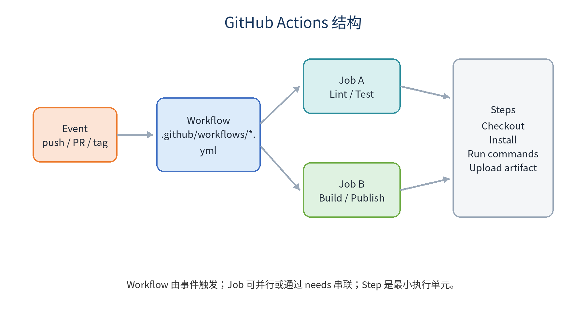


## 操作与示例

```yaml
name: Validate
on:
  push:
    branches: [main]
  pull_request:
permissions:
  contents: read
concurrency:
  group: validate-${{ github.ref }}
  cancel-in-progress: true
jobs:
  test:
    runs-on: ubuntu-latest
    timeout-minutes: 15
    steps:
      - uses: actions/checkout@v6
      - run: python3 scripts/validate.py
```

## 生产实践检查

- 变更是否可以追溯到明确 Commit 和责任人？
- 是否存在自动检查、超时、最小权限和失败恢复？
- 是否区分本地实验与生产环境？
- 是否记录版本、配置、镜像 Digest 和部署结果？

## 本章小结

本章围绕“认识 Event、Workflow、Job、Step 与 Runner”建立了对象关系、操作路径和生产边界。实际应用时，应先在隔离环境验证，再通过 Pull Request、自动检查和审计流程进入下一环境。

## 章末练习

1. Event、Workflow、Job、Step 的关系是什么？
2. 为什么最小权限和 timeout-minutes 都是可靠性设计？

# 第 6 章 自动生成 Release 与发布附件

> **学习目标：** 让 Tag 驱动一致的发布过程

## 核心知识

Tag 工作流应先验证版本号和书稿，再创建 Release。产物名称要包含版本和平台，校验文件与附件一起发布。重复运行时必须明确幂等策略：已存在 Release 是覆盖、跳过还是失败。

GitHub CLI 的 `gh release create` 可以在 Actions 中使用 `GITHUB_TOKEN` 创建 Release。工作流必须使用完整历史或至少能访问 Tag，并确认 `VERSION` 文件与 Tag 一致。

正式发布的 PDF 与 Markdown 应来自同一次提交，SHA256 文件应在上传前重新生成，避免旧校验值与新文件不一致。

## 操作与示例

```yaml
on:
  push:
    tags: ["v*"]
permissions:
  contents: write
steps:
  - uses: actions/checkout@v6
    with:
      fetch-depth: 0
  - run: python3 scripts/validate.py
  - run: |
      gh release create "${GITHUB_REF_NAME}" \
        book/book-v0.02.pdf \
        book/book-v0.02.md \
        book/SHA256SUMS.txt \
        --notes-file release-notes/v0.02.md
```

## 生产实践检查

- 变更是否可以追溯到明确 Commit 和责任人？
- 是否存在自动检查、超时、最小权限和失败恢复？
- 是否区分本地实验与生产环境？
- 是否记录版本、配置、镜像 Digest 和部署结果？

## 本章小结

本章围绕“让 Tag 驱动一致的发布过程”建立了对象关系、操作路径和生产边界。实际应用时，应先在隔离环境验证，再通过 Pull Request、自动检查和审计流程进入下一环境。

## 章末练习

1. Artifact 与 Release Asset 的生命周期有何不同？
2. 如何保证工作流重跑不会产生内容不一致的同名版本？

# 第 7 章 全栈项目构建与产物管理

> **学习目标：** 把源码转化为明确的运行产物

## 核心知识

前端通常通过锁文件和 `npm ci` 生成静态目录；Go 后端通过固定依赖生成目标平台二进制。构建过程要区分源码、缓存、中间产物和正式发布物。

Workflow Artifact 适合 Job 之间传递或短期保存测试报告；Release Asset 适合读者长期下载；容器镜像适合部署到容器环境。三者用途不同，不应混为一谈。

发布目录只放运行所需文件、许可证、配置模板和升级说明，不应包含 `.git`、`node_modules`、本地密钥、日志和开发缓存。

| 产物类型 | 主要用途 | 典型保存位置 |
|---|---|---|
| Workflow Artifact | Job 间传递和短期保存 | GitHub Actions |
| Release Asset | 面向读者长期下载 | GitHub Release |
| Container Image | 容器化运行 | GHCR / Harbor |

: 常见构建产物对比

## 操作与示例

```bash
cd frontend
npm ci
npm run lint
npm test -- --run
npm run build

cd ../backend
go test ./...
CGO_ENABLED=0 GOOS=linux GOARCH=amd64 \
  go build -trimpath -ldflags="-s -w" -o app ./cmd/server
```

## 生产实践检查

- 变更是否可以追溯到明确 Commit 和责任人？
- 是否存在自动检查、超时、最小权限和失败恢复？
- 是否区分本地实验与生产环境？
- 是否记录版本、配置、镜像 Digest 和部署结果？

## 本章小结

本章围绕“把源码转化为明确的运行产物”建立了对象关系、操作路径和生产边界。实际应用时，应先在隔离环境验证，再通过 Pull Request、自动检查和审计流程进入下一环境。

## 章末练习

1. 设计一个前后端发布目录。
2. 为什么 CI 中优先使用 npm ci 而不是 npm install？

# 第 8 章 CI：检查、测试、缓存与 Artifact

> **学习目标：** 建立分层质量门禁

## 核心知识

典型 CI 顺序是格式检查、静态分析、单元测试、集成测试、构建和安全扫描。快而稳定的检查应尽早运行，昂贵任务在基础检查通过后运行。

缓存用于减少重复下载依赖，不是用来传递正式构建结果。Artifact 用于在 Job 之间传递不可变产物或保存报告。缓存命中错误可能掩盖依赖变化，因此键必须包含锁文件哈希。

主分支应启用保护规则，要求 Pull Request、必需检查和审核。CI 绿色只说明自动检查通过，不等于业务风险为零。

## 操作与示例

```yaml
jobs:
  test:
    runs-on: ubuntu-latest
    steps:
      - uses: actions/checkout@v6
      - uses: actions/setup-node@v6
        with:
          node-version: 24
          cache: npm
      - run: npm ci
      - run: npm test
  build:
    needs: test
    runs-on: ubuntu-latest
    steps:
      - run: echo build after tests
```

## 生产实践检查

- 变更是否可以追溯到明确 Commit 和责任人？
- 是否存在自动检查、超时、最小权限和失败恢复？
- 是否区分本地实验与生产环境？
- 是否记录版本、配置、镜像 Digest 和部署结果？

## 本章小结

本章围绕“建立分层质量门禁”建立了对象关系、操作路径和生产边界。实际应用时，应先在隔离环境验证，再通过 Pull Request、自动检查和审计流程进入下一环境。

## 章末练习

1. 为什么 build 应依赖 test？
2. 缓存和 Artifact 的可靠性边界是什么？

# 第三部分 Docker 与持续部署

# 第 9 章 Docker 镜像与 GHCR

> **学习目标：** 构建小型、可追溯和不可变的镜像

## 核心知识

多阶段 Dockerfile 把编译工具留在构建阶段，只把运行文件复制到最终镜像。运行镜像应使用非 root 用户、明确基础镜像版本、最小文件集和健康检查接口。

生产部署不应只依赖 `latest`。可使用 SemVer、Commit SHA 和镜像 Digest。Tag 便于阅读，Digest 提供内容不可变性。镜像名称要规范化为小写，并写入 OCI Labels 记录源码仓库、版本和 Commit。

推送 GHCR 需要 `packages: write`，拉取私有镜像则需要相应凭据或 `imagePullSecret`。公开教学项目可把镜像包设置为 Public，生产应结合组织策略。

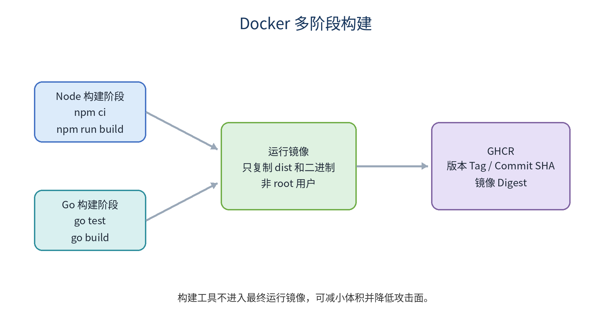


## 操作与示例

```dockerfile
FROM golang:1.24-alpine AS build
WORKDIR /src
COPY go.mod go.sum ./
RUN go mod download
COPY . .
RUN CGO_ENABLED=0 go build -trimpath -o /out/app ./cmd/server

FROM alpine:3.21
RUN addgroup -S app && adduser -S app -G app
COPY --from=build /out/app /app
USER app
ENTRYPOINT ["/app"]
```

## 生产实践检查

- 变更是否可以追溯到明确 Commit 和责任人？
- 是否存在自动检查、超时、最小权限和失败恢复？
- 是否区分本地实验与生产环境？
- 是否记录版本、配置、镜像 Digest 和部署结果？

## 本章小结

本章围绕“构建小型、可追溯和不可变的镜像”建立了对象关系、操作路径和生产边界。实际应用时，应先在隔离环境验证，再通过 Pull Request、自动检查和审计流程进入下一环境。

## 章末练习

1. Tag 与 Digest 在部署中的作用有何不同？
2. 多阶段构建为什么能降低镜像攻击面？

# 第 10 章 自动部署到 Linux 服务器

> **学习目标：** 用明确版本和健康检查完成 CD

## 核心知识

最小服务器 CD 流程是构建镜像、推送仓库、服务器拉取指定版本、更新 Compose 服务、执行健康检查。部署用户应使用独立 SSH 密钥和最小权限，不直接使用 root。

生产部署应使用 GitHub Environment 分离 development、staging 和 production，并为 production 设置人工批准、分支限制和独立 Secrets。

部署脚本使用 `set -euo pipefail`，任何失败都中止。健康检查不仅验证端口，还应验证关键 API 和外部依赖。失败后恢复明确旧版本，而不是猜测 `latest` 指向什么。

## 操作与示例

```bash
#!/usr/bin/env bash
set -euo pipefail
TAG="$1"
cd /opt/myapp
export IMAGE_TAG="$TAG"
docker compose pull app
docker compose up -d --no-deps app
curl --fail --retry 20 --retry-delay 3 \
  http://127.0.0.1:8080/health
```

## 生产实践检查

- 变更是否可以追溯到明确 Commit 和责任人？
- 是否存在自动检查、超时、最小权限和失败恢复？
- 是否区分本地实验与生产环境？
- 是否记录版本、配置、镜像 Digest 和部署结果？

## 本章小结

本章围绕“用明确版本和健康检查完成 CD”建立了对象关系、操作路径和生产边界。实际应用时，应先在隔离环境验证，再通过 Pull Request、自动检查和审计流程进入下一环境。

## 章末练习

1. Environment 保护规则解决什么问题？
2. 为什么部署脚本必须使用明确版本？

# 第 11 章 蓝绿发布、健康检查与回滚

> **学习目标：** 降低切换风险并保留恢复路径

## 核心知识

蓝绿发布同时维护稳定环境和待验证环境。新环境通过健康检查和冒烟测试后，入口层切换流量；旧环境在观察期内保留，失败时快速切回。

Kubernetes 中 readiness 决定是否接收流量，liveness 决定是否重启容器，startup 保护慢启动应用。健康检查不应调用有副作用的接口。

应用回滚不等于数据库回滚。数据库迁移推荐 Expand and Contract：先增加兼容结构，应用同时兼容新旧版本，完成迁移后再清理旧字段。

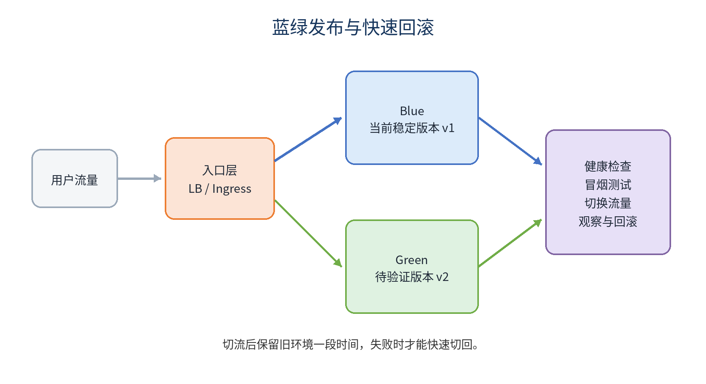


## 操作与示例

```text
Blue v1 接收流量
  -> 部署 Green v2
  -> readiness + smoke test
  -> 切换入口
  -> 观察错误率和延迟
  -> 成功后清理 Blue；失败则切回
```

## 生产实践检查

- 变更是否可以追溯到明确 Commit 和责任人？
- 是否存在自动检查、超时、最小权限和失败恢复？
- 是否区分本地实验与生产环境？
- 是否记录版本、配置、镜像 Digest 和部署结果？

## 本章小结

本章围绕“降低切换风险并保留恢复路径”建立了对象关系、操作路径和生产边界。实际应用时，应先在隔离环境验证，再通过 Pull Request、自动检查和审计流程进入下一环境。

## 章末练习

1. 为什么切流后不能立即删除旧环境？
2. 解释数据库 Expand and Contract。

# 第四部分 Kubernetes 基础与编排

# 第 12 章 Kubernetes 基础与 OrbStack

> **学习目标：** 在本地建立可重复实验环境

## 核心知识

Kubernetes 通过声明式 API 维持期望状态。Pod 是最小调度单元，通常包含一个主应用容器，也可以包含 Sidecar。Namespace 提供逻辑隔离，但不等于强安全边界。

OrbStack 可在 macOS 上启用轻量 Kubernetes。操作前必须确认 `kubectl` 当前上下文，避免误操作其他集群。所有实验资源放入独立 Namespace。

本地环境适合学习控制器行为，但生产还需要多节点、高可用控制面、网络策略、存储、审计和灾难恢复。

| 对象 | 主要职责 |
|---|---|
| Pod | 运行一个或多个紧密协作容器 |
| Deployment | 管理无状态 Pod 副本和更新 |
| Service | 提供稳定访问入口 |
| Namespace | 提供逻辑分组和策略边界 |

: Kubernetes 核心对象

## 操作与示例

```bash
kubectl config get-contexts
kubectl config current-context
kubectl get nodes
kubectl get pods -A
kubectl create namespace demo
kubectl get events -n demo --sort-by=.lastTimestamp
```

## 生产实践检查

- 变更是否可以追溯到明确 Commit 和责任人？
- 是否存在自动检查、超时、最小权限和失败恢复？
- 是否区分本地实验与生产环境？
- 是否记录版本、配置、镜像 Digest 和部署结果？

## 本章小结

本章围绕“在本地建立可重复实验环境”建立了对象关系、操作路径和生产边界。实际应用时，应先在隔离环境验证，再通过 Pull Request、自动检查和审计流程进入下一环境。

## 章末练习

1. Pod 与容器是什么关系？
2. 为什么 Namespace 不能替代独立生产集群？

# 第 13 章 Deployment、Service 与滚动更新

> **学习目标：** 部署无状态应用并安全更新

## 核心知识

Deployment 管理 ReplicaSet 和 Pod 副本，Service 通过 Label Selector 为 Pod 提供稳定网络入口。Selector 必须与 Pod Label 匹配，否则 Service 没有 Endpoint。

RollingUpdate 使用 `maxUnavailable` 和 `maxSurge` 控制替换速度。readinessProbe 失败的 Pod 不进入 Service Endpoint，从而保护用户流量。

手工 `kubectl set image` 可用于学习和应急，但 GitOps 环境最终必须修正 Git，否则控制器会把集群恢复为 Git 中声明的版本。

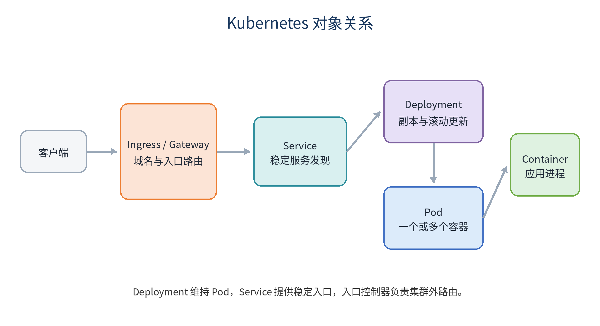


## 操作与示例

```yaml
apiVersion: apps/v1
kind: Deployment
metadata:
  name: demo-api
  namespace: demo
spec:
  replicas: 3
  strategy:
    rollingUpdate:
      maxUnavailable: 0
      maxSurge: 1
  selector:
    matchLabels:
      app: demo-api
  template:
    metadata:
      labels:
        app: demo-api
    spec:
      containers:
        - name: api
          image: ghcr.io/example/demo-api:v0.02
          readinessProbe:
            httpGet: {path: /ready, port: 8080}
```

## 生产实践检查

- 变更是否可以追溯到明确 Commit 和责任人？
- 是否存在自动检查、超时、最小权限和失败恢复？
- 是否区分本地实验与生产环境？
- 是否记录版本、配置、镜像 Digest 和部署结果？

## 本章小结

本章围绕“部署无状态应用并安全更新”建立了对象关系、操作路径和生产边界。实际应用时，应先在隔离环境验证，再通过 Pull Request、自动检查和审计流程进入下一环境。

## 章末练习

1. Service 没有 Endpoint 时应检查什么？
2. maxUnavailable=0 对发布有什么影响？

# 第 14 章 HPA、资源与可用性

> **学习目标：** 让扩缩容建立在可观测指标上

## 核心知识

CPU 利用率 HPA 依赖 Metrics API 和容器 requests。没有 requests 时，百分比利用率无法可靠计算。HPA 扩的是 Pod 副本，不会自动保证节点容量。

资源 requests 影响调度和 HPA 基线，limits 限制最大资源。CPU Limit 可能导致节流，内存超限会触发 OOMKill。参数应通过压测和监控校准。

PDB 约束节点维护等自愿中断，不防止节点宕机、应用崩溃或所有副本同时不健康。扩缩容需要稳定窗口，避免流量波动造成频繁抖动。

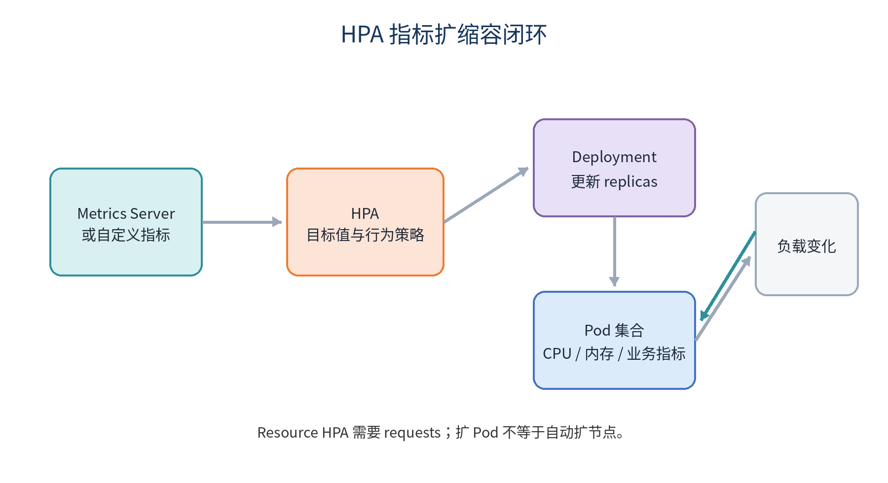


| 配置 | 作用 | 风险 |
|---|---|---|
| requests | 调度基线和 HPA 计算基础 | 过低会争抢，过高会浪费 |
| limits | 限制最大资源 | CPU 节流或内存 OOM |
| PDB | 约束自愿中断 | 不能阻止所有故障 |

: 资源与可用性配置

## 操作与示例

```yaml
apiVersion: autoscaling/v2
kind: HorizontalPodAutoscaler
metadata:
  name: demo-api
  namespace: demo
spec:
  minReplicas: 2
  maxReplicas: 10
  scaleTargetRef:
    apiVersion: apps/v1
    kind: Deployment
    name: demo-api
  metrics:
    - type: Resource
      resource:
        name: cpu
        target:
          type: Utilization
          averageUtilization: 60
```

## 生产实践检查

- 变更是否可以追溯到明确 Commit 和责任人？
- 是否存在自动检查、超时、最小权限和失败恢复？
- 是否区分本地实验与生产环境？
- 是否记录版本、配置、镜像 Digest 和部署结果？

## 本章小结

本章围绕“让扩缩容建立在可观测指标上”建立了对象关系、操作路径和生产边界。实际应用时，应先在隔离环境验证，再通过 Pull Request、自动检查和审计流程进入下一环境。

## 章末练习

1. 为什么 CPU HPA 需要 requests.cpu？
2. PDB 能防止和不能防止哪些故障？

# 第五部分 Argo CD 与 GitOps

# 第 15 章 GitOps 核心思想

> **学习目标：** 用 Git 表达期望状态并持续协调

## 核心知识

GitOps 把 Git 作为期望状态来源，控制器持续比较 Git 与集群实际状态。差异称为 Drift，策略可以告警、人工同步或自动修复。

传统推模式由 CI 持有集群凭据并执行 `kubectl apply`；拉模式由集群内控制器读取 Git，减少 CI 直接持有生产管理员凭据的需要。

推荐将应用源码仓库和 GitOps 配置仓库分离。源码仓库负责测试和构建镜像，配置仓库负责声明各环境使用哪个不可变镜像版本。

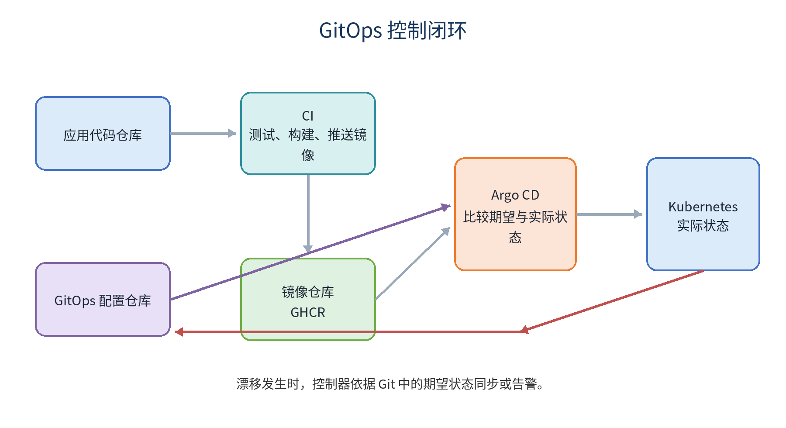


## 操作与示例

```text
应用仓库 -> CI -> 镜像仓库
                 |
                 v
配置仓库 <- 更新版本 PR
     |
     v
Argo CD -> Kubernetes
```

## 生产实践检查

- 变更是否可以追溯到明确 Commit 和责任人？
- 是否存在自动检查、超时、最小权限和失败恢复？
- 是否区分本地实验与生产环境？
- 是否记录版本、配置、镜像 Digest 和部署结果？

## 本章小结

本章围绕“用 Git 表达期望状态并持续协调”建立了对象关系、操作路径和生产边界。实际应用时，应先在隔离环境验证，再通过 Pull Request、自动检查和审计流程进入下一环境。

## 章末练习

1. 什么是期望状态、实际状态和漂移？
2. 推模式与拉模式的权限边界有何不同？

# 第 16 章 Argo CD 在 OrbStack 上的实战

> **学习目标：** 安装并管理第一个 Application

## 核心知识

Argo CD 安装在 Kubernetes 中，通过 Application 关联仓库、分支、路径和目标集群。`Synced` 表示声明一致，`Healthy` 表示资源健康，两者不能相互替代。

同集群部署使用 `https://kubernetes.default.svc`，通常不需要额外执行 `argocd cluster add`。私有仓库应使用只读 Deploy Key 或 GitHub App。

`selfHeal` 修复手工漂移，`prune` 删除 Git 中已移除的受管资源。生产启用自动 Prune 前必须有 PR 审核、权限边界和数据资源保护。

## 操作与示例

```bash
kubectl create namespace argocd
kubectl apply -n argocd --server-side --force-conflicts \
  -f https://raw.githubusercontent.com/argoproj/argo-cd/stable/manifests/install.yaml
kubectl wait --for=condition=Ready pods --all \
  -n argocd --timeout=300s
kubectl port-forward -n argocd svc/argocd-server 8080:443
```

## 生产实践检查

- 变更是否可以追溯到明确 Commit 和责任人？
- 是否存在自动检查、超时、最小权限和失败恢复？
- 是否区分本地实验与生产环境？
- 是否记录版本、配置、镜像 Digest 和部署结果？

## 本章小结

本章围绕“安装并管理第一个 Application”建立了对象关系、操作路径和生产边界。实际应用时，应先在隔离环境验证，再通过 Pull Request、自动检查和审计流程进入下一环境。

## 章末练习

1. Synced 与 Healthy 的区别是什么？
2. selfHeal 和 prune 分别会做什么？

# 第 17 章 完整生产流水线设计

> **学习目标：** 把 CI、镜像、配置和部署连成审计链

## 核心知识

推荐链路是：Pull Request 触发 CI，合并 main 后构建 Commit SHA 镜像，正式 Tag 增加 SemVer 标签，CI 创建 GitOps 配置更新 PR，审批合并后 Argo CD 同步。

环境晋级应使用同一个镜像 Digest，从 dev 晋级 staging 再晋级 production，而不是每个环境重新构建。这样测试的内容与生产内容一致。

发布后验证包括 rollout、探针、错误率、延迟、资源、数据库迁移和业务成功率。版本号、Commit 和 Digest 应注入日志、指标和追踪。

## 操作与示例

```text
PR -> CI -> merge main -> image:sha-...
 -> GitOps PR -> dev -> staging -> production
 -> Argo CD Sync -> rollout -> observe -> promote/revert
```

## 生产实践检查

- 变更是否可以追溯到明确 Commit 和责任人？
- 是否存在自动检查、超时、最小权限和失败恢复？
- 是否区分本地实验与生产环境？
- 是否记录版本、配置、镜像 Digest 和部署结果？

## 本章小结

本章围绕“把 CI、镜像、配置和部署连成审计链”建立了对象关系、操作路径和生产边界。实际应用时，应先在隔离环境验证，再通过 Pull Request、自动检查和审计流程进入下一环境。

## 章末练习

1. 为什么 GitOps 更新更适合走 PR？
2. 设计一个同一 Digest 的三环境晋级流程。

# 第 18 章 安全、权限与供应链

> **学习目标：** 把最小权限贯穿发布链路

## 核心知识

GitHub Actions 权限应按 Workflow 显式声明。构建只需读源码，推镜像增加 packages: write，创建 Release 才增加 contents: write。Secrets 不应打印到日志或传给不可信 Pull Request。

第三方 Action 固定完整 Commit SHA 能减少可移动标签被篡改的风险。镜像可增加 SBOM、漏洞扫描、签名和 SLSA Provenance。

Kubernetes Secret 不是安全保险箱。生产需要 RBAC、ServiceAccount 最小权限、etcd 加密、NetworkPolicy 和外部密钥管理。Argo CD Project 应限制仓库、集群、Namespace 和资源类型。

## 操作与示例

```yaml
permissions:
  contents: read
  packages: write

# 高安全场景：固定完整 SHA
# uses: owner/action@40位提交SHA
```

## 生产实践检查

- 变更是否可以追溯到明确 Commit 和责任人？
- 是否存在自动检查、超时、最小权限和失败恢复？
- 是否区分本地实验与生产环境？
- 是否记录版本、配置、镜像 Digest 和部署结果？

## 本章小结

本章围绕“把最小权限贯穿发布链路”建立了对象关系、操作路径和生产边界。实际应用时，应先在隔离环境验证，再通过 Pull Request、自动检查和审计流程进入下一环境。

## 章末练习

1. 列出三个应采用独立 Secrets 的环境。
2. 为什么只使用 Base64 Secret 不能满足生产安全要求？

# 第 19 章 常见故障排查

> **学习目标：** 按层次定位而不是随机尝试

## 核心知识

排障先确认变更对象，再按源码、CI、产物、仓库、调度、网络、配置、应用和外部依赖逐层检查。保留原始错误和时间线，避免一开始就清理现场。

Pod Pending 查看 describe 和 events；ImagePullBackOff 检查镜像名、权限、架构和网络；CrashLoopBackOff 查看 logs、探针、配置和退出码；Service 不通检查 Selector、Endpoint 和端口映射。

Argo CD OutOfSync 使用 diff 检查默认字段、其他控制器修改和模板随机值。Synced 但业务失败，要继续检查 Pod、Service、Ingress、日志和业务依赖。

## 操作与示例

```bash
kubectl get pods -n demo -o wide
kubectl describe pod POD -n demo
kubectl logs POD -n demo --previous
kubectl get events -n demo --sort-by=.lastTimestamp
kubectl get svc,endpoints -n demo
argocd app diff demo-api
```

## 生产实践检查

- 变更是否可以追溯到明确 Commit 和责任人？
- 是否存在自动检查、超时、最小权限和失败恢复？
- 是否区分本地实验与生产环境？
- 是否记录版本、配置、镜像 Digest 和部署结果？

## 本章小结

本章围绕“按层次定位而不是随机尝试”建立了对象关系、操作路径和生产边界。实际应用时，应先在隔离环境验证，再通过 Pull Request、自动检查和审计流程进入下一环境。

## 章末练习

1. 设计 ImagePullBackOff 排查顺序。
2. 为什么 Synced 不代表业务正常？

# 第 20 章 综合实战与验收

> **学习目标：** 把零散技能组合成端到端发布

## 核心知识

综合项目应从受保护 main 分支开始，Pull Request 自动测试，Tag 触发 Release，镜像推送 GHCR，GitOps PR 更新版本，Argo CD 同步 OrbStack 集群。

验收不是“页面能打开”即可。应验证版本可追溯、配置分离、探针有效、数据持久、漂移自愈、错误版本可通过 Git Revert 恢复、审计记录完整。

建议故意制造失败：错误镜像 Tag、readiness 路径错误、ConfigMap 未重载、手工修改副本和删除 Service。记录现象、诊断命令、根因和修复。

## 操作与示例

```text
验收对象：Tag / Release / PDF / Markdown / SHA256
          Image / Digest / GitOps Commit
          Argo CD Application / Kubernetes Resources
          Logs / Metrics / Rollback Record
```

## 生产实践检查

- 变更是否可以追溯到明确 Commit 和责任人？
- 是否存在自动检查、超时、最小权限和失败恢复？
- 是否区分本地实验与生产环境？
- 是否记录版本、配置、镜像 Digest 和部署结果？

## 本章小结

本章围绕“把零散技能组合成端到端发布”建立了对象关系、操作路径和生产边界。实际应用时，应先在隔离环境验证，再通过 Pull Request、自动检查和审计流程进入下一环境。

## 章末练习

1. 为综合项目定义十项完成标准。
2. 制造一次漂移并记录 Argo CD 的修复过程。

# 第六部分 Kubernetes 生产实战

# 第 21 章 ConfigMap、Secret 与运行时配置

> **学习目标：** 让同一镜像适配不同环境

## 核心知识

非敏感配置放入 ConfigMap，密码、Token 和证书放入 Secret 或外部密钥系统。应用可以通过环境变量或文件挂载读取。配置对象与镜像分离后，同一 Digest 可晋级多个环境。

单独修改 ConfigMap 不一定触发 Deployment 滚动更新。可以使用 Kustomize 生成内容哈希名称、Pod Template Annotation 校验值、重载控制器或应用内热加载。

Secret 的 data 字段仅是 Base64 编码。公开 Git 仓库不能保存明文 Secret。GitOps 可结合 SOPS、Sealed Secrets 或 External Secrets。

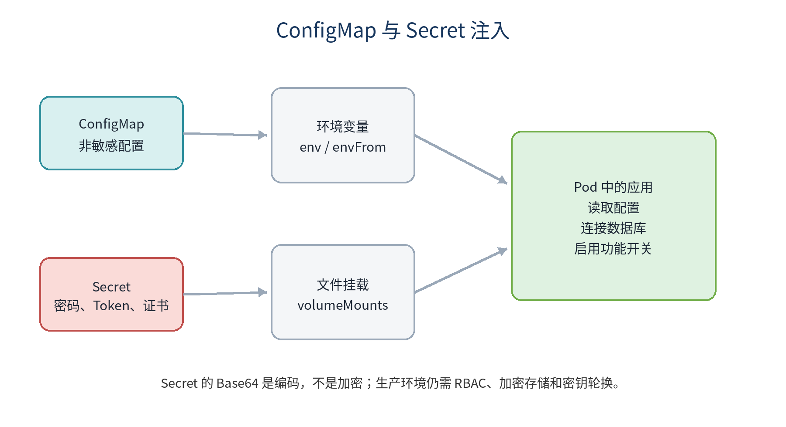


## 操作与示例

```yaml
apiVersion: v1
kind: ConfigMap
metadata:
  name: backend-config
  namespace: demo
data:
  LOG_LEVEL: info
---
apiVersion: v1
kind: Secret
metadata:
  name: backend-secret
  namespace: demo
type: Opaque
stringData:
  DB_PASSWORD: replace-me
```

## 生产实践检查

- 变更是否可以追溯到明确 Commit 和责任人？
- 是否存在自动检查、超时、最小权限和失败恢复？
- 是否区分本地实验与生产环境？
- 是否记录版本、配置、镜像 Digest 和部署结果？

## 本章小结

本章围绕“让同一镜像适配不同环境”建立了对象关系、操作路径和生产边界。实际应用时，应先在隔离环境验证，再通过 Pull Request、自动检查和审计流程进入下一环境。

## 章末练习

1. 环境变量和文件挂载各适合什么配置？
2. 如何让 ConfigMap 变化可靠触发滚动更新？

# 第 22 章 Ingress、Gateway API 与 TLS

> **学习目标：** 把域名和 HTTPS 流量安全引入集群

## 核心知识

ClusterIP Service 主要用于集群内部访问。Ingress 或 Gateway API 定义域名、路径、监听器和后端，但它们必须配合集群中的控制器实现。

Ingress API 已冻结但仍稳定；Gateway API 通过 GatewayClass、Gateway 和 HTTPRoute 更清晰地分离平台与应用职责。

TLS Secret 包含证书和私钥，生产通常使用 cert-manager 或云证书服务自动签发和轮换。入口层应设置安全协议、跳转、请求大小、超时和访问日志。

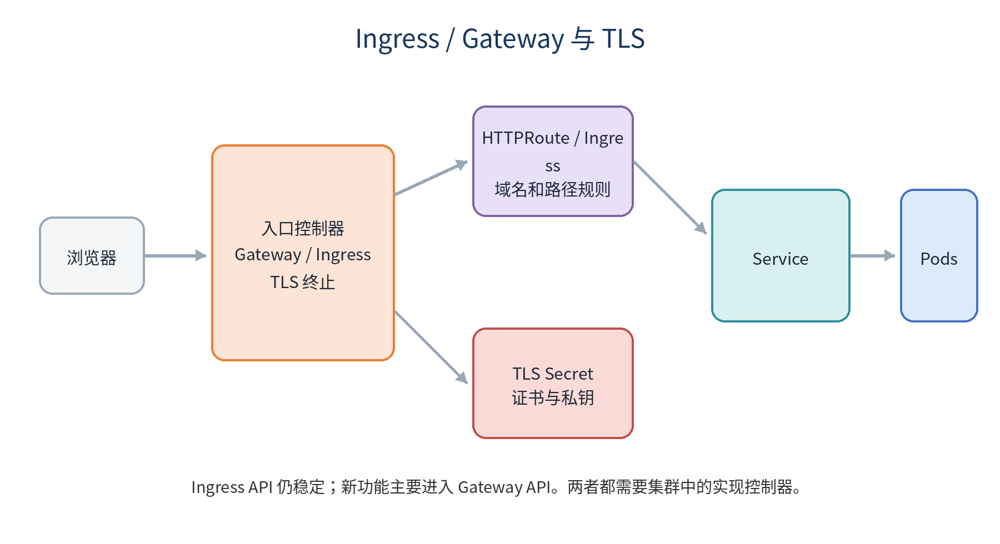


## 操作与示例

```yaml
apiVersion: gateway.networking.k8s.io/v1
kind: HTTPRoute
metadata:
  name: demo-web
  namespace: demo
spec:
  parentRefs:
    - name: shared-gateway
      namespace: gateway-system
  hostnames: [demo.example.com]
  rules:
    - backendRefs:
        - name: frontend
          port: 80
```

## 生产实践检查

- 变更是否可以追溯到明确 Commit 和责任人？
- 是否存在自动检查、超时、最小权限和失败恢复？
- 是否区分本地实验与生产环境？
- 是否记录版本、配置、镜像 Digest 和部署结果？

## 本章小结

本章围绕“把域名和 HTTPS 流量安全引入集群”建立了对象关系、操作路径和生产边界。实际应用时，应先在隔离环境验证，再通过 Pull Request、自动检查和审计流程进入下一环境。

## 章末练习

1. 为什么创建 Ingress 后仍可能无法访问？
2. 设计 /api 和 / 两条路由。

# 第 23 章 StatefulSet、PVC 与数据保护

> **学习目标：** 理解持久化、稳定身份和备份的区别

## 核心知识

StatefulSet 为 Pod 提供稳定名称、有序管理和独立 PVC 模板，适合数据库、队列等需要稳定身份的工作负载。它不会自动实现数据库复制和高可用。

PVC 是存储声明，PV 是实际资源，StorageClass 描述动态供应策略。删除 Pod 通常不会删除 PVC，但删除 PVC 或 Namespace 可能造成数据丢失，具体取决于回收策略。

有 PVC 不等于有备份。生产必须定义 RPO、RTO、加密、保留周期、异地副本和恢复演练。

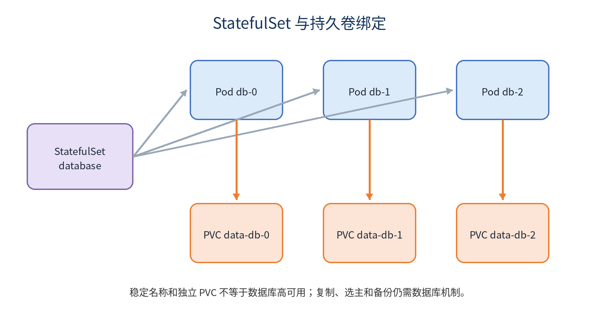


## 操作与示例

```yaml
volumeClaimTemplates:
  - metadata:
      name: data
    spec:
      accessModes: [ReadWriteOnce]
      resources:
        requests:
          storage: 5Gi
```

## 生产实践检查

- 变更是否可以追溯到明确 Commit 和责任人？
- 是否存在自动检查、超时、最小权限和失败恢复？
- 是否区分本地实验与生产环境？
- 是否记录版本、配置、镜像 Digest 和部署结果？

## 本章小结

本章围绕“理解持久化、稳定身份和备份的区别”建立了对象关系、操作路径和生产边界。实际应用时，应先在隔离环境验证，再通过 Pull Request、自动检查和审计流程进入下一环境。

## 章末练习

1. StatefulSet 提供和不提供哪些保证？
2. 为什么恢复演练比备份成功日志更重要？

# 第 24 章 Job、CronJob 与数据库迁移

> **学习目标：** 安全执行一次性和定时任务

## 核心知识

Job 运行到成功或失败，适合迁移、导入和批处理。CronJob 按时间创建 Job，应配置 concurrencyPolicy、历史保留、时区、超时和清理策略。

数据库迁移脚本必须幂等并设置 activeDeadlineSeconds。Argo CD 可用 PreSync Hook 在应用同步前执行迁移，失败时阻止后续资源更新。

迁移应向前兼容旧版本应用，避免应用回滚后无法使用新 Schema。高风险迁移需要独立备份和人工批准。

## 操作与示例

```yaml
apiVersion: batch/v1
kind: Job
metadata:
  generateName: db-migrate-
  annotations:
    argocd.argoproj.io/hook: PreSync
    argocd.argoproj.io/hook-delete-policy: HookSucceeded
spec:
  backoffLimit: 1
  activeDeadlineSeconds: 300
  template:
    spec:
      restartPolicy: Never
      containers:
        - name: migrate
          image: ghcr.io/example/backend:v0.02
          command: ["/app/backend", "migrate"]
```

## 生产实践检查

- 变更是否可以追溯到明确 Commit 和责任人？
- 是否存在自动检查、超时、最小权限和失败恢复？
- 是否区分本地实验与生产环境？
- 是否记录版本、配置、镜像 Digest 和部署结果？

## 本章小结

本章围绕“安全执行一次性和定时任务”建立了对象关系、操作路径和生产边界。实际应用时，应先在隔离环境验证，再通过 Pull Request、自动检查和审计流程进入下一环境。

## 章末练习

1. 为什么迁移 Job 必须幂等？
2. 设计一个不会并发运行的每日备份 CronJob。

# 第 25 章 Kustomize 多环境配置

> **学习目标：** 用 Base 和 Overlay 管理差异

## 核心知识

复制多套完整 YAML 会产生漂移。Kustomize 的 Base 保存公共资源，Overlay 只描述副本、镜像、域名、资源和配置差异。

`kubectl kustomize` 可在应用前查看最终结果；`kubectl apply -k` 应用目录。GitOps 仓库可以用目录表达 dev、staging 和 prod。

configMapGenerator 默认生成内容哈希名称，内容变化会改变 Pod 模板引用，从而触发滚动更新。secretGenerator 只提供生成便利，不等于加密。

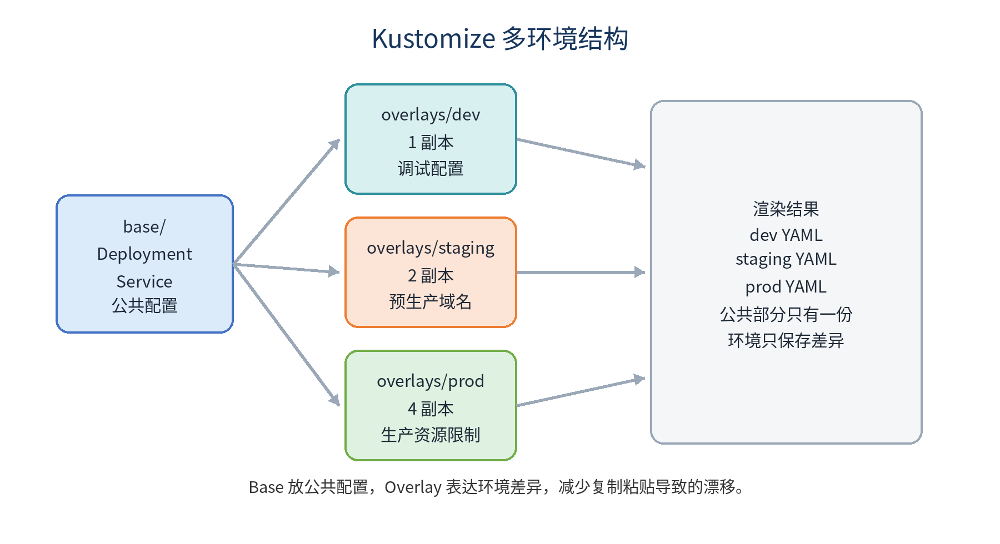


## 操作与示例

```yaml
apiVersion: kustomize.config.k8s.io/v1beta1
kind: Kustomization
resources:
  - ../../base
replicas:
  - name: backend
    count: 4
images:
  - name: ghcr.io/example/backend
    newTag: v0.02
```

## 生产实践检查

- 变更是否可以追溯到明确 Commit 和责任人？
- 是否存在自动检查、超时、最小权限和失败恢复？
- 是否区分本地实验与生产环境？
- 是否记录版本、配置、镜像 Digest 和部署结果？

## 本章小结

本章围绕“用 Base 和 Overlay 管理差异”建立了对象关系、操作路径和生产边界。实际应用时，应先在隔离环境验证，再通过 Pull Request、自动检查和审计流程进入下一环境。

## 章末练习

1. Base 和 Overlay 分别应放什么？
2. 比较 dev 与 prod 的最终渲染结果。

# 第七部分 高级 GitOps 与渐进式交付

# 第 26 章 AppProject、Sync Wave 与 Hook

> **学习目标：** 建立权限边界和同步顺序

## 核心知识

AppProject 限制允许的仓库、目标集群、Namespace 和资源类型，是 Argo CD 多团队治理的重要边界。生产应用不应全部使用权限宽泛的 default Project。

Sync Phase 包括 PreSync、Sync、PostSync 和 SyncFail；Sync Wave 用整数排序同一阶段资源。常见顺序是迁移、Namespace/CRD、配置、Deployment/Service、冒烟测试。

Hook 是发布流程的一部分，但不替代备份和灾难恢复。Hook 脚本必须幂等、有限时、有限重试并有清理策略。

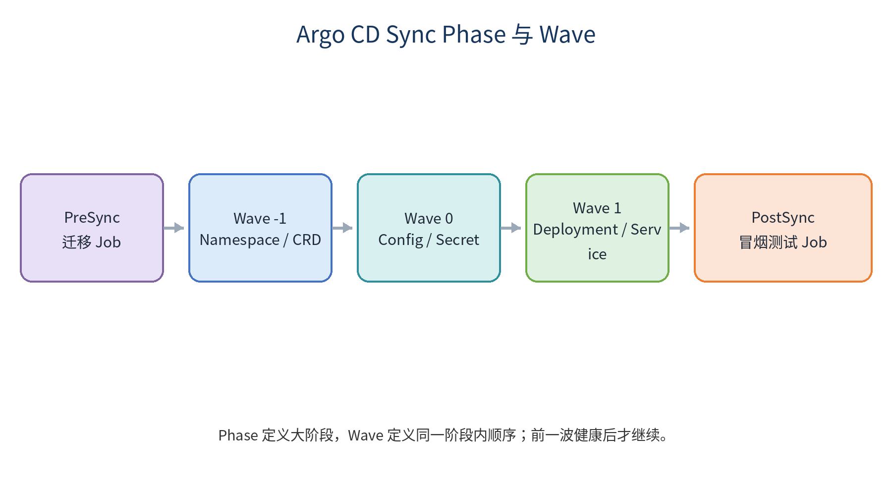


## 操作与示例

```yaml
metadata:
  annotations:
    argocd.argoproj.io/sync-wave: "1"

# AppProject 中限制目标
spec:
  destinations:
    - server: https://kubernetes.default.svc
      namespace: payments-*
```

## 生产实践检查

- 变更是否可以追溯到明确 Commit 和责任人？
- 是否存在自动检查、超时、最小权限和失败恢复？
- 是否区分本地实验与生产环境？
- 是否记录版本、配置、镜像 Digest 和部署结果？

## 本章小结

本章围绕“建立权限边界和同步顺序”建立了对象关系、操作路径和生产边界。实际应用时，应先在隔离环境验证，再通过 Pull Request、自动检查和审计流程进入下一环境。

## 章末练习

1. 设计迁移、配置、应用和冒烟测试的 Wave 顺序。
2. AppProject 为什么是多租户安全边界？

# 第 27 章 ApplicationSet 多环境与多集群

> **学习目标：** 批量生成受控 Application

## 核心知识

ApplicationSet 用 Generator 生成参数，再套用模板创建 Application。List 适合少量固定环境，Git Directory 适合按目录发现应用，Cluster 适合按集群标签部署，Matrix 组合两个维度。

模板中的 project、repoURL 和 destination 都是高风险参数。平台团队应控制模板，来源仓库必须强制审核，AppProject 限制目标范围。

`goTemplateOptions: [missingkey=error]` 能避免缺失参数被静默替换为空值。生产前应渲染并策略校验生成结果。

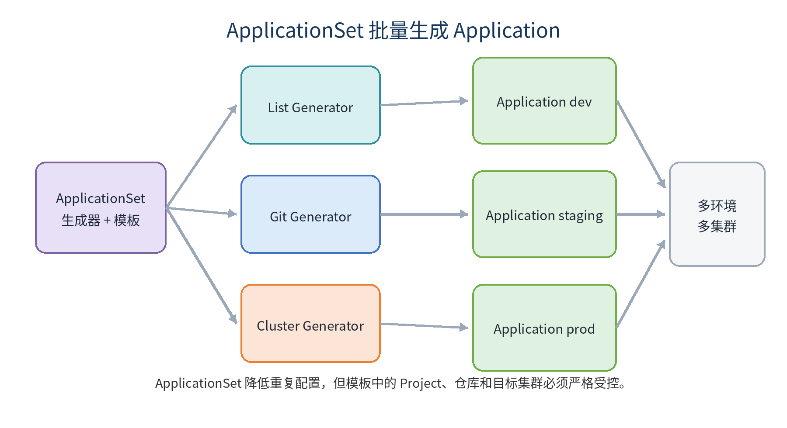


| Generator | 参数来源 | 适用场景 |
|---|---|---|
| List | 固定清单 | 少量已知环境 |
| Git | 目录或文件 | 自动发现应用 |
| Cluster | 集群 Secret 标签 | 多集群部署 |
| Matrix | 两个生成器组合 | 应用与集群组合 |

: ApplicationSet Generator 对比

## 操作与示例

```yaml
apiVersion: argoproj.io/v1alpha1
kind: ApplicationSet
metadata:
  name: demo-envs
  namespace: argocd
spec:
  goTemplate: true
  goTemplateOptions: ["missingkey=error"]
  generators:
    - list:
        elements:
          - {env: dev, namespace: demo-dev}
          - {env: prod, namespace: demo-prod}
```

## 生产实践检查

- 变更是否可以追溯到明确 Commit 和责任人？
- 是否存在自动检查、超时、最小权限和失败恢复？
- 是否区分本地实验与生产环境？
- 是否记录版本、配置、镜像 Digest 和部署结果？

## 本章小结

本章围绕“批量生成受控 Application”建立了对象关系、操作路径和生产边界。实际应用时，应先在隔离环境验证，再通过 Pull Request、自动检查和审计流程进入下一环境。

## 章末练习

1. List、Git、Cluster Generator 的适用场景是什么？
2. 为什么 Git Generator 的仓库需要严格审核？

# 第 28 章 Argo Rollouts 渐进式发布

> **学习目标：** 用流量和指标逐步验证新版本

## 核心知识

Deployment 滚动更新不能原生表达 20% 流量、暂停观察和指标异常自动中止。Argo Rollouts 提供 Canary、BlueGreen、AnalysisTemplate 和流量路由集成。

没有流量管理器时，权重通常通过 Pod 数量近似，不能保证请求精确比例。精细切流需要兼容的 Ingress、Gateway 或 Service Mesh。

自动放量必须有可靠指标，例如错误率、P95 延迟和业务成功率。指标阈值、窗口和样本量需要历史数据验证。

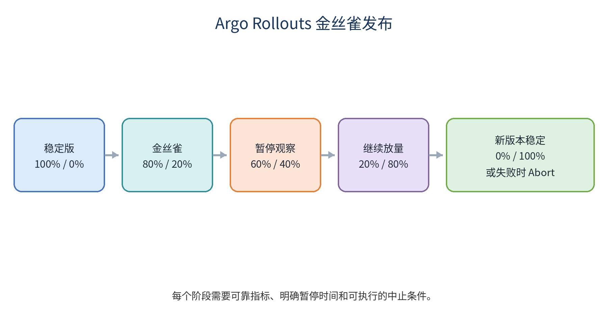


## 操作与示例

```yaml
strategy:
  canary:
    steps:
      - setWeight: 20
      - pause: {}
      - setWeight: 40
      - pause: {duration: 2m}
      - setWeight: 80
      - pause: {duration: 2m}
```

## 生产实践检查

- 变更是否可以追溯到明确 Commit 和责任人？
- 是否存在自动检查、超时、最小权限和失败恢复？
- 是否区分本地实验与生产环境？
- 是否记录版本、配置、镜像 Digest 和部署结果？

## 本章小结

本章围绕“用流量和指标逐步验证新版本”建立了对象关系、操作路径和生产边界。实际应用时，应先在隔离环境验证，再通过 Pull Request、自动检查和审计流程进入下一环境。

## 章末练习

1. 蓝绿和金丝雀分别适合什么场景？
2. 为什么没有可靠指标时不应完全自动放量？

# 第 29 章 OrbStack 全栈 GitOps 综合案例

> **学习目标：** 在本地完成端到端闭环

## 核心知识

综合案例包含前端、Go 后端、PostgreSQL、GHCR、Kustomize 和 Argo CD。代码仓库负责构建镜像，GitOps 仓库声明 dev/prod 版本。

实验步骤包括启用 OrbStack Kubernetes、安装 Argo CD、构建镜像、提交 GitOps 版本、同步资源、验证前后端和数据库、制造漂移、错误镜像和探针故障，再通过 Git Revert 恢复。

验收要覆盖镜像可追溯、配置分离、数据持久、探针、资源、自动同步、自愈、回滚和审计。

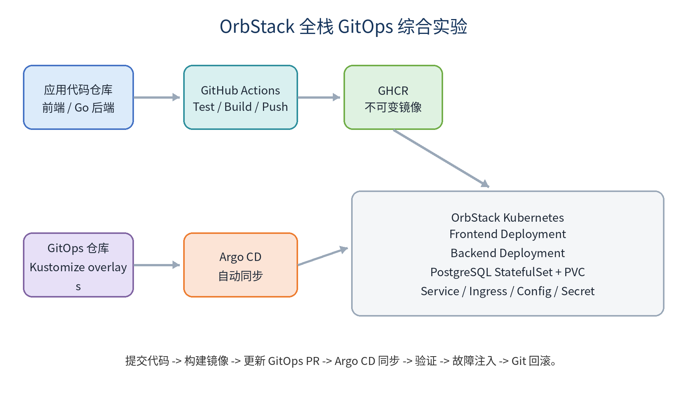


## 操作与示例

```text
demo-app/
  frontend/ backend/ .github/workflows/

demo-gitops/
  base/
  overlays/dev/
  overlays/prod/
  argocd/application.yaml
```

## 生产实践检查

- 变更是否可以追溯到明确 Commit 和责任人？
- 是否存在自动检查、超时、最小权限和失败恢复？
- 是否区分本地实验与生产环境？
- 是否记录版本、配置、镜像 Digest 和部署结果？

## 本章小结

本章围绕“在本地完成端到端闭环”建立了对象关系、操作路径和生产边界。实际应用时，应先在隔离环境验证，再通过 Pull Request、自动检查和审计流程进入下一环境。

## 章末练习

1. 为案例写出从 Commit 到 Pod 的追踪链。
2. 设计一次错误镜像和一次配置漂移演练。

# 第 30 章 综合实验、故障演练与考核

> **学习目标：** 用可验证结果证明掌握能力

## 核心知识

最终考核分为版本发布、CI、镜像供应链、Kubernetes、GitOps 和故障处理。每个实验记录前置条件、变更、命令、预期、实际、故障、恢复和改进。

建议完成四类实验：Tag 驱动 Release；三副本应用加探针、HPA 和 PDB；Argo CD 自愈和 Git 回滚；Argo Rollouts 渐进式发布。

真正掌握不是复制命令，而是能解释对象关系、预测控制器行为、主动制造故障并可靠恢复。

## 操作与示例

```text
Commit -> Tag -> Release -> CI -> Artifact / Image
       -> Kubernetes -> Argo CD -> Progressive Delivery
       -> Observability -> Rollback -> Postmortem
```

## 生产实践检查

- 变更是否可以追溯到明确 Commit 和责任人？
- 是否存在自动检查、超时、最小权限和失败恢复？
- 是否区分本地实验与生产环境？
- 是否记录版本、配置、镜像 Digest 和部署结果？

## 本章小结

本章围绕“用可验证结果证明掌握能力”建立了对象关系、操作路径和生产边界。实际应用时，应先在隔离环境验证，再通过 Pull Request、自动检查和审计流程进入下一环境。

## 章末练习

1. 为四类实验分别编写验收记录。
2. 把一次故障整理为包含根因和改进项的复盘报告。

# 附录 A 常用命令速查

## Git 与 Release

```bash
git status
git log --oneline --decorate --graph
git tag -a v0.02 -m "Release v0.02"
git push origin v0.02
git revert COMMIT
```

## Kubernetes

```bash
kubectl config current-context
kubectl get nodes
kubectl get pods -A
kubectl describe pod POD -n NS
kubectl logs POD -n NS --previous
kubectl get events -n NS --sort-by=.lastTimestamp
kubectl rollout status deployment/APP -n NS
```

## Argo CD

```bash
argocd app list
argocd app get APP
argocd app diff APP
argocd app sync APP
argocd app history APP
```

# 附录 B 术语表

| 术语 | 说明 |
|---|---|
| Commit | 不可变代码快照 |
| Tag | 指向 Git 对象的版本引用 |
| Release | 基于 Tag 的发布说明和附件 |
| Artifact | 工作流或构建产生的文件 |
| Image | 容器只读模板 |
| Pod | Kubernetes 最小调度单元 |
| Deployment | 维持无状态 Pod 副本和更新 |
| Service | 为 Pod 提供稳定网络入口 |
| HPA | 根据指标水平扩缩 Pod |
| GitOps | 用 Git 声明期望状态并持续协调 |
| Drift | 实际状态偏离 Git 期望状态 |
| Prune | 删除 Git 中已不存在的受管资源 |
| Self Heal | 自动修复集群漂移 |

: GitOps 与 Kubernetes 术语表

# 附录 C 官方资料

- [GitHub Actions](https://docs.github.com/actions)
- [GitHub Releases](https://docs.github.com/repositories/releasing-projects-on-github)
- [Docker Documentation](https://docs.docker.com/)
- [Kubernetes Documentation](https://kubernetes.io/docs/)
- [Kustomize](https://kubernetes.io/docs/tasks/manage-kubernetes-objects/kustomization/)
- [Gateway API](https://gateway-api.sigs.k8s.io/)
- [Argo CD](https://argo-cd.readthedocs.io/)
- [Argo Rollouts](https://argo-rollouts.readthedocs.io/)
- [OrbStack Kubernetes](https://docs.orbstack.dev/kubernetes/)

# 附录 D 实验记录模板

```text
实验名称：
目标：
前置条件：
变更内容：
执行命令：
预期结果：
实际结果：
故障现象：
定位过程：
恢复步骤：
根因：
后续改进：
```

# 结语

稳定发布不是记住几条命令，而是建立一套可追溯、可重复、可验证、可观察和可回滚的工程系统。工具会升级，版本会变化，但这些原则长期有效。
