# SRv6网络基础教程

**RFC 8754 / RFC 8986 图解、Linux 实验、VPN、运维与故障排查**

- 作者：jason.wa
- 版本：v0.02
- 日期：2026年6月23日
- 目标读者：了解 IPv6 地址、路由表和下一跳，希望系统掌握 SRv6 的网络工程师、运维人员和技术管理者
- 技术环境：Linux 6.x、iproute2、FRRouting 10.5、Wireshark 4.x；macOS/OrbStack 仅作为辅助宿主环境

---

## 前言

本书将会话中的零散学习内容重构为系统教程，并按官方 RFC、Linux iproute2、FRRouting 与 Wireshark 文档完成技术复核。

## 本版说明

v0.02 增加完整章节、Linux/FRR 实验、故障演练、练习答案、官方资料索引和出版排版。

## 目录
>
> PDF 与 DOCX 版本包含带真实页码的正式目录、图目录和表目录。

# 第1部 基础认知：从 IPv6 到 Segment Routing

# 第1章 为什么需要 SRv6

## 学习目标

- 理解传统逐跳转发、隧道与源路由的差异
- 说明 Segment、SID、Segment List 与 SR Policy 的关系
- 识别 SRv6 适用场景与不适用场景

## 1.1 传统 IP 转发的优点与边界

传统 IP 网络以目的地址为核心：每台路由器根据本地转发表独立选择下一跳。这种模式简单、鲁棒，并能通过 IGP 或 BGP 自动收敛；但当运营者希望让某类流量经过指定链路、指定出口或指定服务节点时，仅依靠最短路径往往不够。传统方案通常需要额外的隧道、策略路由、MPLS 标签分发或逐设备状态。

Segment Routing 的思路不是取消逐跳转发，而是让入口节点能够把一组有序指令与报文关联。中间网络仍然使用既有数据平面进行转发，只有当目的地址命中本地 Segment 时，端点才执行相应行为。

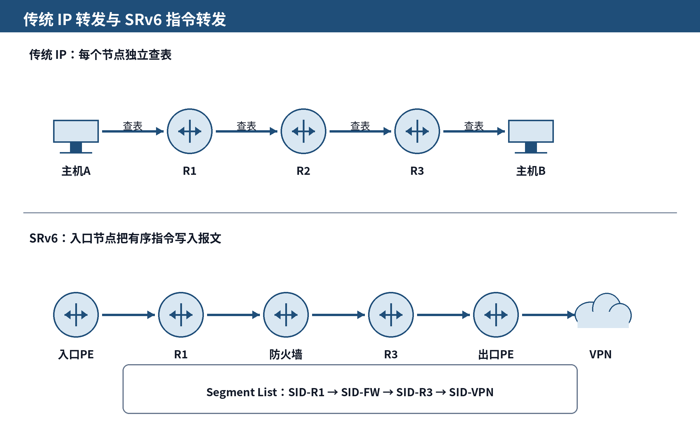
*图 1-1 传统 IP 转发与 SRv6 指令转发的差异*

## 1.2 Segment、SID 与 SR Policy

**表 1-1 基础术语与直观含义**

|术语|正式含义|初学者记忆|
|---|---|---|
|Segment|一条拓扑或服务指令|网络要执行的一步|
|SID|Segment Identifier|指令的标识|
|Segment List|有序的 Segment 集合|任务清单|
|Active Segment|当前正在执行的 Segment|当前任务|
|SR Policy|将流量引导到候选路径的策略|哪些流量走哪张任务清单|

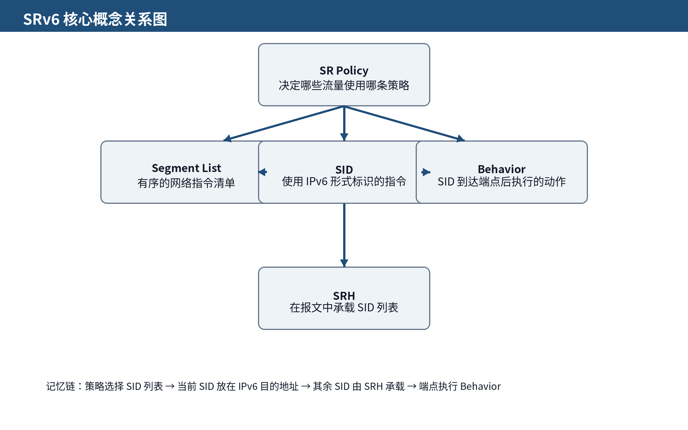
*图 1-2 SRv6 核心概念关系*

## 1.3 SR-MPLS 与 SRv6

Segment Routing 是总体架构。SR-MPLS 用 MPLS 标签栈表达 Segment；SRv6 使用 IPv6 目的地址和可选的 Segment Routing Header 表达 Segment。两者可以共同存在，并不存在“所有网络必须从 MPLS 迁移到 SRv6”的结论。选择时应评估现网能力、芯片支持、报文开销、运维体系和业务目标。

**表 1-2 SR-MPLS 与 SRv6 的工程对比**

|维度|SR-MPLS|SRv6|
|---|---|---|
|数据平面|MPLS 标签|IPv6|
|指令编码|标签栈|IPv6 DA + 可选 SRH|
|单个标识长度|20 bit 标签字段|通常为 128 bit SID|
|网络编程|以拓扑与服务标签为主|Endpoint Behavior 更丰富|
|报文开销|通常较小|长 SID 列表时较大，可使用压缩机制|
|适用判断|成熟 MPLS 骨干|IPv6 化、云网协同、可编程服务|

## 1.4 典型应用与边界

- 流量工程：约束低时延、低丢包、避开维护链路。
- L3VPN/EVPN：以 BGP 为控制面，以 SRv6 Service SID 为数据面指令。
- 服务链：使流量按顺序经过防火墙、DPI 等功能。
- 网络切片和多域编排：把策略意图转换为可执行 Segment List。

> **注意｜不应神化 SRv6**  SRv6 不会自动解决容量不足、地址规划混乱、控制面不稳定或安全边界缺失。没有可靠 IPv6 Underlay 的 SRv6 网络，只会把故障变得更难观察。

## 本章总结

- SRv6 是 Segment Routing 在 IPv6 数据平面上的实现。
- 入口节点负责策略与封装，Transit 节点通常按 IPv6 FIB 转发，Endpoint 执行本地行为。
- SRv6 是可选架构，不是对 MPLS 的无条件替代。

## 章末练习

1. 用自己的语言解释 Segment 与 SID 的区别。
2. 列出两个适合 SRv6 的场景和一个不适合立即引入 SRv6 的场景。
3. 为什么“中间节点没有每条业务流状态”不等于“中间节点没有任何状态”？

# 第2章 IPv6 与 SRv6 的必备基础

## 学习目标

- 复习 IPv6 基本头和扩展头链
- 理解目的地址、Next Header、Hop Limit 与 PMTU
- 为后续抓包和排障建立分层模型

## 2.1 IPv6 基本头

IPv6 基本头固定为 40 字节，包含源地址、目的地址、Next Header、Payload Length 和 Hop Limit 等字段。SRv6 最关键的事实是：当前活动 SID 出现在 IPv6 Destination Address 中，因此普通 IPv6 转发表能够把报文送到拥有该 SID 的端点。

**表 2-1 IPv6 字段与 SRv6 的关系**

|字段|作用|SRv6 关注点|
|---|---|---|
|Source Address|标识外层源|常为 Headend 的封装源地址|
|Destination Address|当前目的地址|承载 Active Segment|
|Next Header|指出后续头部|43 表示 Routing Header|
|Payload Length|基本头之后的长度|受 SRH 与内层报文影响|
|Hop Limit|逐跳递减|用于环路控制和 traceroute|

## 2.2 扩展头链

IPv6 通过 Next Header 把基本头、扩展头和上层协议串成链。SRH 是 Routing Header 的一种，Routing Type 固定为 4。并非所有 SRv6 报文都一定携带 SRH：例如缩减封装只有一个 Segment 且没有 HMAC 时，Linux 的 encap.red 可以省略 SRH。

## 2.3 路径 MTU 与分片

SRv6 封装会增加外层 IPv6 和 SRH。入口必须考虑 Path MTU Discovery、业务 MSS、链路 MTU 和设备缓冲。IPv6 中间路由器不会替源主机执行分片；把持续分片作为常规运行方式会增加性能与排障风险。

> **提示｜实验前检查**  确认内核启用 IPv6 forwarding 与 SRv6 功能；确认虚拟化或容器环境没有屏蔽网络命名空间、LWTunnel 和 seg6local。macOS 本身不提供 Linux seg6 数据平面，OrbStack 只能作为运行 Linux 环境的辅助宿主。

## 本章总结

- 当前 SID 位于 IPv6 目的地址。
- SRH 属于 IPv6 Routing Header，Routing Type 为 4。
- MTU 是 SRv6 设计中的一等约束。

## 章末练习

1. IPv6 基本头的固定长度是多少？
2. 为什么 Transit 节点通常不需要理解 VPN 业务？
3. 解释 Next Header=43 与 Routing Type=4 的区别。

# 第3章 SID、Locator 与地址规划

## 学习目标

- 理解 LOC:FUNCT:ARG 的逻辑模型
- 掌握 Locator 聚合与 Function 分配原则
- 识别地址规划中的可扩展性和安全问题

## 3.1 SID 不是普通主机地址

SRv6 SID 具有 IPv6 地址形式，并按设计出现在 IPv6 目的地址中，但它的语义可以是“到达节点并继续”“从指定邻接转发”或“解封装后查询某个 VRF”。RFC 9602进一步讨论了 SID 与 IPv6 地址架构的关系，并为 SRv6 SID 提供了专用前缀资源；生产网络仍应按本组织与地址管理政策进行规划。

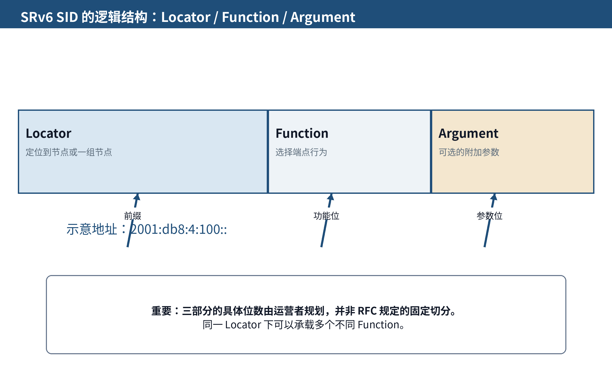
*图 3-1 SRv6 SID 的逻辑结构*

## 3.2 Locator 的作用

Locator 是可路由的 IPv6 前缀，用于把报文送到拥有相关 SID 的节点或节点集合。IGP 通常发布 Locator，而具体 Function 由本地 SID 表解释。良好的规划可以让核心网络只维护聚合 Locator 路由，而不是发布每一个 /128 Service SID。

**表 3-1 Locator 规划检查项**

|检查项|推荐做法|常见错误|
|---|---|---|
|层次化|按区域/站点/节点分层|全网随机分配 /128|
|聚合|让 IGP 发布聚合前缀|每个 Function 单独进 IGP|
|预留|为增长和压缩 SID 留空间|一次性填满 Function 空间|
|安全|区分基础设施与服务 SID|把 SID 空间直接暴露到外网|
|文档|维护 SID 注册表|仅靠设备配置反向猜测|

## 3.3 Function 与 Argument

Function 标识 Endpoint Behavior 或本地功能实例。Argument 是可选输入，是否存在以及如何编码由具体行为和控制面定义。不能把示意地址中的某一段十六进制字段机械地认定为固定 Function 位；位宽需要在设计文档、控制面和设备实现之间保持一致。

## 3.4 生产地址模板

```text
# 示例：仅用于说明层次，不代表唯一标准
2001:db8:1000::/40      # SRv6 Block
2001:db8:1001::/48      # 区域 1
2001:db8:1001:0100::/64 # 节点 PE1 Locator
2001:db8:1001:0100:1::  # Node/End Function
2001:db8:1001:0100:100::# VPN Service Function
```

> **注意｜不要直接照抄文档前缀**  2001:db8::/32 是文档示例前缀，不应部署到真实生产网络。实际地址必须来自组织合法获得并登记的 IPv6 地址空间，或使用适当的内部地址规划。

## 本章总结

- Locator 解决“送到谁”，Function 解决“做什么”。
- 切分位数由部署规划决定。
- IGP 聚合、SID 注册表和边界过滤共同决定可运维性。

## 章末练习

1. 设计一个包含两个区域、每区四台 PE 的 Locator 规划。
2. 为什么不建议将所有 Service SID 以 /128 发布到 IGP？
3. 说明 Argument 与 Function 的区别。

# 第2部 数据平面：SRH 与 Endpoint Behavior

# 第4章 SRH 报文结构与逐跳处理

## 学习目标

- 掌握 SRH 固定字段和 Segment List
- 准确解释 Segments Left 与 Last Entry
- 通过逐帧变化读懂真实报文

## 4.1 SRH 字段

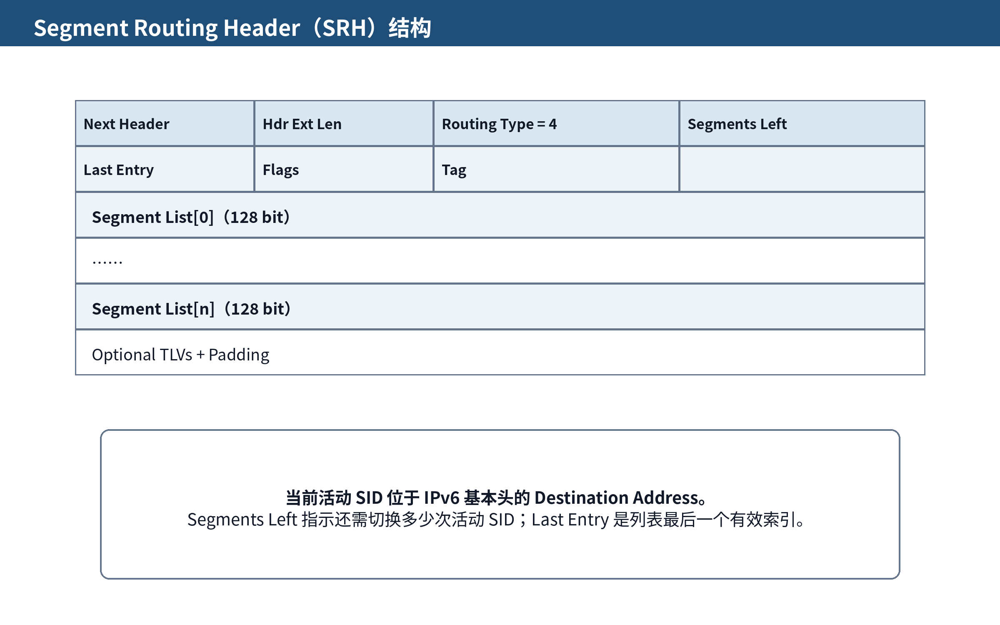
*图 4-1 Segment Routing Header 结构*

**表 4-1 SRH 关键字段**

|字段|长度|含义|
|---|---|---|
|Next Header|8 bit|SRH 后面的头部或上层协议|
|Hdr Ext Len|8 bit|以 8 字节为单位表示 SRH 长度，不含最初 8 字节|
|Routing Type|8 bit|SRH 固定为 4|
|Segments Left|8 bit|还需进行的活动 SID 切换次数/索引状态|
|Last Entry|8 bit|Segment List 最后一个有效索引|
|Flags|8 bit|标志位|
|Tag|16 bit|策略或分组标识，具体使用可选|
|Segment List|每项 128 bit|SID 或 RFC 9800 允许的压缩容器|
|TLV|可变|可选扩展信息和填充|

## 4.2 为什么列表看起来倒序

若执行顺序为 SID1 → SID2 → SID3，SRH 中通常存储 Segment List[0]=SID3、[1]=SID2、[2]=SID1。入口把 SID1 放入 IPv6 DA，并设置 Last Entry=2、Segments Left=2。端点执行 End 时先递减 Segments Left，再把 Segment List[Segments Left] 写入 DA。

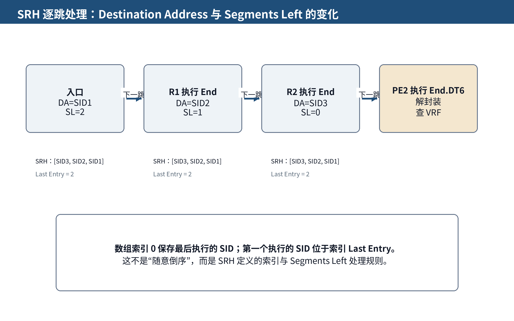
*图 4-2 SRH 逐跳处理过程*

## 4.3 初学者常见误区

**表 4-2 常见误解与修正**

|误解|修正|
|---|---|
|每台 Transit 路由器都逐项读取 SRH|普通 Transit 节点通常只按当前 DA 查 IPv6 FIB；命中本地 SID 的 Endpoint 才执行行为|
|Segments Left 是未执行 SID 的总数|更准确地说，它控制后续活动 SID 的切换；当前活动 SID 已在 DA|
|SRH 永远存在|单 Segment 的缩减封装等情况下可以没有 SRH|
|Segment List 显示顺序就是执行顺序|抓包显示通常为索引 0 到 Last Entry，执行从 Last Entry 向 0 推进|

## 4.4 长度计算

不含 TLV 时，SRH 长度为 8 + 16×N 字节，其中 N 是 Segment List 条目数。H.Encaps 还要增加 40 字节外层 IPv6 基本头。缩减封装可能减少一个重复的 SID 条目。

## 本章总结

- 当前活动 SID 在 IPv6 DA。
- Last Entry 是数组最后索引，不是 SID 数量。
- 解析抓包时要同时观察 DA、Segments Left 和 Segment List。

## 章末练习

1. 三条 SID 的 Last Entry 是多少？
2. 给出 SID-A→SID-B→SID-C 的数组索引。
3. 当 DA=SID-B、Segments Left=1 时，下一次 End 后 DA 是什么？

# 第5章 基础行为：End、End.X 与 End.T

## 学习目标

- 区分基础端点行为
- 理解 FIB 查找与指定邻接的差别
- 识别 RFC 语义和 Linux 实现约束
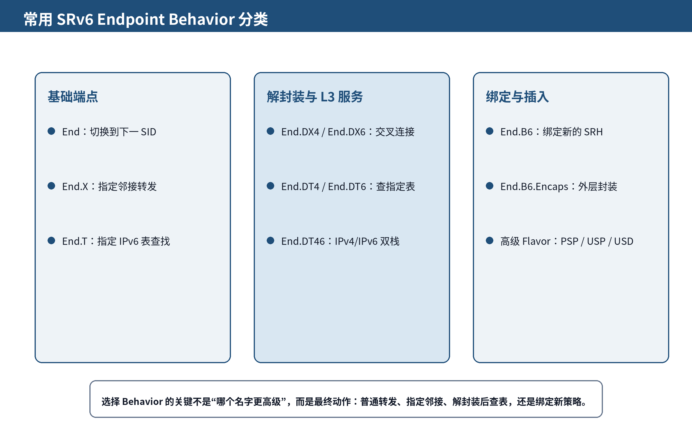
*图 5-1 常用 SRv6 Endpoint Behavior 分类*

## 5.1 End：基础端点行为

End 是最基本的 Endpoint Behavior。端点收到目的地址为本地 SID 的报文后，验证 SRH，推进 Segments Left，更新 IPv6 DA，并按新的 DA 进行 IPv6 转发。若已经没有后续 Segment，RFC 行为进入上层处理；具体平台的 seg6local 实现可能对匹配条件更严格。

## 5.2 End.X：指定 L3 邻接

End.X 在完成基本 End 处理后，把报文转发到预配置的 IPv6 邻接 J。它适合表达“必须从这条链路离开”或“必须交给这个下一跳”，但也使策略依赖邻接状态，因此需要链路检测和备份候选路径。

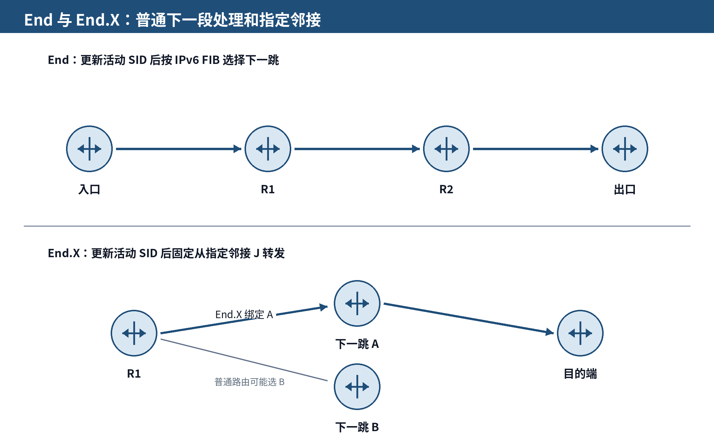
*图 5-2 End 与 End.X 的转发差异*

## 5.3 End.T：指定 IPv6 路由表

End.T 在推进活动 Segment 后，使用指定 IPv6 路由表 T 查找新的 DA。它可用于多拓扑或特定表的转发，但不能与 End.DT6 混淆：End.T 处理的是外层 SRv6 报文并继续 Segment 处理；End.DT6 终结外层封装并对内层 IPv6 报文查表。

**表 5-1 End、End.X、End.T 对比**

|行为|是否推进 SID|下一步依据|典型用途|
|---|---|---|---|
|End|是|默认 IPv6 FIB|普通节点段|
|End.X|是|固定邻接 J|严格链路/下一跳|
|End.T|是|指定 IPv6 表 T|多拓扑或特定转发表|

## 5.4 Linux 示例

```bash
# 普通 End
ip -6 route add 2001:db8:100::1/128 \
  encap seg6local action End count \
  dev lo

# End.X：处理后发往指定 IPv6 下一跳
ip -6 route add 2001:db8:100::2/128 \
  encap seg6local action End.X \
  nh6 2001:db8:12::2 count \
  dev eth1
```

> **提示｜实现差异**  iproute2 手册指出 Linux End 和 End.X 仅接受 Segments Left 非零的报文。设计和实验必须以当前内核与 iproute2 行为为准，不能仅凭 RFC 伪代码推断平台细节。

## 本章总结

- End 依赖新的 DA 继续 FIB 查找。
- End.X 把下一跳固定到邻接。
- End.T 与 End.DT6 的对象不同：前者继续处理外层，后者处理内层。

## 章末练习

1. 什么情况下 End.X 比 End 更合适？
2. End.X 绑定的链路失败时需要哪些保护机制？
3. 解释 End.T 与 VRF Service SID 的差异。

# 第6章 解封装与业务行为：End.DX、End.DT

## 学习目标

- 掌握 DX 与 DT 系列行为
- 正确理解 End.DT6 的解封装和查表
- 选择适合 L3VPN 的 Service SID

## 6.1 DX 与 DT 的共同点

End.DX4、End.DX6、End.DT4、End.DT6 和 End.DT46 都属于终结类行为：它们接收外层 SRv6 封装，取出内层报文，然后按指定方式转发。它们要求当前已到达最后 Segment，通常表现为 Segments Left=0，或者报文使用没有 SRH 的单 Segment 缩减封装。

## 6.2 End.DX6 与 End.DT6

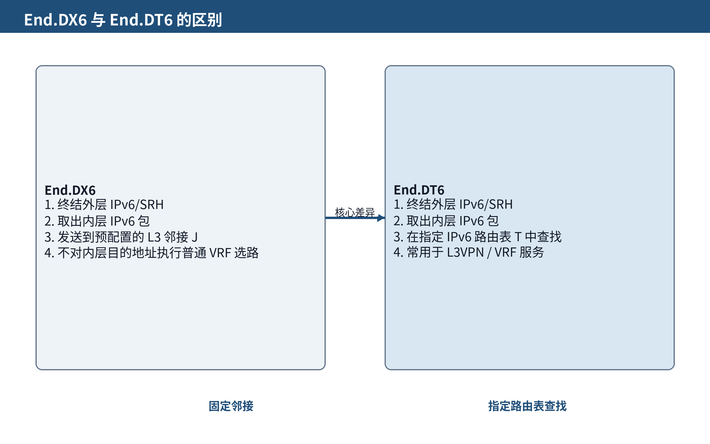
*图 6-1 End.DX6 与 End.DT6 的区别*

**表 6-1 常用解封装行为**

|行为|内层协议|转发方式|典型场景|
|---|---|---|---|
|End.DX4|IPv4|发送到指定 IPv4 邻接|固定 CE 邻接|
|End.DX6|IPv6|发送到指定 IPv6 邻接|固定 CE 邻接|
|End.DT4|IPv4|在指定 VRF/表中查找|IPv4 L3VPN|
|End.DT6|IPv6|在指定 IPv6 表中查找|IPv6 L3VPN|
|End.DT46|IPv4 或 IPv6|在 VRF 中按内层协议查找|双栈 L3VPN|

> **注意｜重要纠错**  End.DT6 不是“不解封装直接进入 VRF”。正确过程是终结外层 IPv6/SRH，取出内层 IPv6 报文，再在指定表或 VRF 中查找。

## 6.3 Linux VRF 严格模式

Linux 使用 End.DT4/End.DT46 的 vrftable 参数时，需要 VRF 设备与表号关联，并启用 net.vrf.strict_mode=1。End.DT6 可以使用 table 或 vrftable；使用 vrftable 时同样要求严格模式。严格模式避免不同 VRF 使用同一表号或产生不明确查找。

```bash
ip link add vrf10 type vrf table 100
ip link set vrf10 up
sysctl -w net.vrf.strict_mode=1

ip -6 route add 2001:db8:400::100/128 \
  encap seg6local action End.DT6 \
  vrftable 100 count \
  dev vrf10
```

## 6.4 Service SID 的粒度

可以为每个 VRF 分配一个 SID，也可以按下一跳或业务族分配。粒度越细，控制能力越强，但 SID 数量、BGP 通告和运维复杂度也更高。生产设计应明确 per-VRF、per-CE 或 per-prefix 的使用边界。

## 本章总结

- DX 固定邻接，DT 指定表查找。
- End.DT6 会解封装外层并查内层 IPv6 路由表。
- VRF、RD/RT、Service SID 和回程路由缺一不可。

## 章末练习

1. 为什么 End.DX6 不适合需要多个动态出口的 VRF？
2. 列出 End.DT46 的两个前置条件。
3. 如何证明报文已经执行 End.DT6，但业务仍因 VRF 路由缺失而失败？

# 第7章 Headend 行为、封装模式与 MTU

## 学习目标

- 区分 Encaps、Encaps.Red、Insert
- 计算报文开销
- 制定 MTU、MSS 与边界策略

## 7.1 Headend 是什么

Headend 是把业务流量引入 SR Policy 的入口节点。它根据分类结果选择 Segment List，并执行封装或插入。Headend 可以是 PE、边缘网关、主机或软件转发节点，但必须受信任并接受统一策略管理。

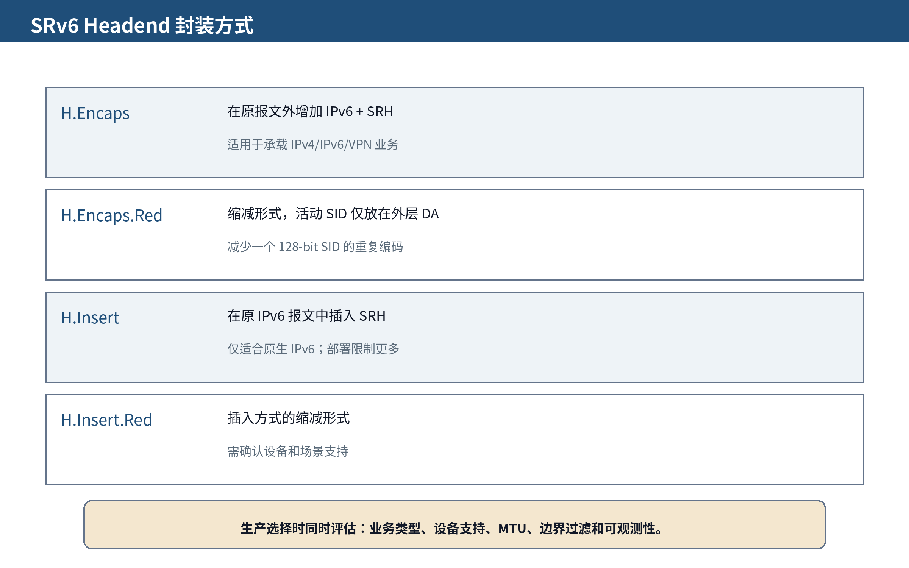
*图 7-1 常用 Headend 封装方式*

## 7.2 开销计算

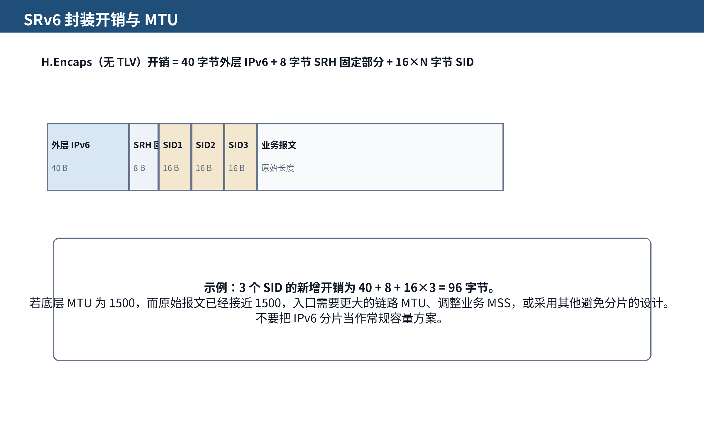
*图 7-2 SRv6 封装开销与 MTU*

**表 7-1 无 TLV 时的开销示例**

|模式|SID 数|新增开销示例|说明|
|---|---|---|---|
|H.Encaps|1|64 B|40+8+16|
|H.Encaps|3|96 B|40+8+48|
|H.Encaps.Red|3|约 80 B|活动 SID 只在 DA，SRH 中减少一个条目|
|Encaps.Red 单 SID|1|40 B|无 HMAC 时可省略 SRH|

实际开销还可能包含 TLV、HMAC、二层封装或其他扩展头。设备 ASIC 对扩展头深度、SID 数量和线速能力也可能有限，设计时不能只看协议理论上允许的最大值。

## 7.3 MTU 设计流程

1. 统计业务最大报文和现网链路 MTU。
2. 计算最坏 Segment List、TLV 和外层头开销。
3. 确认每一段链路和设备都支持所需 MTU。
4. 对 TCP 业务评估 MSS 调整；对 UDP/隧道业务评估应用分片行为。
5. 使用 Packet Too Big 和 PMTUD 进行故障演练。

> **注意｜风险方案**  在生产中依赖“设备会自动帮忙分片”并不可靠。IPv6 中间路由器不执行分片，ICMPv6 Packet Too Big 被过滤会造成典型 PMTU 黑洞。

## 本章总结

- Headend 决定如何把业务装入 SRv6。
- SID 越多，报文开销越大。
- MTU、ASIC 解析能力和边界扩展头策略必须一起评审。

## 章末练习

1. 计算 5 个 SID 的 H.Encaps 基础开销。
2. 为什么单 SID 的 encap.red 可能看不到 SRH？
3. 设计一个验证 PMTU 黑洞的实验。

# 第3部 控制平面与业务：从 Locator 到 VPN

# 第8章 IGP 发布 Locator 与 SRv6 能力

## 学习目标

- 理解 Underlay 与 Service Overlay 的分工
- 掌握 IS-IS/OSPFv3 的 SRv6 扩展角色
- 设计可聚合、可收敛的 Locator 发布

## 8.1 Underlay 的职责

Underlay 首要目标是让所有基础设施 Locator 可达。IGP 负责拓扑、最短路径和 Locator/能力通告；它不应承载每一个客户前缀。Service Overlay 再通过 BGP 发布 VPN 路由与 Service SID。

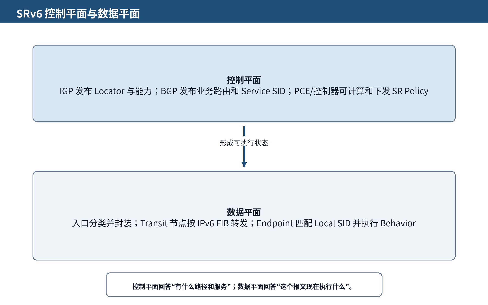
*图 8-1 SRv6 控制平面与数据平面*

## 8.2 IS-IS 与 OSPFv3

RFC 9352定义 IS-IS 的 SRv6 扩展，RFC 9513定义 OSPFv3 扩展。两者都可以发布 Locator 和端点能力。选择通常取决于现网 IGP、人员经验、设备支持和多拓扑设计，而不是“SRv6 只能使用 IS-IS”。

**表 8-1 IGP 设计检查**

|主题|建议|
|---|---|
|Locator 发布|优先聚合前缀，控制 LSDB 规模|
|度量|先保证基础最短路径正确，再引入 Flex-Algo|
|收敛|部署 BFD、TI-LFA 或厂商支持的快速重路由|
|能力一致性|确认所有节点支持所需 Behavior 与 Flavor|
|升级|混合版本阶段明确不支持节点的绕行策略|

## 8.3 FRR 10.5 示例骨架

```frr
segment-routing
 srv6
  locators
   locator LOC1
    prefix 2001:db8:1001:100::/64
   exit
  exit
 exit
!
router isis CORE
 segment-routing srv6
  locator LOC1
 exit
!
```

> **提示｜版本基线**  FRR 10.5 文档说明：Locator 必须先在 Zebra 配置；IS-IS 关联 Locator 后可分配并通告相关 SID。命令树在不同 FRR 版本中可能变化，实验前必须查对应版本文档和 show 命令。

## 本章总结

- IGP 解决 Locator 可达和拓扑收敛。
- Service SID 不应无节制进入 IGP。
- IS-IS 与 OSPFv3 都有标准化 SRv6 扩展。

## 章末练习

1. Underlay 和 Overlay 分别保存哪些信息？
2. 为什么 Locator 聚合能降低故障域影响？
3. 列出升级混合网络的三个风险。

# 第9章 SR Policy：把意图变成 SID 列表

## 学习目标

- 理解 `<Color, Endpoint>` 标识
- 掌握 Candidate Path 与 Preference
- 设计主备、动态和显式策略

## 9.1 SR Policy 的对象模型

RFC 9256 将 SR Policy 组织为 `<Color, Endpoint>`，并通过一个或多个 Candidate Path 提供可选路径。每条候选路径可以包含显式 Segment List、由控制器计算的路径或其他动态来源。只有有效且优先级最高的候选路径会被选中。

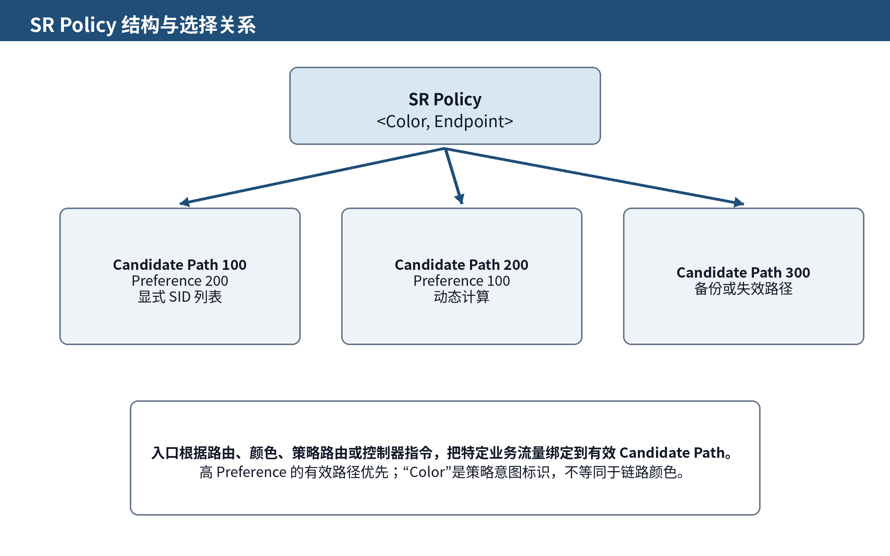
*图 9-1 SR Policy 与 Candidate Path*

**表 9-1 SR Policy 关键属性**

|属性|含义|排障问题|
|---|---|---|
|Color|策略意图标识|业务路由是否带对 Color|
|Endpoint|策略终点|地址族和终点是否一致|
|Preference|候选路径优先级|主路径是否因无效被跳过|
|Segment List|可执行 SID 序列|顺序、可达性、行为是否正确|
|Binding SID|可把整条 Policy 表示为一个 Segment|是否形成递归或跨域依赖|

## 9.2 业务如何绑定 Policy

绑定方式包括 BGP Color Extended Community、静态路由、策略路由、控制器下发或应用 API。Color 只表达意图，真正的路径由设备上的 SR Policy 决定。把“颜色 100”直接解释为“低时延”只有在组织策略目录明确规定时才成立。

## 9.3 主备设计

1. 为主路径和备路径定义不同 Candidate Path。
2. 确保备路径的 Segment 与主路径不共享关键故障点。
3. 设置合理 Preference 并验证失效条件。
4. 观察 Policy 状态、BFD/IGP 收敛和业务丢包。
5. 恢复后确认是否需要自动回切和抑制震荡。

## 9.4 错误方案对比

**表 9-2 策略设计对比**

|方案|问题|改进|
|---|---|---|
|SID 列表写死且无备份|链路变更后业务中断|增加动态计算或备候选|
|Color 无治理|不同团队含义冲突|维护企业级 Color 注册表|
|仅验证控制面 Up|数据面可能仍因 MTU/Local SID 失败|加入端到端探测和抓包|
|长期手工修改设备|配置漂移，无法审计|使用模板、控制器或 Git 管理配置|

## 本章总结

- SR Policy 是意图与可执行路径之间的桥梁。
- Color 不等于路径，Candidate Path 才包含实际执行内容。
- 主备必须验证故障独立性和数据面结果。

## 章末练习

1. 设计 Color 100/200/300 的企业语义。
2. 什么情况下高 Preference 的路径不会被选择？
3. 如何验证备路径确实绕开了主链路故障域？

# 第10章 BGP SRv6 L3VPN 与 EVPN 基础

## 学习目标

- 理解 RFC 9252 的控制面模型
- 掌握 Service SID、RD、RT 与 VRF 的关系
- 避免“SRv6 等于取消 BGP VPN”的误解

## 10.1 控制面没有消失

SRv6 改变的是数据平面指令表达方式，不会自动替代 BGP 的业务路由分发。RFC 9252定义了 BGP 如何为 L3VPN、EVPN 和 Internet 服务携带 SRv6 信息。PE 仍然使用 RD 区分重叠前缀，使用 RT 控制导入导出，并把 Service SID 与业务路由关联。

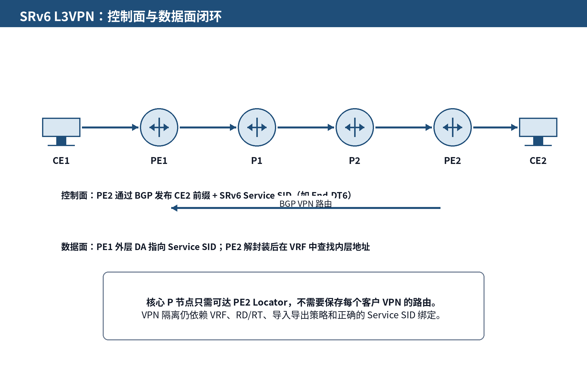
*图 10-1 SRv6 L3VPN 控制面与数据面闭环*

## 10.2 端到端流程

1. CE2 前缀进入 PE2 的 VRF。
2. PE2 分配或选择 End.DT/End.DX Service SID。
3. PE2 通过 MP-BGP 发布 VPN 路由、RD/RT 和 SRv6 Service SID 信息。
4. PE1 根据 RT 导入路由，并得到到达 PE2 服务的 SID。
5. PE1 封装业务报文；核心只需到达 PE2 Locator。
6. PE2 执行 Service SID，解封装并把内层报文送入 VRF 或邻接。

## 10.3 FRR L3VPN SRv6 能力

FRR 文档提供 sid vpn per-vrf export 和按地址族导出 SID 的配置。使用 auto 时由 Zebra SID Manager 分配；使用 explicit 时请求明确 SID。若 Zebra 未运行、Locator 不可用或分配失败，VPN 路由导出可能被阻塞。

```frr
router bgp 65000 vrf BLUE
 address-family ipv6 unicast
  rd vpn export 65000:10
  rt vpn both 65000:10
  sid vpn per-vrf export auto
  import vpn
  export vpn
 exit-address-family
!
```

> **注意｜不要把示例当成完整生产配置**  真实部署还需要邻居、地址族、路由策略、下一跳、Locator、VRF 接口、回程路由和安全策略。示例只展示对象关系。

## 10.4 “核心不知道 VPN”的准确说法

核心 P 节点通常不需要保存客户 VPN 前缀或 VRF 状态，只需转发到 Locator；但核心仍然运行 IGP、维护 IPv6 FIB、可能参与策略和遥测。因此，更准确的表述是“核心不需要逐客户业务路由状态”，而不是“核心对业务一无所知”。

## 本章总结

- BGP 仍是 SRv6 VPN 的关键控制面。
- Service SID 与 RD/RT、VRF 路由共同构成服务。
- 核心可避免逐客户 VPN 路由，但仍需完整 Underlay 状态。

## 章末练习

1. RD 与 RT 的作用分别是什么？
2. Service SID 分配失败会对 BGP 导出造成什么影响？
3. 比较 per-VRF 与 per-nexthop SID 的优缺点。

# 第11章 流量工程、服务链与多域设计

## 学习目标

- 把拓扑 Segment 与服务 Segment 组合
- 理解服务链的可达性与状态依赖
- 识别跨域编排和故障定位难点

## 11.1 拓扑指令与服务指令

一条 Segment List 可以同时包含节点、邻接和服务行为，例如“经过低时延路径 → 进入防火墙 → 到达出口 PE → 进入 BLUE VRF”。这体现了 SRv6 网络编程能力，但每增加一个指令都会增加报文开销和故障依赖。

## 11.2 服务链设计原则

**表 11-1 服务链设计问题**

|问题|必须回答|
|---|---|
|服务是否 SR-aware|能否直接处理 SRv6，还是需要 Proxy|
|会话状态|主备切换是否保持会话一致|
|回程路径|是否要求对称经过相同服务|
|扩缩容|SID 指向实例、负载均衡器还是服务集合|
|健康检查|服务失效如何使 Candidate Path 无效|
|合规|哪些业务必须经过审计/安全节点|

## 11.3 多域

跨 IGP 域、跨自治系统或跨厂商网络时，不宜把每个内部 SID 暴露给所有入口。常见做法包括分层 Policy、Binding SID、控制器计算和域边界重封装。多域设计的目标是隐藏内部拓扑、减少 SID 列表长度并明确责任边界。

## 11.4 不推荐方案

> **注意｜超长静态 SID 列表**  把每个物理节点都写入静态 Segment List 会放大 MTU、拓扑变化和配置漂移问题。只在确有严格路径需求时使用必要 Segment，普通区段让 IGP 最短路径完成。

## 本章总结

- SRv6 可把路径和服务组合成程序。
- 服务链必须处理状态、对称性和健康检查。
- 多域应使用分层抽象，避免泄露全部内部 SID。

## 章末练习

1. 设计一条“低时延+防火墙+VPN”的 Segment List，并说明每个 Segment 类型。
2. 为什么有状态防火墙对回程路径敏感？
3. Binding SID 如何帮助跨域隐藏内部结构？

# 第4部 实验实战：Linux、Wireshark 与 FRRouting

# 第12章 实验环境、能力检查与安全准备

## 学习目标

- 选择适合 SRv6 的实验环境
- 执行内核、iproute2 与权限检查
- 建立可重复、可清理的实验习惯

## 12.1 推荐环境

**表 12-1 实验环境分级**

|级别|环境|用途|限制|
|---|---|---|---|
|入门演示|单台 Linux 虚拟机 + network namespace|理解报文与行为|不模拟真实控制面|
|本地实验|多 Linux VM 或 containerlab/namespace|FRR、IGP、BGP、抓包|依赖宿主内核与权限|
|企业预生产|硬件/虚拟路由器混合实验室|性能、HA、互通、升级|成本与版本管理要求高|
|不推荐|在未知限制的普通应用容器中直接测试|快速但不可控|CAP_NET_ADMIN、sysctl、LWTunnel 可能缺失|

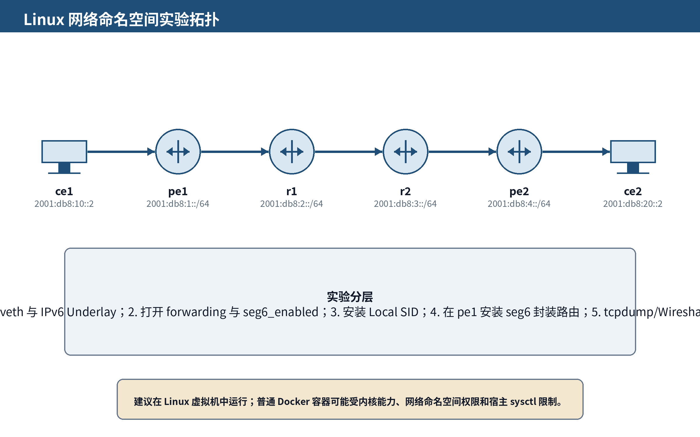
*图 12-1 Linux 网络命名空间实验拓扑*

## 12.2 能力检查

```bash
uname -r
ip -Version
ip -6 route help 2>&1 | grep -E "seg6|seg6local" || true
sysctl net.ipv6.conf.all.forwarding

# 检查内核配置；路径因发行版而异
grep -E "CONFIG_IPV6_SEG6|CONFIG_IPV6_SEG6_LWTUNNEL" \
  /boot/config-"$(uname -r)" 2>/dev/null || true
```

## 12.3 安全与清理

网络命名空间实验需要 root 或等效能力。脚本必须使用专用名称、支持 destroy 清理，并避免删除真实接口或覆盖生产路由。不要在远程生产服务器上直接运行会修改 forwarding、VRF、路由表或防火墙的实验脚本。

> **注意｜快照优先**  在虚拟机中实验前创建快照。若使用远程主机，确保有带外管理和恢复路径，避免错误路由或 sysctl 导致管理连接中断。

## 本章总结

- Linux VM/namespace 是最可控的入门环境。
- 实验前检查内核、iproute2 和权限。
- 每个实验都要有清理、日志和回滚步骤。

## 章末练习

1. 为什么 macOS 不能直接执行 Linux seg6local？
2. 列出脚本 destroy 模式应清理的对象。
3. 如何证明当前 iproute2 支持 End.DT46？

# 第13章 完整 Linux 数据平面实验

## 学习目标

- 建立六节点 IPv6 Underlay
- 配置 End、End.DX6 与 Headend 封装
- 验证去程 SRv6、回程普通 IPv6

## 13.1 实验目标和拓扑

本实验建立 ce1—pe1—r1—r2—pe2—ce2 六个命名空间。去程使用 SID1（R1 End）→ SID2（R2 End）→ SID3（PE2 End.DX6）；回程使用普通 IPv6 静态路由。这样可以清楚区分 SRv6 去程与基础 IP 回程。

## 13.2 一键实验脚本

**完整脚本 srv6-lab.sh**

```bash
#!/usr/bin/env bash
set -euo pipefail

NAMES=(ce1 pe1 r1 r2 pe2 ce2)

cleanup() {
  for ns in "${NAMES[@]}"; do
    ip netns del "$ns" 2>/dev/null || true
  done
}

if [[ "${1:-}" == "destroy" ]]; then
  cleanup
  exit 0
fi

cleanup
for ns in "${NAMES[@]}"; do ip netns add "$ns"; done

link() {
  local a=$1 ai=$2 b=$3 bi=$4
  ip link add "$ai" type veth peer name "$bi"
  ip link set "$ai" netns "$a"
  ip link set "$bi" netns "$b"
  ip -n "$a" link set "$ai" up
  ip -n "$b" link set "$bi" up
}

link ce1 c1 pe1 p1c
link pe1 p1r r1 r1p
link r1 r1r r2 r2r
link r2 r2p pe2 p2r
link pe2 p2c ce2 c2

for ns in "${NAMES[@]}"; do
  ip -n "$ns" link set lo up
  ip netns exec "$ns" sysctl -qw net.ipv6.conf.all.forwarding=1
  ip netns exec "$ns" sh -c \
    'for f in /proc/sys/net/ipv6/conf/*/seg6_enabled; do echo 1 > "$f"; done'
done

ip -n ce1 addr add 2001:db8:10::2/64 dev c1
ip -n pe1 addr add 2001:db8:10::1/64 dev p1c
ip -n pe1 addr add 2001:db8:11::1/64 dev p1r
ip -n r1  addr add 2001:db8:11::2/64 dev r1p
ip -n r1  addr add 2001:db8:12::1/64 dev r1r
ip -n r2  addr add 2001:db8:12::2/64 dev r2r
ip -n r2  addr add 2001:db8:13::1/64 dev r2p
ip -n pe2 addr add 2001:db8:13::2/64 dev p2r
ip -n pe2 addr add 2001:db8:20::1/64 dev p2c
ip -n ce2 addr add 2001:db8:20::2/64 dev c2

ip -n ce1 -6 route add default via 2001:db8:10::1
ip -n ce2 -6 route add default via 2001:db8:20::1

# Underlay：到下一个 Locator/SID 的路由
ip -n pe1 -6 route add 2001:db8:100::/64 via 2001:db8:11::2
ip -n r1  -6 route add 2001:db8:200::/64 via 2001:db8:12::2
ip -n r2  -6 route add 2001:db8:400::/64 via 2001:db8:13::2

# 回程普通 IPv6
ip -n pe2 -6 route add 2001:db8:10::/64 via 2001:db8:13::1
ip -n r2  -6 route add 2001:db8:10::/64 via 2001:db8:12::1
ip -n r1  -6 route add 2001:db8:10::/64 via 2001:db8:11::1

# Local SID
ip -n r1 -6 route add 2001:db8:100::1/128 \
  encap seg6local action End count dev lo
ip -n r2 -6 route add 2001:db8:200::1/128 \
  encap seg6local action End count dev lo
ip -n pe2 -6 route add 2001:db8:400::100/128 \
  encap seg6local action End.DX6 \
  nh6 2001:db8:20::2 count dev p2c

# Headend：CE2 前缀使用三段 SRv6 封装
ip -n pe1 -6 route add 2001:db8:20::/64 \
  encap seg6 mode encap \
  segs 2001:db8:100::1,2001:db8:200::1,2001:db8:400::100 \
  via 2001:db8:11::2 dev p1r

echo "实验已建立。测试："
echo "  ip netns exec ce1 ping -c 3 2001:db8:20::2"
echo "抓包："
echo "  ip netns exec r1 tcpdump -ni r1p -vv ip6"
echo "清理：$0 destroy"
```

## 13.3 验证步骤

```bash
sudo bash srv6-lab.sh
sudo ip netns exec ce1 ping -c 3 2001:db8:20::2

# 查看 Local SID 统计
sudo ip netns exec r1  ip -s -6 route show 2001:db8:100::1/128
sudo ip netns exec r2  ip -s -6 route show 2001:db8:200::1/128
sudo ip netns exec pe2 ip -s -6 route show 2001:db8:400::100/128

# 完成后清理
sudo bash srv6-lab.sh destroy
```

## 13.4 预期报文变化

**表 13-1 去程逐节点状态**

|位置|外层 DA|Segments Left|动作|
|---|---|---|---|
|PE1 发出|2001:db8:100::1|2|H.Encaps|
|R1 处理后|2001:db8:200::1|1|End|
|R2 处理后|2001:db8:400::100|0|End|
|PE2|外层终结|0|End.DX6，交付 CE2|

## 13.5 已知限制

脚本依赖宿主内核支持 seg6 和 seg6local，并要求 root。部分发行版可能禁用相关内核选项；部分内核对 Local SID 路由设备和源地址选择有额外要求。若脚本失败，应按第17章顺序检查，而不是随意改动地址。

## 本章总结

- 实验把 Underlay、Local SID 和 Headend 三层分开。
- 去程 SRv6、回程普通 IPv6 有利于观察。
- 统计计数器能证明哪个 Endpoint 已经执行。

## 章末练习

1. 把 R2 的 End 改为 End.X，并固定下一跳。
2. 将最终行为改成 End.DT6，需要增加哪些 VRF 配置？
3. 删除 R1 到 R2 Locator 的路由，记录 ping、计数器和抓包现象。

# 第14章 Wireshark 与 tcpdump 抓包分析

## 学习目标

- 用过滤器定位 SRH
- 按 DA/SL/Segment List 还原执行过程
- 识别 MTU、扩展头和行为错误

## 14.1 抓包点选择

至少在 Headend 输出、一个 Endpoint 输入以及最终 Service Endpoint 输入抓包。只在业务主机抓包可能看不到外层 SRv6；只在最终出口抓包又可能错过中间 DA 与 Segments Left 的变化。

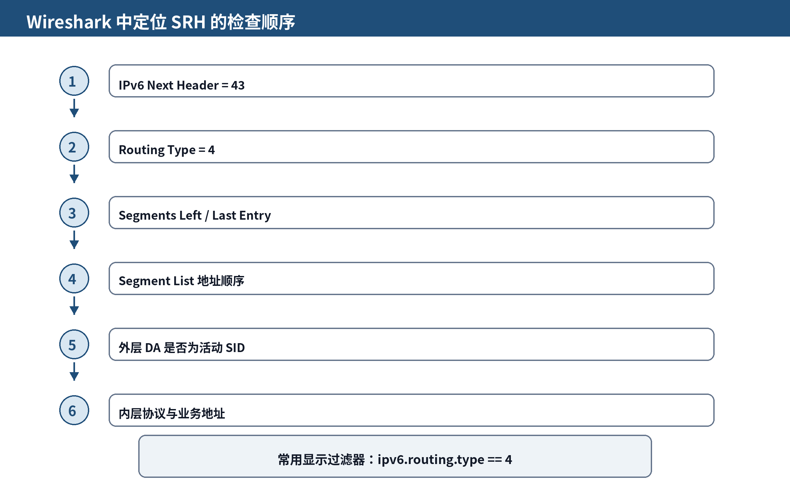
*图 14-1 Wireshark 中定位 SRH 的检查顺序*

## 14.2 常用命令与过滤器

```text
# 在 R1 输入接口抓包并保存
ip netns exec r1 tcpdump -ni r1p -s 0 -w /tmp/r1-srv6.pcap ip6

# Wireshark 显示过滤器
ipv6.routing.type == 4
ipv6.routing.segleft == 0
ipv6.dst == 2001:db8:400::100
```

## 14.3 分析模板

1. 检查外层 IPv6 源/目的地址。
2. 确认 Next Header 指向 Routing Header。
3. 确认 Routing Type=4。
4. 记录 Segments Left、Last Entry 和 Segment List。
5. 比较相邻抓包点的 DA 与 SL 是否按预期变化。
6. 展开内层报文，确认内层源/目的地址未被错误修改。
7. 检查 ICMPv6 Packet Too Big、Destination Unreachable 或参数问题。

**表 14-1 抓包现象与可能原因**

|现象|可能原因|
|---|---|
|看不到 SRH|使用 encap.red 单 SID、抓错接口、流量未绑定 Policy|
|DA 不变化|Endpoint 未命中 Local SID 或没有执行 End|
|SL 大于 Last Entry|报文格式错误，应被丢弃|
|到最终 SID 但没有内层包|行为类型错误或内层协议不匹配|
|大包失败小包成功|MTU/PMTUD 黑洞|
|中间节点 CPU 高|扩展头走慢路径或超出硬件能力|

## 本章总结

- 多点抓包才能还原完整过程。
- 过滤器 ipv6.routing.type==4 是最直接入口。
- 抓包要结合路由表、Local SID 计数和策略状态。

## 章末练习

1. 在三个节点抓取同一 ICMP Echo，并制作字段对比表。
2. 为什么最终单 SID encap.red 报文可能没有 Routing Header？
3. 模拟 MTU 不足并找出 Packet Too Big。

# 第15章 FRRouting 控制平面实验

## 学习目标

- 理解 Zebra、IGP 与 BGP 的职责
- 配置 Locator 和 IS-IS SRv6 基线
- 读取关键 show 输出并定位版本差异

## 15.1 组件关系

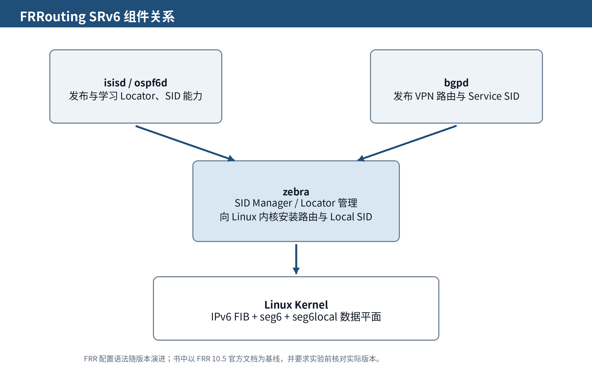
*图 15-1 FRRouting SRv6 组件关系*

## 15.2 Zebra Locator 基线

```frr
segment-routing
 srv6
  encapsulation
   source-address 2001:db8:1001:100::1
  exit
  locators
   locator LOC1
    prefix 2001:db8:1001:100::/64
   exit
  exit
 exit
!
```

## 15.3 IS-IS 关联 Locator

```frr
router isis CORE
 net 49.0001.0000.0000.0001.00
 is-type level-2-only
 segment-routing srv6
  locator LOC1
  interface sr0
 exit
!
interface eth1
 ip router isis CORE
 ipv6 router isis CORE
!
```

FRR 10.5 文档要求用于安装 SID 的 dummy 接口预先创建，默认名称可为 sr0。

```bash
ip link add sr0 type dummy
ip link set sr0 up
```

## 15.4 验证命令

```frr
show segment-routing srv6 manager
show segment-routing srv6 locator
show isis segment-routing srv6 node
show ipv6 route
show running-config
```

## 15.5 技术评审说明

> **注意｜不提供未经验证的厂商 CLI**  不同厂商、版本和许可证下的 SRv6 命令差异很大。本书删除了会话中未能以正式版本文档验证的具体华为命令，只保留标准模型和 FRR 官方文档可核对的命令骨架。生产配置必须以设备版本对应的命令参考为准。

## 本章总结

- Zebra 管理 Locator/SID 并写入内核。
- IGP 发布 Locator 与能力，BGP 发布业务路由和 Service SID。
- show 命令与版本文档是控制面排障起点。

## 章末练习

1. 画出 bgpd、isisd、zebra 和 Linux Kernel 的消息关系。
2. 如果 Zebra 未运行，自动 Service SID 分配会发生什么？
3. 比较静态 namespace 实验与 FRR 动态控制面的学习价值。

# 第5部 生产设计、运维与演进

# 第16章 生产架构、安全与权限

## 学习目标

- 设计 SRv6 域边界
- 实施最小权限、源验证与扩展头策略
- 建立配置、变更和密钥治理

## 16.1 受信任域模型

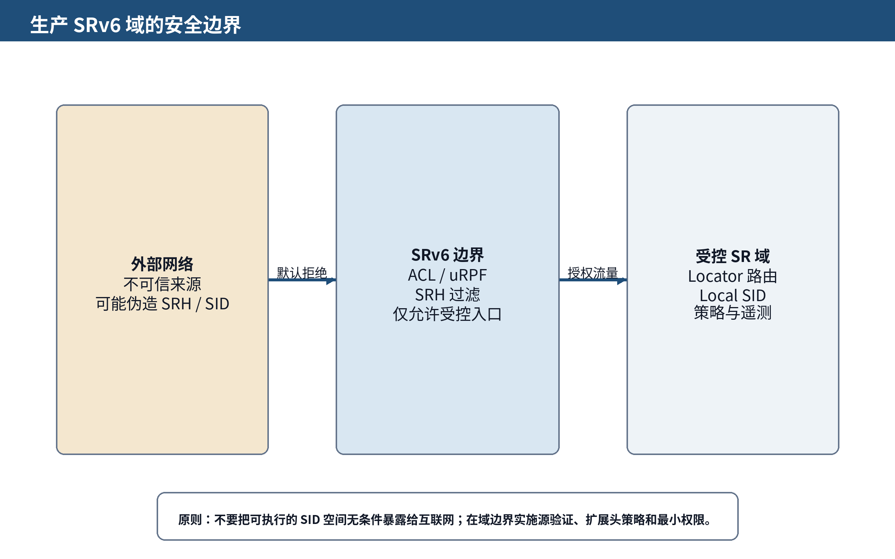
*图 16-1 生产 SRv6 域的安全边界*

SRH 和 SID 可以表达可执行网络指令，因此入口信任比普通目的地址转发更敏感。生产网络应明确哪些节点可以作为 Headend、哪些接口允许进入带 SRH 报文、哪些 SID 仅在域内可达。

## 16.2 边界控制

- 在外部边界默认拒绝未经授权的 SRH 和基础设施 SID。
- 实施源地址验证、uRPF 或等效策略，降低伪造 Headend 风险。
- 把 Locator 与 Service SID 前缀纳入 ACL、RTBH 和监控。
- 限制控制器、PCE、NETCONF/gNMI 和路由协议的管理权限。
- 对配置变更、Policy 下发和 SID 分配保留审计记录。

## 16.3 密钥与 HMAC

SRH 支持可选 HMAC TLV，但是否使用取决于威胁模型和设备支持。HMAC 不是替代边界过滤、源验证和控制面认证的万能机制。若使用，必须管理密钥生命周期、轮换、算法和跨设备一致性。

## 16.4 配置管理

**表 16-1 变更治理**

|对象|建议|
|---|---|
|Locator/SID 规划|代码化注册表，合并前审查冲突|
|路由策略|模板化并进行静态检查|
|设备配置|版本控制、审批、分批发布|
|控制器 API|最小权限 Token，短期凭证|
|回滚|保留前一版本与业务验证脚本|
|审计|记录谁在何时改变了哪个 Policy|

## 本章总结

- SRv6 入口与 SID 空间必须被视为受控执行面。
- 边界过滤、源验证和管理面权限不可缺失。
- HMAC 只能解决部分完整性问题。

## 章末练习

1. 制定一个“允许哪些接口接收 SRH”的策略。
2. 列出控制器 Token 的最小权限要求。
3. 为什么 Service SID 注册表属于安全资产？

# 第17章 OAM、监控与分层故障排查

## 学习目标

- 使用 ping/traceroute、计数器和抓包联合排障
- 建立六层故障树
- 设计持续探测与告警

## 17.1 OAM 原则

RFC 9259说明现有 IPv6 ping 和 traceroute 可以用于 SRv6 OAM，包括验证 SID 可达和本地安装。生产运维不能只依赖“路由协议邻居正常”，还要观察 Policy 状态、Local SID 计数、业务探测、丢包、时延和 MTU 事件。

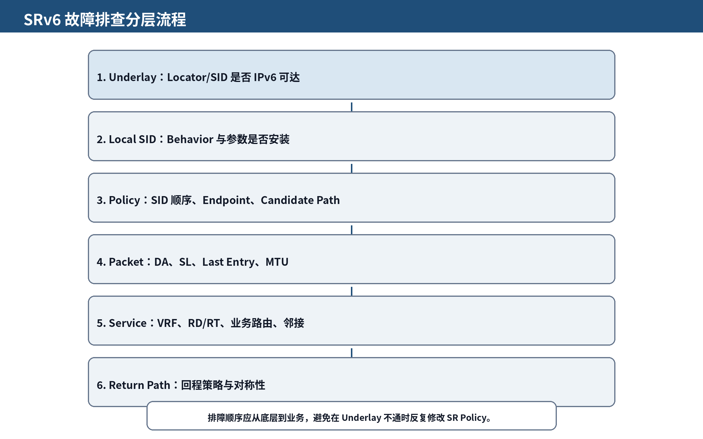
*图 17-1 SRv6 分层故障排查流程*

## 17.2 六层排障法

**表 17-1 分层排障清单**

|层次|核心问题|示例命令/数据|
|---|---|---|
|Underlay|Locator/SID 是否可达|ip -6 route get、ping6、IGP LSDB|
|Local SID|行为是否安装且参数正确|ip -s -6 route、show locator|
|SR Policy|候选路径是否有效|show policy、控制器状态|
|Packet|DA/SL/SRH/MTU 是否正确|tcpdump、Wireshark|
|Service|VRF、RT、邻接和业务路由|show bgp vpn、VRF RIB|
|Return Path|回程是否可达/对称|反向 traceroute、双向抓包|

## 17.3 监控指标

- 每条 SR Policy 的有效状态、切换次数和当前 Candidate Path。
- Local SID 成功包、字节和错误包计数。
- Locator 路由数量、收敛时延和邻居状态。
- 按业务 SLA 统计丢包、时延、抖动与可用性。
- ICMPv6 Packet Too Big、参数错误和扩展头丢弃。
- 设备慢路径、CPU、ASIC 资源和扩展头解析异常。

## 17.4 故障演练

1. 关闭主链路，验证备 Candidate Path。
2. 删除一个 Local SID，确认告警能定位端点。
3. 制造 RT 导入错误，验证 VPN 路由与数据面差异。
4. 降低链路 MTU，验证 PMTU 监控。
5. 恢复配置并确认业务、策略和计数全部回到基线。

## 本章总结

- SRv6 排障必须从 Underlay 到业务逐层推进。
- 控制面 Up 不等于业务可用。
- 持续探测和故障演练比事后抓包更重要。

## 章末练习

1. 为本书综合实验设计 10 个监控指标。
2. 如何区分 Local SID 未命中和 VRF 路由缺失？
3. 为什么回程路径应单独验证？

# 第18章 高可用、升级、备份与灾难恢复

## 学习目标

- 规划控制面和数据面冗余
- 制定混合版本升级与回滚
- 把地址、策略和配置纳入灾难恢复

## 18.1 高可用对象

**表 18-1 高可用对象与措施**

|对象|主要风险|措施|
|---|---|---|
|Headend|单点或策略错误|双归属、策略校验、分批下发|
|IGP|邻居/LSDB 故障|BFD、快速重路由、过载位|
|SR Policy|主候选失效|独立备路径、回切抑制|
|Service Endpoint|VRF/服务实例故障|多 PE、多实例、Anycast/负载分配|
|控制器|错误集中放大|集群、审批、限速、紧急断开|
|配置仓库|丢失或篡改|异地备份、签名、访问控制|

## 18.2 升级流程

1. 盘点设备、内核、FRR 与 Behavior 支持矩阵。
2. 在实验室重放生产配置和抓包。
3. 先升级非关键节点并观察扩展头、MTU 和控制面兼容。
4. 保持旧路径和回滚配置可用。
5. 逐域升级，避免同时改变 IGP、BGP、SID 规划和控制器。
6. 完成后进行端到端验收和文档更新。

## 18.3 数据库与配置状态

SRv6 网络的关键状态不仅在设备配置，还包括 SID 注册表、Color/Policy 目录、控制器数据库、BGP 路由策略和监控基线。设备回滚不能替代控制器数据库恢复；同样，恢复数据库也不保证设备已经回到一致状态。灾难恢复要定义权威源和重建顺序。

## 18.4 备份清单

- 设备运行配置和启动配置。
- Locator、SID、VRF、RD/RT 与 Color 注册表。
- 控制器/PCE 数据库与证书。
- FRR 配置、系统 sysctl、路由表和版本信息。
- 验证脚本、抓包样本和验收结果。
- 官方版本文档和已知限制记录。

## 本章总结

- 高可用不仅是双设备，还包括策略、控制器和状态源。
- 升级要控制变量并保留旧路径。
- 灾难恢复必须明确权威源和重建顺序。

## 章末练习

1. 设计一个两阶段 FRR 升级计划。
2. 为什么只备份设备配置不够？
3. 制定控制器不可用时的降级策略。

# 第19章 压缩 SRv6 与标准演进

## 学习目标

- 理解 RFC 9800 的压缩目标
- 区分标准 RFC 与 Internet-Draft
- 制定采用新 Flavor 的评审步骤

## 19.1 为什么需要压缩

传统 SID 每项 128 bit，严格路径或长服务链会增加显著开销。RFC 9800于 2025 年发布，定义压缩 SRv6 Segment List 编码以及配套 Endpoint Flavor，并更新 RFC 8754，允许 SRH 条目使用规定的 REPLACE-CSID 容器。

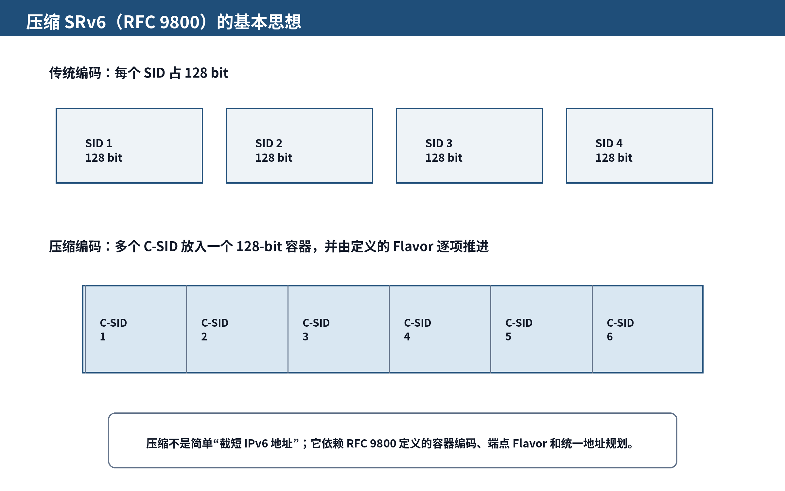
*图 19-1 压缩 SRv6 的基本思想*

## 19.2 采用前的检查

**表 19-1 压缩 SRv6 采用检查**

|项目|检查内容|
|---|---|
|标准状态|确认是 RFC 还是仍为 Internet-Draft|
|设备支持|芯片、软件、控制面和 OAM 是否一致|
|地址规划|Locator Block、Node/Function 长度是否统一|
|互通|跨厂商、跨域和非压缩节点行为|
|可观测性|抓包工具、监控和人员是否能解释容器|
|回滚|能否恢复传统 128-bit SID Policy|

## 19.3 RFC 与草案的区别

Internet-Draft 没有正式标准地位，内容会变化或过期。生产设计可以评估草案，但必须明确风险和版本；书末官方索引优先列 RFC 和正式项目文档。对于 2026 年仍在推进的地址建议草案，本书只作为趋势提示，不把其参数写成生产标准。

## 19.4 渐进采用

1. 先建立传统 SRv6 可工作的基线。
2. 选择一个封闭域验证压缩行为。
3. 确认控制面通告、数据面、抓包和 OAM 全链路支持。
4. 做混合节点、故障和 MTU 对比测试。
5. 经变更评审后逐域启用，并保留传统 Policy 回滚。

## 本章总结

- RFC 9800解决长 Segment List 的编码开销。
- 压缩依赖容器、Flavor 和统一规划，不是简单缩短地址。
- 新标准采用必须完成互通、OAM 和回滚评审。

## 章末练习

1. 传统 6 条 SID 与压缩容器的开销差异应如何测量？
2. 为什么工具链支持与设备支持同样重要？
3. 列出判断一份 IETF 文档是否适合生产引用的步骤。

# 第20章 综合实验、故障演练与验收

## 学习目标

- 把 Underlay、Policy、VPN 与 OAM 串成闭环
- 完成主备路径和双 VRF 验证
- 使用可量化标准验收

## 20.1 综合架构

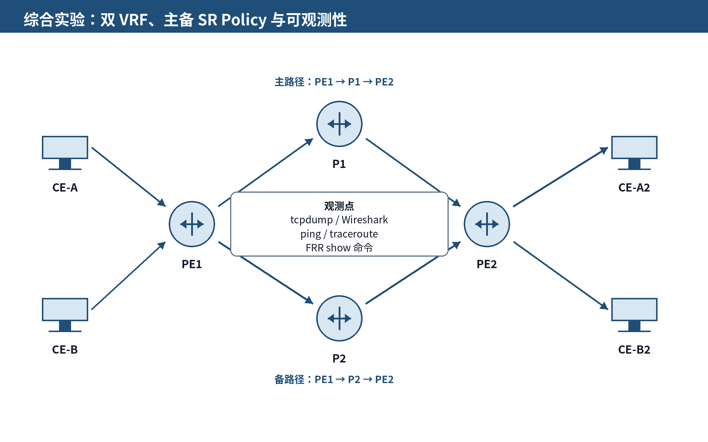
*图 20-1 双 VRF、主备 SR Policy 与可观测性综合实验*

## 20.2 实验任务

1. 建立 PE1—P1/P2—PE2 双路径 IPv6 Underlay。
2. 为 P1、P2 和 PE2 规划 Locator 与 Local SID。
3. 建立 BLUE 与 GREEN 两个 VRF，分别分配 End.DT6 Service SID。
4. 配置主路径经 P1、备路径经 P2 的 Candidate Path。
5. 通过 BGP VPN 或静态映射把 CE 前缀关联到 Service SID。
6. 在入口、P1/P2、PE2 和 CE 侧布置抓包与探测。
7. 执行链路、SID、RT、MTU 和回程五类故障。

## 20.3 故障演练矩阵

**表 20-1 综合故障演练**

|编号|注入故障|预期现象|通过标准|
|---|---|---|---|
|F1|关闭主路径链路|Policy 切换到备路径|业务在目标时间内恢复|
|F2|删除 PE2 Service SID|到达 PE2 后错误计数增加|告警指出 Local SID 缺失|
|F3|错误 RT|BGP 路由未导入|VRF RIB 与 VPN RIB 差异可解释|
|F4|降低一段 MTU|大包失败、小包正常|捕获 Packet Too Big 或定位黑洞|
|F5|删除回程路由|去程计数正常但会话失败|双向抓包确认回程中断|

## 20.4 验收清单

- 所有 Locator 在 Underlay 中可达且能聚合。
- Local SID 行为、参数和计数符合设计。
- 主备 SR Policy 状态、Preference 和切换满足 SLA。
- BLUE/GREEN VRF 完全隔离，无路由泄露。
- 抓包能解释 DA、SL、Last Entry 与内层地址。
- 大包、异常扩展头和边界未授权流量按策略处理。
- 配置、注册表、脚本、基线与恢复步骤已归档。

## 20.5 考核建议

学习者应在不查看答案的情况下，完成拓扑搭建、解释一次完整抓包、修复至少三类故障，并提交设计说明、配置、验证结果和回滚步骤。仅能执行命令但无法解释报文变化，不视为通过。

## 本章总结

- 综合实验要求控制面、数据面、业务和运维闭环。
- 故障注入是验证设计而不是破坏环境。
- 验收必须可量化、可复现、可回滚。

## 章末练习

1. 独立完成综合实验并记录每个故障的时间线。
2. 将静态 Segment List 改为 FRR IGP/BGP 动态通告。
3. 撰写一份生产变更单，包括风险、验证和回滚。

# 第6部 附录与参考

# 第21章 常用命令速查

## 学习目标

- 快速定位 Linux、FRR 和 Wireshark 命令
- 避免在生产中盲目执行破坏性命令

## 21.1 Linux

**表 21-1 Linux SRv6 速查**

|目的|命令|
|---|---|
|查看 IPv6 路由|ip -6 route show|
|查看带计数的 Local SID|ip -s -6 route show|
|查询到 SID 的路径|`ip -6 route get <SID>`|
|查看 namespace|ip netns list|
|进入 namespace|`ip netns exec <ns> bash`|
|开启 forwarding|sysctl -w net.ipv6.conf.all.forwarding=1|
|抓包|`tcpdump -ni <if> -s 0 -w file.pcap ip6`|

## 21.2 FRR

```frr
show segment-routing srv6 manager
show segment-routing srv6 locator
show isis segment-routing srv6 node
show ipv6 route
show bgp ipv6 vpn
show running-config
```

## 21.3 Wireshark

```text
ipv6.routing.type == 4
ipv6.routing.segleft == 0
ipv6.routing.srh.last_entry == 2
ipv6.dst == 2001:db8:400::100
```

> **注意｜速查不等于操作授权**  任何 add/del、sysctl、VRF 和路由协议修改，都应先确认设备、namespace 和变更窗口。

## 本章总结

- 先 show，再 change。
- 用计数器和抓包验证，不依赖单一输出。

## 章末练习

1. 为自己的设备补充对应 show 命令。

# 第22章 术语表

## 学习目标

- 统一全书术语
**表 22-1 SRv6 术语表**
|术语|解释|
|---|---|
|Active Segment|当前活动 Segment，位于 IPv6 目的地址。|
|Behavior|本地 SID 命中后执行的端点行为。|
|Binding SID|代表一条 SR Policy 或指令集合的 Segment。|
|Candidate Path|SR Policy 的候选路径。|
|Color|用于标识策略意图的数值。|
|Endpoint|拥有并处理本地 SID 的节点。|
|Headend|选择 Policy 并封装/插入 SRH 的入口。|
|Locator|将 SID 路由到节点或节点集合的 IPv6 前缀。|
|Local SID|本节点安装并绑定行为的 SID。|
|Segment|拓扑或服务指令。|
|Segment List|有序 Segment 序列。|
|Service SID|与 VPN、邻接或服务行为关联的 SID。|
|SID|Segment Identifier。|
|SRH|IPv6 Segment Routing Header，Routing Type 4。|
|SR Policy|把流量引入一组 Candidate Path 的策略。|
|Transit Node|仅转发到当前 DA、不执行本地 SID 的节点。|
|VRF|独立的虚拟路由与转发表。|

## 本章总结

- 遇到厂商术语时先映射到标准对象。

## 章末练习

1. 任选五个术语画出关系图。

# 第23章 技术复核清单与参考答案

## 学习目标

- 用于定稿和自测

## 23.1 技术复核清单

- 是否把 SRv6 描述为 MPLS 的可选替代，而非必然替代。
- 是否明确当前 SID 位于 IPv6 DA，SRH 不一定存在。
- 是否正确解释 Segment List 索引、Segments Left 和 Last Entry。
- 是否明确 End.DT6 会解封装并查内层 IPv6 表。
- 是否区分 DX 固定邻接与 DT 路由表查找。
- 是否计算 MTU、ASIC 解析深度和扩展头策略。
- 是否区分 RFC 标准、项目官方文档和 Internet-Draft。
- 是否标明 Linux/FRR 命令的版本基线与权限风险。
- 是否包含回程、监控、备份和回滚。

## 23.2 练习参考答案与实验提示

章末练习多为开放题，以下给出判分要点：概念题必须说明对象和处理阶段；设计题必须包含故障、回程、MTU 与安全；实验题必须给出可复现命令、抓包或计数器证据。

**表 23-1 重点题参考要点**

|章节|参考要点|
|---|---|
|第4章|三 SID：Last Entry=2；执行从索引2推进到0。|
|第6章|End.DT6：外层终结→内层 IPv6→指定表查找。|
|第7章|5 SID Encaps 基础开销：40+8+80=128 B。|
|第10章|RD 使重叠前缀唯一；RT 控制 VPN 路由导入导出。|
|第13章|改 End.DT6 需 VRF、表号、strict_mode、VRF 路由与 Service SID。|
|第17章|Local SID 未命中：计数不增/路由缺失；VRF 路由缺失：SID 计数增但业务无下一跳。|

## 23.3 三轮评审结论

**表 23-2 定稿评审结果**

|轮次|范围|结果|
|---|---|---|
|第一轮：内容|结构、重复、术语、学习顺序|已重构为 6 部 24 章；删除对话式重复和未经验证的简化说法|
|第二轮：技术|RFC、Linux、FRR、命令、安全|修正 End.DT6、SRH 必然存在、核心完全无状态等问题；命令以官方文档为基线|
|第三轮：排版|页面、代码、图表、字体|按 185×260 mm 排版，图像 300 DPI，完成逐页渲染和预检|

## 本章总结

- 复核清单应在每次版本升级时重新执行。

## 章末练习

1. 选择一章进行独立技术复核并提出修订。

# 第24章 官方资料索引与结语

## 学习目标

- 建立持续学习入口

## 24.1 核心 RFC

**表 24-1 IETF/RFC 官方资料**

|文档|主题|链接|
|---|---|---|
|RFC 8200|Internet Protocol, Version 6 (IPv6) Specification|<https://www.rfc-editor.org/info/rfc8200>|
|RFC 8402|Segment Routing Architecture|<https://www.rfc-editor.org/info/rfc8402>|
|RFC 8754|IPv6 Segment Routing Header (SRH)|<https://www.rfc-editor.org/info/rfc8754>|
|RFC 8986|SRv6 Network Programming|<https://www.rfc-editor.org/info/rfc8986>|
|RFC 9252|BGP Overlay Services Based on SRv6|<https://www.rfc-editor.org/info/rfc9252>|
|RFC 9256|Segment Routing Policy Architecture|<https://www.rfc-editor.org/info/rfc9256>|
|RFC 9259|OAM in SRv6|<https://www.rfc-editor.org/info/rfc9259>|
|RFC 9352|IS-IS Extensions for SRv6|<https://www.rfc-editor.org/info/rfc9352>|
|RFC 9513|OSPFv3 Extensions for SRv6|<https://www.rfc-editor.org/info/rfc9513>|
|RFC 9602|SRv6 SIDs in the IPv6 Addressing Architecture|<https://www.rfc-editor.org/info/rfc9602>|
|RFC 9800|Compressed SRv6 Segment List Encoding|<https://www.rfc-editor.org/info/rfc9800>|
|RFC 9819|Argument Signaling for BGP SRv6 Services|<https://www.rfc-editor.org/info/rfc9819>|

## 24.2 软件官方文档

**表 24-2 软件与工具官方资料**

|项目|主题|链接|
|---|---|---|
|iproute2|ip-route(8) seg6/seg6local|<https://git.kernel.org/pub/scm/network/iproute2/iproute2.git/>|
|Linux Kernel|Networking / seg6 相关实现与 sysctl|<https://www.kernel.org/doc/>|
|FRRouting 10.5|IS-IS SRv6|<https://docs.frrouting.org/en/stable-10.5/isisd.html>|
|FRRouting latest|Zebra SRv6 Manager 与 BGP L3VPN SRv6|<https://docs.frrouting.org/en/latest/>|
|Wireshark|IPv6 Routing Header display filters|<https://www.wireshark.org/docs/dfref/i/ipv6.routing.html>|

## 24.3 结语

SRv6 最难的地方不是记住命令，而是同时理解地址、报文、行为、控制面和业务状态。学习时应反复执行三个动作：画出报文当前 DA 与 SL，指出本节点命中的 Local SID 行为，再说明处理后由哪个表或邻接决定下一跳。只要这条链条能讲清楚，复杂 VPN、服务链和多域 Policy 都可以逐层拆解。

完成本书后，建议从本地 namespace 实验开始，逐步加入 FRR IGP、BGP VPN、主备 Policy 和自动化验证。任何生产部署都必须以设备版本的正式文档、互通测试和组织变更流程为准。

## 本章总结

- 从报文出发，用行为解释转发，用控制面解释状态来源。
- 标准、实现和生产设计必须分别验证。

## 章末练习

1. 完成第20章综合实验并形成自己的实验报告。
