# Codex 橙皮书：从安装到实战案例的全链路使用指南

> 非官方开源指南 · 持续更新版  
> 写给开发者、独立开发者和 AI 工具重度用户的 Codex 使用手册。

| 版本 | 最后校验 | 资料性质 |
| --- | --- | --- |
| v0.1.0 | 2026-06-22 | 非官方指南，不代表 OpenAI 官方文档或产品承诺 |

> 本文以 2026-06-22 可访问的 Codex App、Codex CLI、Codex IDE Extension、Codex Web / Cloud 公开能力和实测界面为参考。Codex 更新很快，安装方式、模型名称、额度、入口位置和命令参数都可能变化；涉及具体功能和价格时，请以 OpenAI 官方文档、Codex 当前版本和你账号实际显示为准。  
> CC Switch、DeepSeek 等第三方工具和模型接入方案仅作为扩展方法记录，不属于 OpenAI 官方功能。

## 阅读入口

> 本仓库是集成到 mybooks 多书管理系统的一部分。

- [在线阅读](https://jincaiw.github.io/mybooks/4.codex橙皮书/)
- [下载 PDF](https://github.com/jincaiw/mybooks/releases/latest)
- [原始仓库](https://github.com/jincaiw/codex-orange-book)

## 目录

- [0. 使用说明](#0-使用说明)
  - [0.1 重要声明](#01-重要声明)
  - [0.2 这份 PDF 适合谁](#02-这份-pdf-适合谁)
  - [0.3 阅读路线](#03-阅读路线)
- [第一篇：先搞懂 Codex 是什么](#第一篇先搞懂-codex-是什么)
  - [Codex 基础认知](#codex-基础认知)
  - [Codex 的使用入口](#codex-的使用入口)
- [第二篇：安装、配置与环境准备](#第二篇安装配置与环境准备)
  - [安装前准备](#安装前准备)
  - [Codex App 安装与上手 （新手最为推荐，也是功能最强的）](#codex-app-安装与上手-新手最为推荐也是功能最强的)
  - [Codex CLI 安装与上手](#codex-cli-安装与上手)
  - [Codex IDE Extension](#codex-ide-extension)
  - [Codex Web](#codex-web)
- [第三篇：核心功能详解](#第三篇核心功能详解)
  - [自动化](#自动化)
  - [插件](#插件)
  - [Skill](#skill)
  - [MCP](#mcp)
  - [代码管理 （Git 与 GitHub 工作流）](#代码管理-git-与-github-工作流)
  - [云端运行](#云端运行)
  - [记忆系统](#记忆系统)
- [第四篇：标准工作流](#第四篇标准工作流)
  - [从需求到交付的完整链路](#从需求到交付的完整链路)
  - [Codex 任务模板库](#codex-任务模板库)
- [第五篇：实战案例库](#第五篇实战案例库)
  - [实战案例一：制作一个宠物零食售卖的前端页面网站](#实战案例一制作一个宠物零食售卖的前端页面网站)
  - [实战案例二：给宠物零食网站增加功能和优化页面](#实战案例二给宠物零食网站增加功能和优化页面)
  - [实战案例三：制作宠物零食的管理后台](#实战案例三制作宠物零食的管理后台)
  - [实战案例四：制作宠物零食品牌招商 PPT](#实战案例四制作宠物零食品牌招商-ppt)
  - [实战案例五：制作宠物零食宣传视频](#实战案例五制作宠物零食宣传视频)
- [附录](#附录)
  - [附录 A：第三方模型接入](#附录-a第三方模型接入)

## 0. 使用说明

### 0.1 重要声明

- 本资料为非官方指南，不代表 OpenAI 官方文档。
- 所有功能以 OpenAI 官方文档和 Codex 实际版本为准。
- 本 PDF 会随着 Codex 更新持续维护。
- 建议读者优先查看 GitHub 仓库中的最新版 Markdown 原稿。

### 0.2 这份 PDF 适合谁

- 完全没用过 Codex，但想系统上手的人。
- 会写代码，但不知道怎么把 Codex 接入真实项目的人。
- 已经用过 Cursor、Claude Code、ChatGPT，想比较 Codex 工作流的人。
- 独立开发者、AI 工具博主、技术团队负责人。
- 想搭建 AI 编程工作流、知识库和自动化流程的人。

### 0.3 阅读路线

- **快速上手路线**：0. 使用说明 → 第一篇：先搞懂 Codex 是什么 → 第二篇：安装、配置与环境准备 → 第四篇：标准工作流 → 第五篇：实战案例库
- **开发者核心路线**：第一篇：先搞懂 Codex 是什么 → 第二篇：安装、配置与环境准备 → 第三篇：核心功能详解 → 第四篇：标准工作流
- **进阶扩展路线**：第三篇：核心功能详解 → 第四篇：标准工作流 → 附录：第三方模型接入

---

## 第一篇：先搞懂 Codex 是什么

### Codex 基础认知

#### Codex 到底是什么

很多人第一次听到 Codex，会下意识把它理解成“又一个 AI 写代码工具”。

但如果只把 Codex 当成“帮我写代码的 ChatGPT”，你很容易低估它。

Codex 真正重要的地方，不是它能不能写一个函数、补一段代码、解释一个报错，而是它代表了 AI 编程工具的一次角色变化：

以前，AI 是坐在你旁边帮你补代码的人。

后来，AI 是在编辑器里和你一起改代码的人。

现在，Codex 更像是一个可以被交代任务的工程执行者。

它不只是回答你“这段代码怎么写”，而是可以进入一个项目，读取文件，理解上下文，制定计划，修改代码，运行命令，检查结果，最后把改动整理成可以 review 的结果。

这就是 Codex 和普通 AI 聊天工具最大的区别。

---

##### 五年变了四次

<p align="center">
  
</p>

**AI 编程工具的四次进化**

过去几年，AI 编程工具大致经历了四个阶段。

**2021 年：Copilot 补全时代。**
Codex 这个名字第一次被大量开发者听到，是因为 GitHub Copilot。那时 AI 主要负责代码补全：你写开头，它补后面；你写函数名，它补函数体。它像一个更聪明的输入法，能让你写得更快，但项目怎么拆、文件怎么找、测试怎么跑，仍然主要靠人完成。

**2022 年：ChatGPT 对话时代。**
ChatGPT 出现后，AI 编程从“补全”进入“对话”。你可以直接问它报错原因、代码优化、接口写法、项目结构解释。AI 从输入法变成了问答伙伴。但它通常不在真实项目里，你需要复制代码、粘贴报错、手动补上下文，再把答案搬回项目。

**2023—2024 年：Cursor 项目协作时代。**
Cursor 这类 AI 编辑器让 AI 真正进入编辑器，能看到文件、修改函数、跨文件重构、根据项目上下文完成一部分开发任务。AI 开始从“回答问题”变成“协助修改项目”。但它大多数时候仍依附在 IDE 里，你还需要盯着它改、判断下一步、跑测试、整理提交。

**2025 年：Codex 工程 Agent 时代。**
Codex 重新出现后，已经不只是当年负责代码补全的模型，而是面向真实软件工程任务的 coding agent。它能读项目、解释代码、修 bug、加功能、补测试、重构模块、运行命令、检查 diff、整理 PR 说明，甚至并行处理多个工程任务。

这意味着，AI 编程工具的重点正在从“帮你写代码”转向“帮你交付任务”。

一句话总结：

**Copilot 帮你补代码，ChatGPT 帮你想代码，Cursor 陪你改项目，而 Codex 开始帮你执行工程任务。**

---

#### Codex 能做什么

**What Codex Can Do**

<p align="center">
  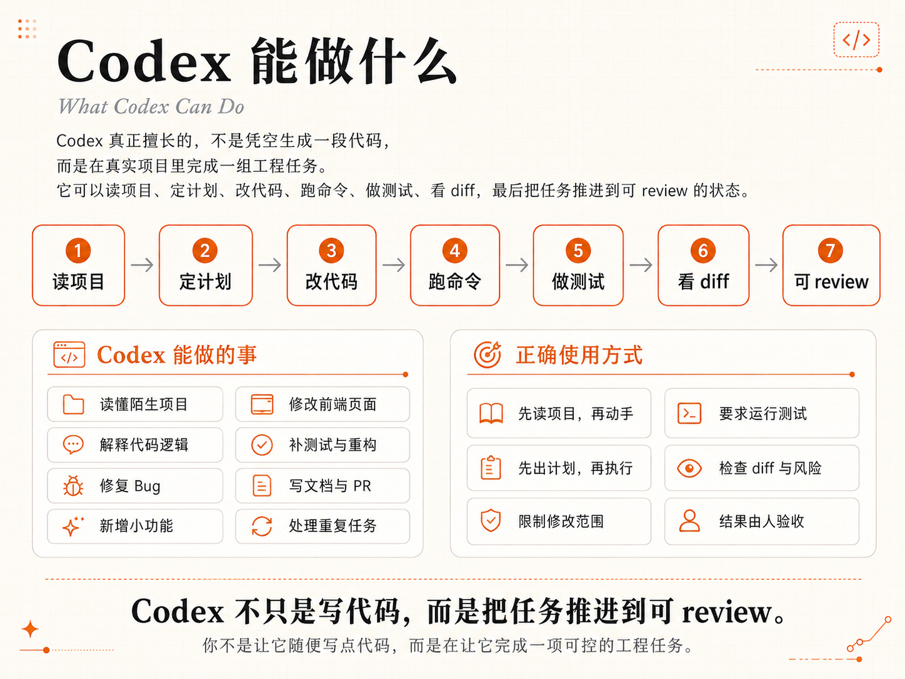
</p>

很多人第一次用 Codex，会直接问：

- “帮我写一个登录页面。”
- “帮我修一下这个 bug。”
- “帮我做一个项目。”

这些当然可以，但还不够准确。

Codex 真正擅长的，不是凭空生成一段代码，而是在真实项目里完成一组工程任务。

它可以读项目、找文件、理解上下文、制定计划、修改代码、运行命令、检查结果、整理 diff，最后把任务推进到可以 review 的状态。

所以，不要把 Codex 当成一个“代码生成按钮”。

更准确地说：

**Codex 是一个可以进入项目现场的 AI 工程助手。**

它能做的事，大致可以分成以下几类。

---

##### 读懂一个陌生项目

使用 Codex 的第一步，不应该是让它直接写代码，而是让它先读项目。

它可以帮你快速搞清楚：

- 项目用什么技术栈。
- 入口文件在哪里。
- 核心模块在哪里。
- 测试和构建命令是什么。
- 哪些文件不能随便动。

很多 Codex 任务失败，不是因为它不会写代码，而是因为它还没理解项目，就被要求直接动手。

---

##### 解释代码和梳理逻辑

Codex 可以帮你解释看不懂的代码。

比如：

- 这个函数是做什么的。
- 这个组件为什么这样写。
- 接口调用链路是什么。
- 状态从哪里来。
- 这个 bug 可能和哪些文件有关。

它不只是解释单个函数，还可以结合上下文，梳理模块关系、数据流和潜在风险。

这对接手旧项目尤其有用。

---

##### 修 bug 和加功能

Codex 很适合处理边界清楚的开发任务。

比如：

- 修复一个可复现 bug。
- 新增一个设置页。
- 新增一个表单校验。
- 新增一个接口。
- 新增一个导出按钮。
- 优化一个前端页面。

但不要直接把一个大项目丢给它。

更好的方式是把任务拆小：

1. 先读项目。
2. 再出方案。
3. 只改一个模块。
4. 跑测试。
5. 看 diff。
6. 确认没问题后再继续。

Codex 更适合连续完成小任务，而不是一次吞下大项目。

---

##### 写测试、做重构

Codex 可以帮你补测试，也可以帮你重构代码。

它可以做：

- 补单元测试。
- 补边界条件。
- 补异常场景。
- 提取重复逻辑。
- 拆分过长函数。
- 整理组件结构。
- 封装 API 请求。

但这类任务必须加边界：

- 不改业务逻辑。
- 不改公共 API。
- 不引入无关依赖。
- 不大范围重构。
- 修改后必须跑测试。

Codex 能重构，但你必须控制范围。

---

##### 写文档和整理 PR

Codex 很适合写工程文档。

比如：

- README。
- 安装说明。
- 启动说明。
- 接口文档。
- 环境变量说明。
- 项目结构说明。
- PR 描述。
- commit message。
- 更新日志。

文档不是附属品。

在 Codex 工作流里，文档本身就是上下文基础设施。

文档越清楚，后续人和 AI 接手项目都会更轻松。

但要提醒 Codex：

**不要编造不存在的命令，不确定的信息要明确标注。**

---

##### 跑命令、看 diff、做 review

Codex 和普通聊天工具最大的区别之一，是它可以在项目环境里运行命令。

它可以：

- 运行测试。
- 运行 lint。
- 运行 typecheck。
- 运行 build。
- 查看 git status。
- 查看 git diff。
- 搜索代码。
- 检查修改结果。

这让 Codex 不只是“猜答案”，而是可以验证结果。

但命令执行也有风险。

能验证的，可以让它验证。

有风险的，必须由你批准。

涉及生产环境、数据库、真实用户数据的操作，不要交给它自动执行。

---

##### 什么时候适合用 Codex

适合 Codex 的任务，一般有几个特点：

- 目标明确。
- 范围可控。
- 上下文清楚。
- 结果能验证。
- 失败能回滚。
- 风险可接受。

比如：

- 读项目。
- 修 bug。
- 加小功能。
- 补测试。
- 写文档。
- 优化前端页面。
- 整理 PR。
- 审查 diff。
- 处理重复任务。

---

##### 什么时候不适合直接用 Codex

不建议直接让 Codex 处理：

- 生产数据库。
- 真实用户数据。
- 支付核心逻辑。
- 权限和安全核心模块。
- 大规模架构迁移。
- 没有备份的重要项目。
- 没有测试的核心业务。
- 你自己也无法验收的任务。

如果你判断不了结果对不对，就不要让 Codex 独立完成。

Codex 可以提高效率，但不能替你做判断。

---

##### 一句话总结

Codex 能做的事情，不只是写代码。

它真正重要的能力是：

**把一个明确的软件工程任务，从需求推进到可 review 的结果。**

你不是让它随便写点代码。

你是在让它按照你的项目规则、上下文和验收标准，完成一项可控的工程任务。

---

#### Codex 与 ChatGPT 的区别

很多人会问：

既然 ChatGPT 也能写代码，为什么还要用 Codex？

核心区别在于：

**ChatGPT 更像一个顾问，有问题问GPT，从它那里得到答案，然后自己去执行。那么现在Codex更像是一个实习生，我们能够真正的让它帮我们干活，交代任务能够完成这种。**

ChatGPT 适合帮你想问题。

Codex 适合帮你推进任务。

更合理的用法是：

**先用 ChatGPT 想清楚，再用 Codex 进项目执行。**

<p align="center">
  
</p>

#### Codex 与 Cursor 的区别

很多人会把 Codex 和 Cursor 放在一起比较，因为它们都能帮你写代码、改代码、理解项目。

但它们的定位并不一样。

**Cursor 更像一个 AI 编辑器，Codex 更像一个工程 Agent。**

合理的用法是组合使用：

**用 Cursor 做日常编码和局部修改，用 Codex 做任务推进和工程交付。**

Cursor 负责陪你写。

Codex 负责帮你跑完整任务。

一个偏 IDE 协作，一个偏 Agent 执行。

这就是它们最大的区别。

<p align="center">
  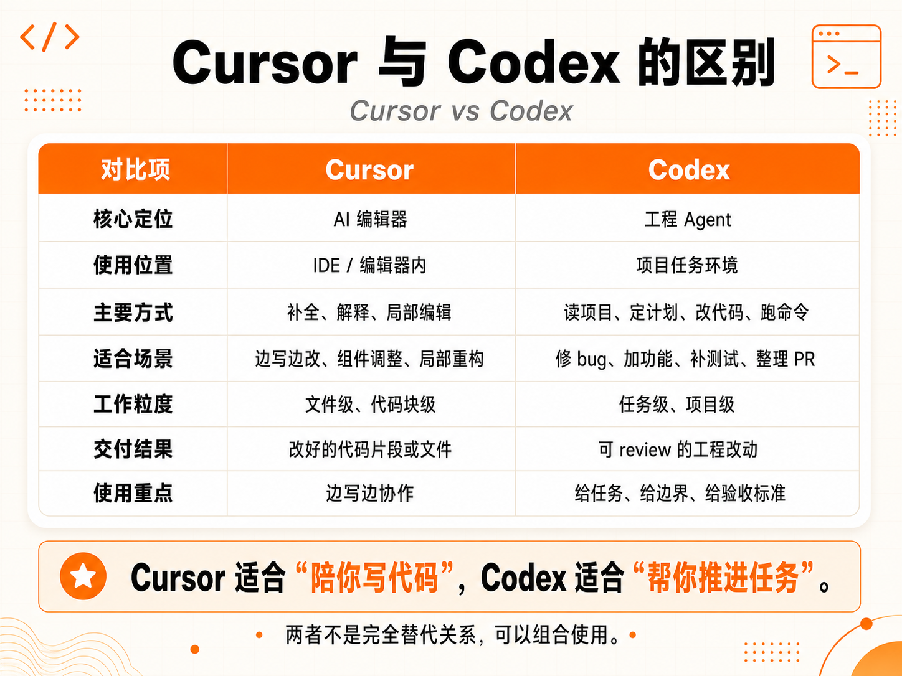
</p>

#### Codex 与 Claude Code 的区别

Codex 和 Claude Code 很像。

都是 **agentic coding 工具，**但两者的侧重点不一样。

---

##### Claude Code 更偏终端里的长期协作

Claude Code 的体验更像是：

你打开终端，把它放进项目里，然后和它围绕一个开发任务持续协作。

它适合：

- 长时间读项目。
- 持续追踪一个复杂任务。
- 在终端里边讨论边修改。
- 处理多步骤工程问题。
- 通过 hooks、subagents、MCP 等机制扩展工作流。

所以，Claude Code 更像一个长期待在你终端里的 AI 工程搭档。

它的优势在于命令行工作流、深度上下文协作和工程任务连续推进。

---

##### Codex 更偏 OpenAI 生态里的多端任务执行

Codex 的优势，不只在 CLI，而在 OpenAI 生态里的多端联动。

它可以通过不同入口使用：

Codex CLI。

Codex App。

Codex IDE Extension。

Codex Web。

ChatGPT 账号体系。

GitHub / PR 工作流。

Skills 和项目规则。

OpenAI 官方文档中，Codex CLI 是本地终端里的 coding agent；Codex App 则提供桌面端多线程、worktree、自动化和 Git 功能；Codex Skills 也可以在 CLI、IDE extension 和 Codex app 中复用。

所以，Codex 更像一个接入 OpenAI 生态的工程任务平台。

它不只是“在终端里写代码”，而是可以在 App、CLI、IDE、Web 等多个入口之间流转，让你用不同方式管理、执行和审查工程任务。

---

##### 怎么选

如果你更喜欢终端工作流，希望 AI 长时间待在项目里，和你围绕复杂任务持续协作，Claude Code 很适合。

如果你已经在使用 ChatGPT 和 OpenAI 生态，希望在 CLI、桌面 App、IDE、Web 之间切换，并把任务、diff、PR、Skills、GitHub 工作流串起来，Codex 会更顺手。

但两者没有绝对谁替代谁。

最终选择要看：

- 模型能力。
- 上下文处理。
- 工具链。
- 价格。
- 团队习惯。
- 你自己的开发流程。

一句话总结：

**Claude Code 更像终端里的长期工程搭档，Codex 更像 OpenAI 生态里的多端工程 Agent。**

<p align="center">
  
</p>

#### 一句话总结 Codex

- 初级用法：让它帮你写代码。
- 中级用法：让它帮你读项目、改功能、跑测试。
- 高级用法：让它成为你的项目执行代理，配合规则、上下文、自动化和团队流程工作。

---

### Codex 的使用入口

<p align="center">
  
</p>

如果你主要做本地项目、网页练习和日常开发，优先从 Codex App 开始通常就够用；等你熟悉 Git、终端和团队协作后，再逐步补 CLI、IDE Extension 和 Web / Cloud。

---

## 第二篇：安装、配置与环境准备

### 安装前准备

#### 账号准备

如果你是普通个人用户，建议准备：

- ChatGPT 账号
- 能正常访问 ChatGPT / OpenAI 服务的网络
- 选择当前包含 Codex 的 ChatGPT 套餐；套餐名称、额度和功能范围会变化，请以官方页面和你账号实际显示为准。

#### 系统准备

Codex 四大形态：

| 方式 | 适合谁 | 需要准备 |
| --- | --- | --- |
| Codex App 桌面版 | 小白、想要图形界面的人 | Windows 或 macOS |
| Codex CLI | 稍微懂终端的人 | 终端、Git、项目环境 |
| Codex IDE Extension 插件 | 用 VS Code / Cursor / Windsurf 的人 | 编辑器 + 插件 |
| Codex Web / Cloud | 想让 Codex 远程处理 GitHub 项目的人 | GitHub 仓库 |

Codex App 支持 **macOS 和 Windows**；Codex CLI 支持 macOS、Windows 和 Linux。

#### 软件工具准备

安装 Codex 之前，建议先准备这些基础工具：

| 工具 | 作用 | 下载 / 注册链接 |
| --- | --- | --- |
| Git | 让 Codex 能看代码变更、生成 diff、回滚修改 | Git 官方下载 |
| VS Code / Cursor | 方便查看和编辑代码 | VS Code 下载 / Cursor 下载 |
| 终端 | Windows 用 PowerShell；Mac 用 Terminal | 不用下载，系统自带 |
| 浏览器 | 登录 ChatGPT / OpenAI / GitHub | Chrome 下载 |
| Node.js | 做网页、前端、Next.js、Vite 项目常用 | Node.js 下载 |
| Python | 做脚本、自动化、数据处理常用 | Python 下载 |
| GitHub 账号 | 如果要用 Codex Cloud 或推送代码，需要准备 | GitHub 注册 |
| Codex App | Codex 桌面版，用图形界面管理任务和项目 | Codex App 官方页 |
| Codex CLI | 在终端里使用 Codex，适合真实项目开发 | Codex CLI 官方文档 |
| Codex 网页版 | 连接 GitHub 后，让 Codex 在云端处理项目 | Codex Web |

#### 项目目录准备

Codex 不是单纯聊天工具，它需要进入一个具体项目目录工作。官方入门流程也是：登录 Codex 后，选择电脑上的文件夹或 Git 仓库，再开始第一个任务。

建议你提前建一个专门练习目录，比如：

```text
D:\AI-Codex-Projects
```

里面可以放：

```text
hello-web
ai-tools-page
xiaohongshu-cover-tool
landing-page-demo
```

不要一开始就让 Codex 操作你最重要的真实项目。先用练习项目熟悉它怎么改文件、跑命令、生成结果。

#### 权限与安全准备

Codex 可以读取、修改文件，还能在你的项目目录里运行命令。官方对 CLI 的描述就是：它可以在你选择的目录中读取、修改代码，并运行命令。

所以安装前要注意：

| 注意点 | 建议 |
| --- | --- |
| 不要直接放重要文件 | 先用测试项目 |
| 不要把密码/API Key 写在代码里 | 用 .env 文件，并避免上传 |
| 操作前先 Git 提交 | 方便回滚 |
| 看清 Codex 要执行的命令 | 不懂的命令先问它解释 |
| 不要给它整个 C 盘权限 | 只选择具体项目文件夹 |

推荐每个项目先初始化 Git：

```text
git init
git add .
git commit -m "initial commit"
```

这样 Codex 改坏了也可以回退。

---

### Codex App 安装与上手 （新手最为推荐，也是功能最强的）

#### 下载与安装

##### macOS 安装

如果你使用的是 Mac，先确认自己的芯片类型。

点击电脑左上角的 Apple 图标，选择「关于本机」。

如果显示的是：

- Apple M1 / M2 / M3 / M4：选择 Apple Silicon 版本
- Intel：选择 Intel 版本

进入 Codex App 官方页面后，根据自己的芯片下载对应版本。下载完成后，打开安装包，把 Codex 拖进「应用程序」文件夹。

安装完成后，在「应用程序」里打开 Codex。

第一次打开时，系统可能会提示：

「这是从互联网下载的应用，是否确认打开？」

选择「打开」即可。

###### Intel Mac 与 Apple Silicon 的区别

Mac 主要分两种芯片：

| 类型 | 常见机型 | 应该下载 |
| --- | --- | --- |
| Apple Silicon | M1 / M2 / M3 / M4 Mac | Apple Silicon 版本 |
| Intel Mac | 老款 Intel 芯片 Mac | Intel 版本 |

最简单的判断方法：

打开「关于本机」，看芯片信息。

如果写的是 Apple M 系列，就是 Apple Silicon。

如果写的是 Intel Core i5、Intel Core i7、Intel Core i9，就是 Intel Mac。

这个地方不要选错。选错版本可能会导致无法安装、打不开，或者运行不稳定。

##### Windows 安装

如果你使用的是 Windows，进入 Codex App 官方页面，选择 Windows 版本。

Windows 版一般会跳转到 Microsoft Store 安装。

安装步骤：

1. 打开 [Codex App 官方页面](https://openai.com/zh-Hans-CN/codex/)
2. 点击 Windows 下载入口

<p align="center">
  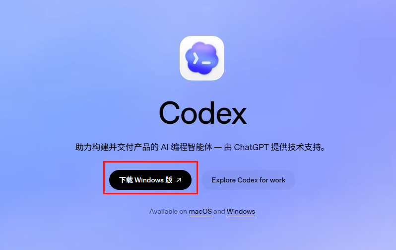
</p>

1. 跳转到 Microsoft Store

<p align="center">
  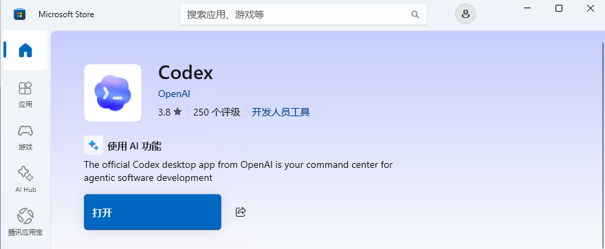
</p>

1. 点击「获取」或「安装」（这里我已经安装过了所以显示的是打开）
2. 打开 Codex App
3. 到这里Codex App已经安装完成

#### 第一次打开 Codex App

##### 选择项目目录

第一次打开 Codex App 后，登录完成，系统会让你选择一个项目目录。

这里的「项目目录」，可以理解成：

Codex 要进入哪个文件夹工作。

比如你想让 Codex 帮你做一个网页，就可以提前新建一个文件夹：

```text
hello-codex
```

然后在 Codex App 里选择这个文件夹。

新手建议第一次选择一个干净的练习目录，不要直接 C 盘，也不要一上来就选择重要工作项目。

推荐目录结构：

```text
AI-Codex-Projects
└── hello-codex
    └── index.html
```

选择项目目录后，Codex 才知道自己应该读哪些文件、改哪些文件、在哪个地方运行命令。

<p align="center">
  
</p>

##### 理解项目列表

进入 Codex App 后，左侧通常会看到项目列表。

你可以把项目列表理解成：

你交给 Codex 的不同代码文件夹。

比如：

```text
hello-codex
ai-first-page
```

每一个项目，都对应你电脑上的一个本地文件夹，或者一个 Git 仓库。

如果你之前在 Codex App、Codex CLI、Codex IDE Extension 里打开过项目，这些项目也可能会出现在列表里。

小白要记住一点：

项目列表不是聊天记录列表，而是「代码项目列表」。

你点进不同项目，Codex 看到的文件范围也不一样。

<p align="center">
  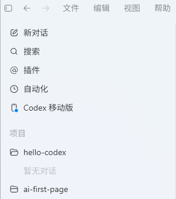
</p>

##### 理解 thread（对话）

Thread 可以理解成：

同一个项目里的一个任务对话。

比如你在 `hello-Codex` 这个项目里，可以开多个 thread：

```text
Thread 1：做一个首页
Thread 2：修复按钮点击无反应的问题
Thread 3：优化移动端样式
Thread 4：帮我写 README
```

<p align="center">
  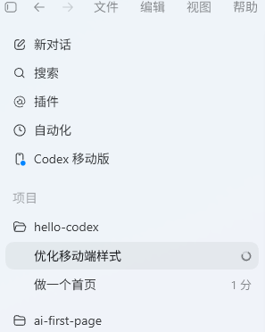
</p>

每个 thread 都有自己的上下文。

也就是说，你在 Thread 1 里让 Codex 做首页，它会围绕这个任务持续理解和修改。

你在 Thread 2 里让它修 bug，它就围绕另一个任务工作。

小白可以简单理解：

- 项目 = 一个公司
- thread = 公司里面的员工

不要把所有事情都塞进同一个 thread。

更好的做法是：

一个清楚的任务，开一个 thread。

比如：

```text
请帮我做一个个人主页
```

这是一个 thread。

```text
请检查为什么移动端布局错位
```

这是另一个 thread。

这样项目不会乱，Codex 也更容易理解任务边界。

##### 理解任务窗口

任务窗口就是你和 Codex 对话、安排工作的地方。

你可以在这里输入任务，比如：

```text
请帮我做一个简单网页，黑色背景，中间显示 Hello, Codex。
```

<p align="center">
  
</p>

也可以继续追问：

```text
请把这个页面改得更像科技产品首页。
```

任务窗口里通常会出现这些内容：

| 内容 | 作用 |
| --- | --- |
| 你的任务描述 | 告诉 Codex 要做什么 |
| Codex 的计划 | 它准备怎么做 |
| Codex 的执行过程 | 它正在看文件、改文件、运行命令 |
| Codex 的总结 | 它最后改了什么 |
| 后续输入框 | 你可以继续让它修改 |

第一次使用时，不要写太复杂的任务。

不推荐：

```text
帮我做一个完整的 AI 工具平台，要有登录、支付、数据库、后台管理。
```

推荐：

```text
请帮我做一个简单的产品介绍页，只用 HTML 和 CSS。
```

任务越清楚，Codex 越容易做好。

##### 理解 review pane

Review pane 可以理解成：

检查 Codex 改了什么的地方。

Codex 改完文件后，你不要只看它的文字总结，而是要打开 review pane 看实际改动。

<p align="center">
  
</p>

它会告诉你：

- 哪些文件被修改了
- 哪些地方新增了代码
- 哪些地方删除了代码
- 哪些改动可以接受
- 哪些改动可以退回

小白可以把 review pane 理解成：

Codex 的「作业检查区」。

你不是让 Codex 写完就直接相信，而是要在这里检查它到底交了什么作业。

如果你看到某一行代码不满意，可以在对应位置留下评论，让 Codex 按照你的评论继续修改。

比如你可以评论：

```text
这里的按钮颜色太亮了，改成更克制的深蓝色。
```

或者：

```text
这段代码太复杂，请改成新手更容易理解的写法。
```

##### 理解 diff

Diff 是代码改动对比。

<p align="center">
  
</p>

小白可以这样理解：

```text
绿色 = 新增内容
红色 = 删除内容
```

比如 Codex 原来没有写标题，后来加了一行：

```html
<h1>Hello, Codex</h1>
```

这行就会显示为新增。

如果 Codex 删除了一段旧代码，那段就会显示为删除。

Diff 的作用是让你看清楚：

Codex 到底改了什么。

不要只看最终页面，也不要只看 Codex 的总结。

真正重要的是看 diff。

因为 Codex 有时候可能会：

- 顺手改了你没要求改的地方
- 删除了某些你还需要的代码
- 把简单代码改复杂
- 修改了多个文件但没有说清楚

所以第一次上手就要养成习惯：

```text
每次 Codex 完成任务后，先看 diff，再决定要不要接受。
```

##### 第一次打开后的推荐操作流程

第一次打开 Codex App，可以按这个顺序操作：

```text
1. 登录 ChatGPT
2. 选择一个练习项目目录
3. 新建或选择一个 thread
4. 在任务窗口输入一个简单任务
5. 等 Codex 修改文件
6. 打开 review pane
7. 查看 diff
8. 确认没有问题后再继续修改
```

推荐第一个任务：

```text
请帮我做一个简单网页，要求：
1. 黑色背景
2. 页面中间显示大字 Hello, Codex
3. 字体白色
4. 页面整体水平和垂直居中
5. 只使用 HTML 和 CSS
```

这个任务足够简单，适合用来熟悉 Codex App 的基本流程。

##### 小白需要记住的几个概念

| 概念 | 简单理解 |
| --- | --- |
| 项目目录 | 你公司的地址 |
| 项目列表 | 你公司的项目部门 |
| thread | 一个项目部门的员工 |
| 任务窗口 | 给员工下指令的地方 |
| review pane | 检查改动的地方 |
| diff | 新增和删除的代码对比 |

#### Codex App 的基础使用

##### 基础布局

可以看到 Codex App 是经典的三栏布局

左侧是任务列表

中间是对话窗口

右侧是多功能区域

<p align="center">
  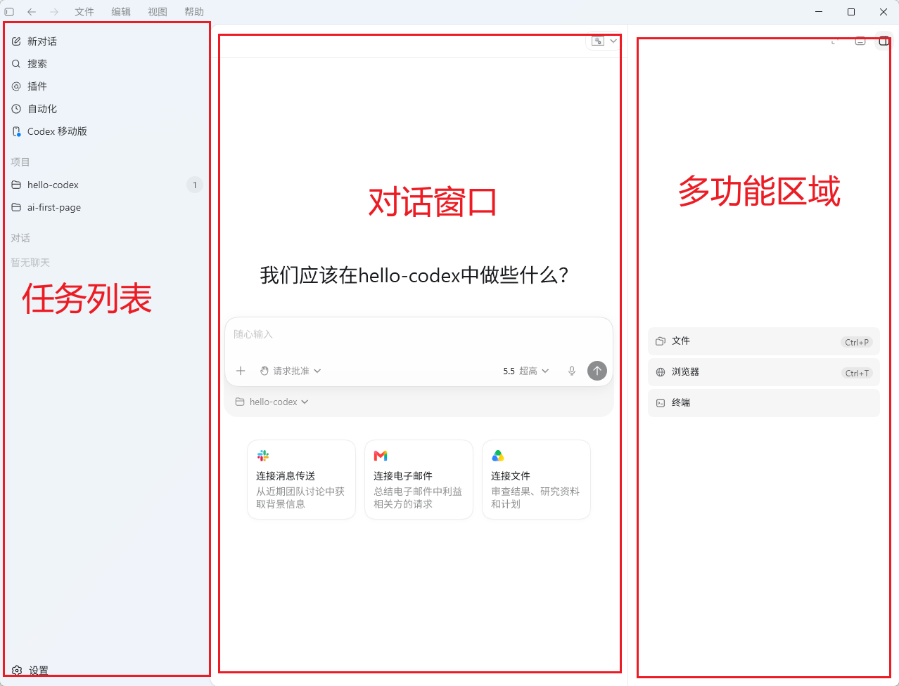
</p>

##### 新对话

###### 使用项目

我们可以开启一个新对话来执行一个新的任务

开启新对话后需要选择新对话属于哪个项目

<p align="center">
  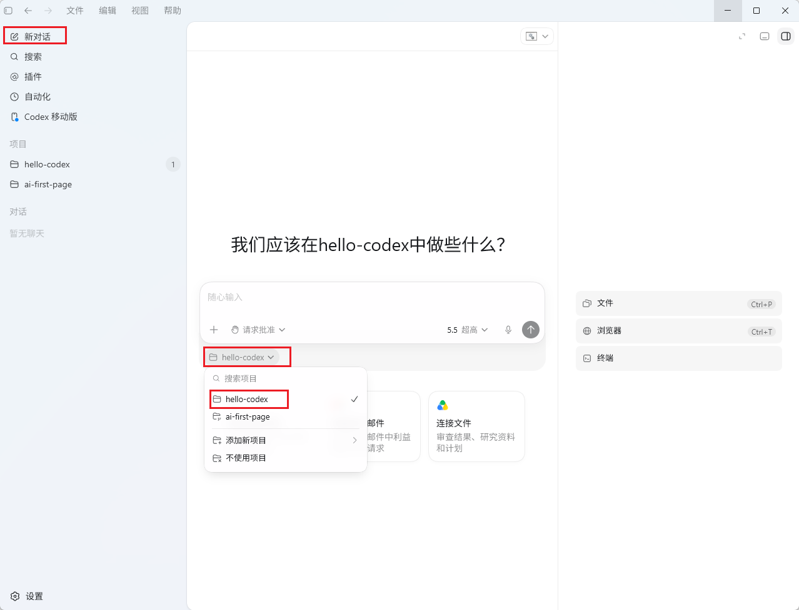
</p>

当然我们也可以直接在项目右侧的小按钮那里点击，直接开启对应项目的一个新对话。

<p align="center">
  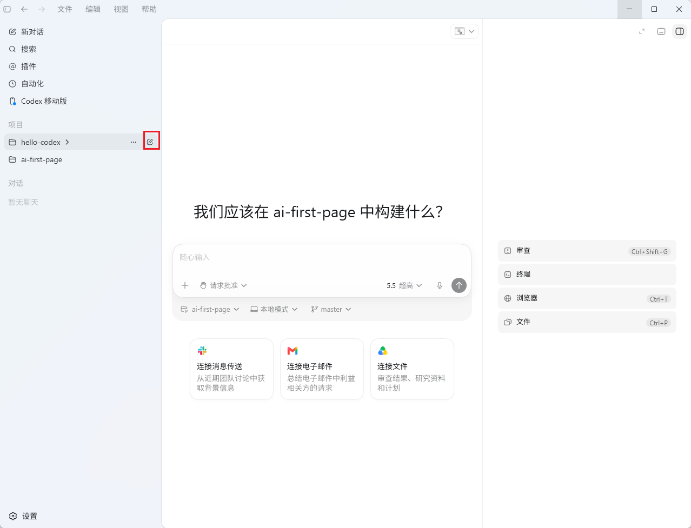
</p>

###### 不使用项目

点击不使用项目，对应的会话会显示在对话里面，可以作为想问和项目无关的问题

<p align="center">
  
</p>

<p align="center">
  
</p>

##### 搜索

后期任务对话太多了，但是只记得一些关键次找不到对应的任务对话了，可以直接在搜索这里，搜关键词，就会查找到对应的任务对话了

<p align="center">
  
</p>

##### 插件

功能较多，后续再讲

##### 自动化

功能较多，后续再讲

##### 项目

###### 创建项目

可以在Codex中直接创建一个新项目，也可以使用现有的项目

创建或选择好的项目会出现在项目栏里面，方便后续的管理

<p align="center">
  
</p>

###### thread

 thread 是一个项目里的「单独任务对话」

<p align="center">
  
</p>

比如你有一个项目叫：

```text
hello-codex
```

你可以在这个项目里开多个 thread：

| Thread | 代表的任务 |
| --- | --- |
| Thread 1 | 做一个首页 |
| Thread 2 | 修复按钮点击没反应 |
| Thread 3 | 优化移动端样式 |
| Thread 4 | 帮我写 README |
| Thread 5 | 检查项目有没有报错 |

你可以这样理解：

```text
Project 项目 = 一个代码文件夹
Thread = 这个项目里的一个具体任务
```

比如：

```text
项目：小红书封面生成器
Thread 1：做首页
Thread 2：修复上传图片失败
Thread 3：优化手机端布局
Thread 4：写项目说明文档
```

**为什么要有 thread？**

因为不同任务最好分开做。

 如果你把“做首页、修 bug、改样式、写文档”全塞进一个对话里，Codex 容易上下文混乱，你也不好检查它到底改了什么。

更好的用法是：

```text
一个明确任务 = 一个 thread
```

比如你要做页面：

```text
请帮我做一个 AI 工具介绍页。
```

这是一个 thread。

后面你发现按钮有问题，再新开一个 thread：

```text
请检查为什么首页按钮点击后没有反应。
```

一句话总结：

**Thread 就是 Codex App 里的任务对话，一个 thread 专门处理一个具体任务。**

###### 等待批准

在我们 Codex 执行任务的时候，很多时候都会需要用户进行权限的批准

并且会在对应的对话处提示等待批准的标签

点击对应的对话后，再点击允许，Codex 就会继续进行接下来的工作了

<p align="center">
  
</p>

###### 归档

归档 Archive，可以理解成把一个已经完成、暂时不用继续处理的 thread 收起来。

它的作用不是删除代码，也不是合并代码，而是让你的任务列表更干净。

<p align="center">
  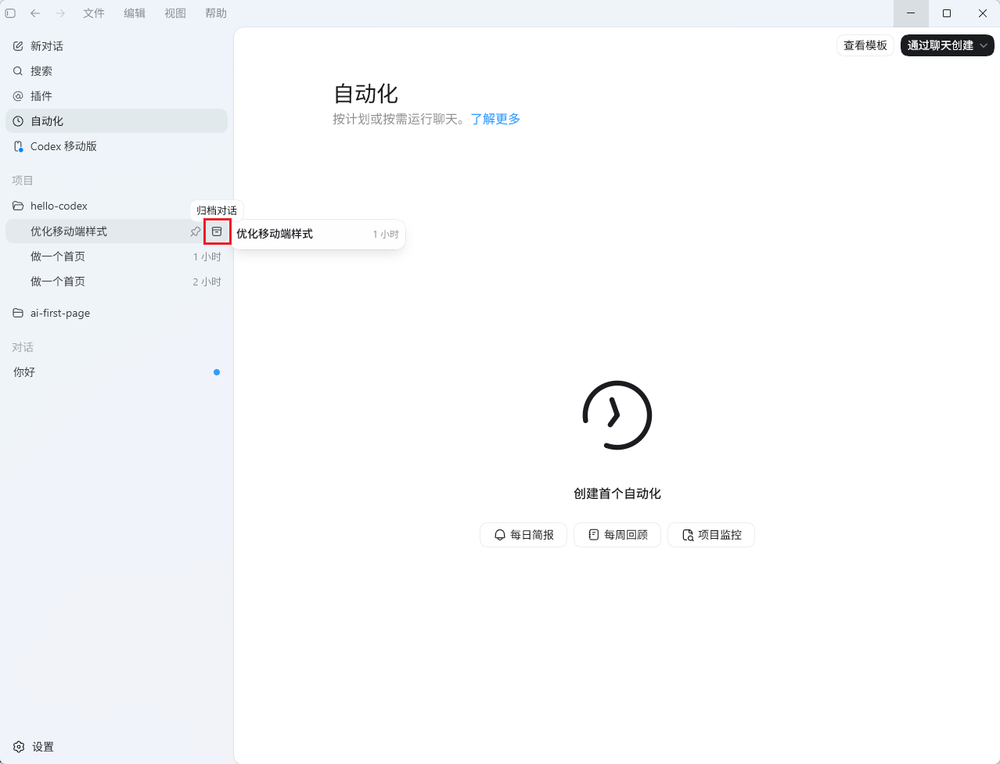
</p>

比如你做完了这些任务：

```text
Thread 1：优化移动端样式
Thread 2：做一个首页
Thread 3：做一个首页

```

其中 Thread 2、Thread 3 已经完成了，Thread 1 你也不打算用了，就可以把它们归档。

归档后，它们不会继续占据当前任务列表的位置，你的项目界面会更清爽。

**取消归档，当然你也可以在设置里面找到已归档对话，将其还原回来**

<p align="center">
  
</p>

##### 设置

###### 剩余额度

在这里可以看到当前账号的额度、速率限制或使用情况。

不同套餐、工作区、模型和版本显示的限制可能不一样；具体能用多久、什么时候恢复、是否能购买额外额度，都以 Codex 当前界面和官方说明为准。

<p align="center">
  
</p>

##### 对话窗口

###### 权限控制

###### 沙盒（Sandbox）

要知道权限控制必须先知道一个沙盒（Sandbox）的概念

你可以把它理解成：

> Codex 可以在围栏里面干活，但不能随便跑到围栏外面乱动你的电脑。

因为 Codex App 不是普通聊天工具，它可以读文件、改文件、运行命令，所以必须有一个“围栏”限制它能碰哪里、能不能联网、能不能改项目外的文件。官方文档里，Codex 的 sandbox 模式包括 `read-only`、`workspace-write`、`danger-full-access` 这几类，用来控制文件系统和网络访问边界。

###### **简单来说**

假设你的项目文件夹是：

```text
D:\AI-Codex-Projects\hello-codex
```

如果开启沙盒，Codex 正常只能在这个项目文件夹范围内工作，比如：

```text
可以看 index.html
可以改 style.css
可以运行 npm run dev
```

但如果它想做这些事，就可能需要你批准：

```text
访问桌面文件
读取下载文件夹
修改项目外的文件
联网下载东西
运行高风险命令
```

所以：

```text
Sandbox = 给 Codex 设置工作边界
```

###### 三大权限

<p align="center">
  
</p>

```text
请求批准
替我审批
完全访问权限
```

可以这样对应理解：

| 你看到的选项 | 和 Sandbox 的关系 |
| --- | --- |
| 请求批准 | 有沙盒限制，越界操作先问你 |
| 替我审批 | 让系统帮你自动判断一部分审批 |
| 完全访问权限 | 放开沙盒，可以在电脑上执行任何操作，风险最高 |

新手建议开启：

**请求批准或自动审批类选项**。如果你是新手，优先选择不会放开项目边界的模式：让 Codex 可以在当前项目内工作，但遇到越界、联网或高风险命令时仍然停下来让你确认。不同版本里权限选项名称可能不同，核心原则是：不要一开始就开完全访问权限。

###### 一句话总结

**Sandbox 沙盒就是 Codex 的安全围栏。**

它决定 Codex 能不能：

```text
看文件
改文件
访问项目外目录
联网
运行命令
```

###### Model 模型选择

###### 推理强度

可以看到推理强度分为了4档，强度越高对应的推理能力越强所花的时间和token消耗也越大

<p align="center">
  
</p>

| 选项 | 简单来说 | 适合任务 |
| --- | --- | --- |
| 低 | 想得少，速度快，省额度 | 改文案、改颜色、小问题 |
| 中 | 平衡速度和质量 | 普通网页、简单 bug、日常开发 |
| 高 | 想得更深，更适合复杂问题 | 多文件修改、复杂 bug、重构 |
| 超高 | 最认真、最慢、最耗 | 很难的问题、架构分析、反复修不好的 bug |

###### 模型选择

这里可以选择不同的模型。模型能力、可用范围和消耗会随账号套餐、地区、版本和模型目录变化。普通任务用默认推荐模型即可；复杂任务再考虑切换更强模型或提高推理强度。

<p align="center">
  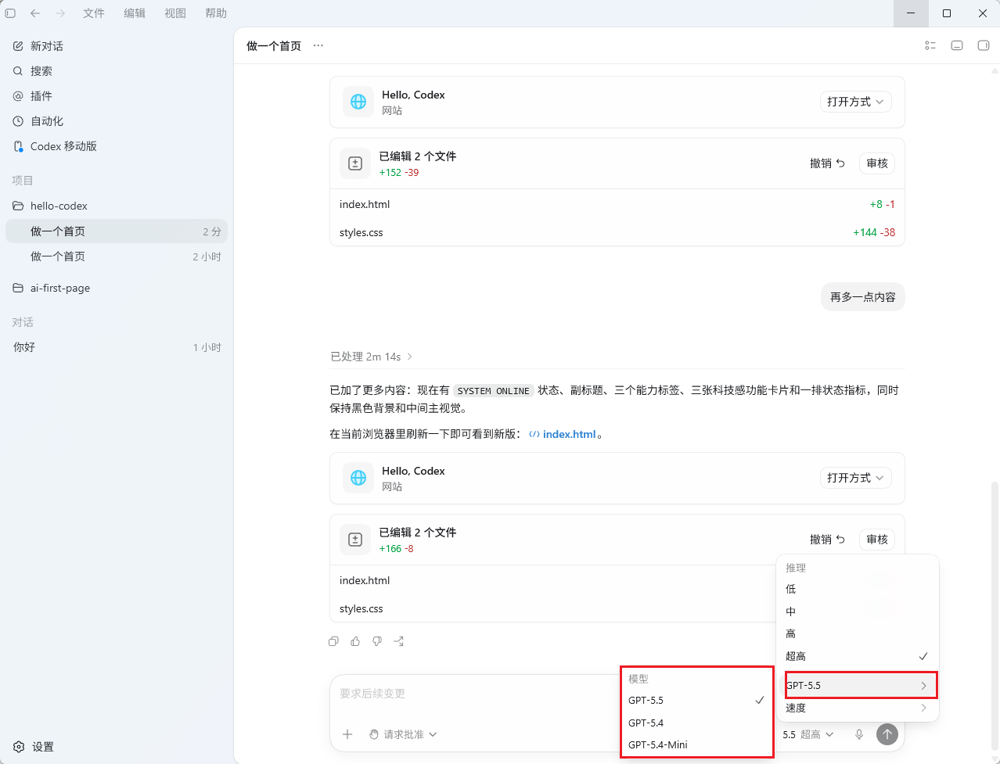
</p>

###### 速度

有些模型或版本会提供标准 / 快速之类的服务档位。

快速模式的速度提升、额度消耗和是否可用，都以当前界面显示为准。任务很急、额度充足时可以考虑开启；日常任务不需要默认开启。

<p align="center">
  
</p>

###### 引导

可中途插入对话

当我们在AI执行的过程中，发现AI理解错了我们的意思，就不应该让它继续执行了，这时候就应该及时进行人工引导

如果不选择引导则会排队执行，只有执行完上一个任务过后，AI才会执行你发送的下一个任务

<p align="center">
  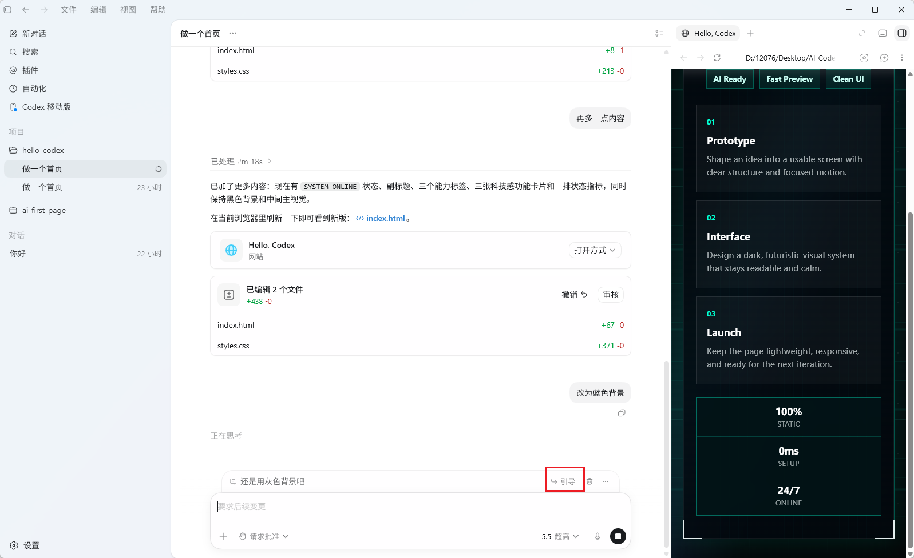
</p>

###### 计划模式

开启计划模式后，Codex 就不会立即上手干活，而是会先整理出一份工作计划，跟我们确认了过后再开始干活

对于所有复杂任务，建议都先开启计划模式，可以查漏补缺。

<p align="center">
  
</p>

<p align="center">
  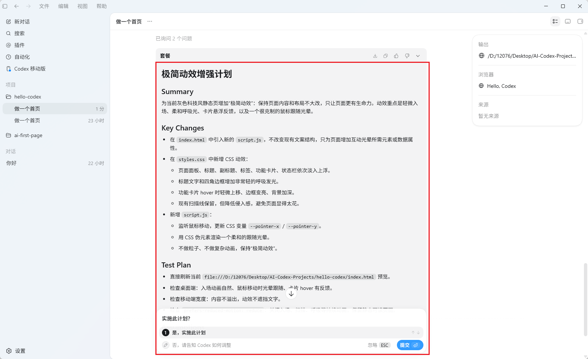
</p>

##### 多功能区

###### 注释

在多功能的右上角区域的注释

当我们用 Codex 内置的浏览器打开了页面过后，会发现有个注释功能

可以让AI帮我们只修改页面的具体部分

<p align="center">
  
</p>

<p align="center">
  
</p>

<p align="center">
  
</p>

---

### Codex CLI 安装与上手

Codex CLI 是 Codex 的命令行版本。

它适合愿意打开终端的人使用，比如 PowerShell、Terminal、iTerm、Windows Terminal。

#### macOS / Linux 安装

macOS 有两种常见安装方式。

##### 方式一：使用 npm 安装

先确认电脑已经安装 Node.js。

打开 Terminal，输入：

```text
node -v
npm -v
```

能看到版本号，说明 Node.js 和 npm 已经可用。

然后安装 Codex CLI：

```text
npm install -g @openai/codex
```

安装完成后，检查是否安装成功：

```text
codex --version
```

或者直接运行：

```text
codex
```

---

##### 方式二：使用 Homebrew 安装

Mac 用户也可以用 Homebrew：

```text
brew install --cask codex
```

安装后运行：

```text
codex
```

小白建议：

- 已经装过 Node.js，就用 npm。
- 已经习惯 Homebrew，就用 brew。

#### Windows 安装

Windows 用户建议使用 PowerShell 或 Windows Terminal。

第一步，安装 Node.js。

安装完成后，打开 PowerShell，输入：

```text
node -v
npm -v
```

能看到版本号，说明安装成功。

第二步，安装 Codex CLI：

```text
npm install -g @openai/codex
```

第三步，检查是否安装成功：

```text
codex --version
```

或者直接运行：

```text
codex
```

Windows 用户第一次使用时，建议不要在系统目录里运行 Codex。

不要在这些位置直接操作：

```text
C:\
系统目录
桌面
下载文件夹
重要资料文件夹
```

建议新建一个练习目录：

```text
D:\AI-Codex-Projects\hello-codex
```

#### 第一次运行

安装完成后，在终端输入：

```text
codex
```

第一次运行时，Codex 会提示你登录。

Codex CLI 常见有两种登录方式：

```text
1. 使用 ChatGPT 账号登录
2. 使用 OpenAI API Key 登录
```

新手优先推荐第一种：ChatGPT 账号登录。

##### 方式一：使用 ChatGPT 账号登录

这是最适合普通用户和小白的方式。

在终端输入：

```text
codex
```

或者：

```text
codex login
```

然后选择：

```text
Sign in with ChatGPT
```

登录流程大概是：

```text
1. 终端输入 codex 或 codex login
2. 选择 Sign in with ChatGPT
3. 浏览器会自动打开登录页面
4. 输入你的 ChatGPT 账号
5. 登录成功后，浏览器会把登录结果传回终端
6. 回到终端，Codex CLI 就可以使用了
```

##### 方式二：使用 API Key 登录

Codex CLI 也支持使用 OpenAI API Key 登录。

API Key 登录更适合开发者、自动化脚本、CI/CD、服务器任务等场景。

小白可以这样理解：

```text
ChatGPT 登录 = 走 ChatGPT 账号和套餐额度
API Key 登录 = 走 OpenAI Platform API 计费
```

如果你要用 API Key 登录，先去 OpenAI Platform 创建 API Key。

然后在终端里设置环境变量。

macOS / Linux 可以这样写：

```text
export OPENAI_API_KEY="你的_API_Key"
printenv OPENAI_API_KEY | codex login --with-api-key
```

Windows PowerShell 可以这样写：

```text
$env:OPENAI_API_KEY="你的_API_Key"
$env:OPENAI_API_KEY | codex login --with-api-key
```

登录成功后，Codex CLI 会保存登录信息，后面再次运行：

```text
codex
```

就可以继续使用。

---

##### ChatGPT 登录和 API Key 登录有什么区别？

| 对比 | ChatGPT 账号登录 | API Key 登录 |
| --- | --- | --- |
| 适合人群 | 普通用户、小白 | 开发者、自动化、CI/CD |
| 使用额度 | 跟 ChatGPT 套餐有关 | 按 OpenAI Platform API 计费 |
| 上手难度 | 更简单 | 稍复杂 |
| 是否推荐小白 | 推荐 | 不推荐一开始用 |
| 适合本地练习 | 适合 | 也可以，但没必要 |
| 适合自动化脚本 | 一般 | 更适合 |

##### API Key 登录注意事项

API Key 很敏感，不能随便泄露。

不要把 API Key：

```text
写进代码里
发给别人
截图公开
上传到 GitHub
放进 README
放进前端网页
提交到 Git 仓库
```

如果不小心泄露了 API Key，要立刻去 OpenAI Platform 删除或重新生成。

API Key 登录虽然方便做自动化，但它会按 API 使用量计费，所以新手不要不清楚费用规则就长时间运行任务。

---

##### 查看当前登录状态

你可以用下面命令查看当前是否已经登录：

```text
codex login status
```

如果需要退出登录，可以运行：

```text
codex logout
```

退出后，下次再运行 Codex CLI，需要重新登录。

#### CLI 基础命令

Codex CLI 的命令可以分成两类：

| 类型 | 使用位置 | 作用 |
| --- | --- | --- |
| 终端命令 | PowerShell / Terminal 里输入 | 启动、登录、更新、诊断、管理 Codex |
| 斜杠命令 | 进入 Codex 后输入 | 切模型、调权限、看 diff、生成规则、退出会话 |

##### CLI 终端命令

CLI 终端命令，是在 PowerShell / Terminal / Windows Terminal 里输入的命令。

###### 小白最常用终端命令

| 命令 | 作用 | 简单来说 | 使用场景 |
| --- | --- | --- | --- |
| `codex` | 启动 Codex CLI | 打开终端版 Codex | 进入项目后使用 |
| `codex --version` | 查看版本 | 检查是否安装成功 | 安装后第一步 |
| `codex --help` | 查看帮助 | 查看支持哪些命令 | 不知道命令怎么用时 |
| `codex login` | 登录 Codex | 用 ChatGPT 账号或 API Key 登录 | 第一次使用 |
| `codex login status` | 查看登录状态 | 看当前有没有登录 | 登录异常时 |
| `codex logout` | 退出登录 | 清除本机登录状态 | 换账号、公共电脑 |
| `codex doctor` | 检查环境问题 | 自动生成诊断报告 | 启动失败、登录失败、环境异常 |
| `codex update` | 更新 Codex | 更新 CLI 版本 | 需要升级时 |
| `codex app` | 打开 Codex App | 从终端打开桌面版 | 想切到图形界面时 |

---

###### 进入项目相关命令

| 命令 | 作用 | 示例 | 简单来说 |
| --- | --- | --- | --- |
| `cd 项目目录` | 进入项目文件夹 | `cd D:\\AI-Codex-Projects\\hello-Codex` | 先走到项目里面 |
| `codex` | 在当前目录启动 Codex | `codex` | 让 Codex 在当前项目工作 |
| `codex --cd 项目路径` | 指定目录启动 | `codex --cd D:\\AI-Codex-Projects\\hello-Codex` | 不用先 cd，直接指定项目 |
| `codex -C 项目路径` | --cd 的简写 | `codex -C ./hello-Codex` | 更短写法 |

新手推荐最简单的方式：

```text
cd 项目目录
codex
```

不要在这些地方直接运行 Codex：

```text
C:\
桌面
下载文件夹
系统目录
重要资料文件夹
```

---

###### 登录相关命令

| 命令 | 作用 | 适合场景 |
| --- | --- | --- |
| `codex login` | 默认打开浏览器，用 ChatGPT 账号登录 | 小白首选 |
| `codex login --device-auth` | 用设备码登录 | 远程服务器、浏览器打不开 |
| `printenv OPENAI_API_KEY \| codex login --with-api-key` | 使用 API Key 登录 | 开发者、自动化、CI/CD |
| `codex login status` | 查看当前登录方式和状态 | 不确定是否已登录 |
| `codex logout` | 删除本机保存的登录凭证 | 换账号、公共电脑 |

Windows PowerShell 使用 API Key 登录：

```text
$env:OPENAI_API_KEY | codex login --with-api-key
```

---

###### 启动时直接发任务

| 命令 | 作用 | 示例 |
| --- | --- | --- |
| `codex "任务内容"` | 启动 Codex，并直接发送第一条任务 | `codex "请解释这个项目结构"` |
| `codex -i 图片路径 "任务"` | 附加图片一起分析 | `codex -i ./error.png "分析这个报错"` |
| `codex --image 图片路径 "任务"` | `-i` 的完整写法 | `codex --image ./ui.png "根据截图优化页面"` |
| `codex --search "任务"` | 允许使用搜索能力 | `codex --search "查一下这个库的新用法"` |

适合：

```text
简单解释项目
分析报错截图
根据 UI 截图提修改建议
查新版本文档
```

新手更推荐先运行：

```text
codex
```

进入后再输入任务，更容易观察执行过程。

---

###### 模型、权限、沙盒相关命令

| 命令 | 作用 | 简单来说 | 新手建议 |
| --- | --- | --- | --- |
| `codex --model 模型名` | 指定模型 | 选择 AI 大脑 | 默认即可，复杂任务再改 |
| `codex -m 模型名` | `--model` 简写 | 更短写法 | 不必强行记 |
| `codex --sandbox read-only` | 只读模式 | 只能看，尽量不改 | 只分析项目时用 |
| `codex --sandbox workspace-write` | 当前项目可读写 | 能在项目里工作 | 日常推荐 |
| `codex --sandbox danger-full-access` | 完全放开限制 | 权限很大 | 新手不要用 |
| `codex --ask-for-approval on-request` | 敏感操作先问你 | 请求批准 | 新手推荐 |
| `codex -a on-request` | 审批模式简写 | 更短写法 | 推荐 |

新手推荐组合：

```text
codex --sandbox workspace-write --ask-for-approval on-request
```

意思是：

```text
Codex 可以在当前项目里工作，但敏感操作要先问我。
```

不要把这个当成省事模式：

```text
codex --sandbox danger-full-access
```

---

###### 非交互式任务命令

| 命令 | 作用 | 简单来说 | 适合场景 |
| --- | --- | --- | --- |
| `codex exec "任务"` | 一次性执行任务 | 不进入长对话，跑完就结束 | 自动化、检查、生成报告 |
| `codex e "任务"` | `exec` 的简写 | 同上 | 快速执行 |
| `codex exec --cd 项目路径 "任务"` | 指定目录执行任务 | 在某个项目里一次性执行 | 自动化脚本 |
| `codex exec resume` | 恢复 exec 会话 | 接着上次非交互任务继续 | 自动化任务中断后 |
| `codex exec resume --last` | 恢复最近一次 exec 会话 | 接着最近任务继续 | 最常用恢复方式 |

示例：

```text
codex exec "请检查当前项目有没有明显问题"
```

小白阶段优先用：

```text
codex
```

熟悉后再用 `codex exec`。

---

###### 会话管理命令

| 命令 | 作用 | 简单来说 | 使用场景 |
| --- | --- | --- | --- |
| `codex resume` | 恢复之前会话 | 接着之前的 thread 继续 | 上次没做完 |
| `codex resume --last` | 恢复最近一次会话 | 接着最近任务继续 | 最常用 |
| `codex archive` | 归档会话 | 把不用的任务收起来 | 任务完成或不要了 |
| `codex unarchive` | 恢复归档会话 | 找回被归档的任务 | 归档后还想继续 |
| `codex fork` | 复制旧会话成新 thread | 保留原任务，再试一个新方向 | 多方案尝试 |

简单来说：

```text
resume = 接着做
archive = 收起来
unarchive = 找回来
fork = 复制一份去试新方案
```

---

###### 诊断、更新和维护命令

| 命令 | 作用 | 什么时候用 |
| --- | --- | --- |
| `codex doctor` | 生成诊断报告 | Codex 启动异常、登录异常、环境异常 |
| `codex update` | 检查并更新 Codex CLI | 想升级版本时 |
| `codex completion` | 生成命令补全脚本 | 经常用终端的人 |
| `codex features list` | 查看功能开关 | 排查功能是否开启 |
| `codex features enable 功能名` | 开启某个功能 | 进阶配置 |
| `codex features disable 功能名` | 关闭某个功能 | 进阶配置 |

小白最常用：

```text
codex doctor
codex update
```

其他先不用记。

---

###### Cloud、MCP、插件相关命令

| 命令 | 作用 | 小白是否需要 |
| --- | --- | --- |
| `codex cloud` | 在终端里浏览或执行 Codex Cloud 任务 | 暂时不用 |
| `codex apply` | 把 Codex Cloud 生成的 diff 应用到本地 | 用 Cloud 后再学 |
| `codex mcp list` | 查看 MCP 工具 | 暂时不用 |
| `codex mcp add` | 添加 MCP server | 进阶 |
| `codex mcp remove` | 删除 MCP server | 进阶 |
| `codex plugin list` | 查看插件 | 暂时不用 |
| `codex plugin add` | 安装插件 | 进阶 |
| `codex plugin remove` | 删除插件 | 进阶 |

小白阶段先不用管这些。

等你开始用：

```text
Codex Cloud
外部工具
数据库
Figma
项目管理工具
MCP
插件
```

再学习这一类命令。

---

###### 沙盒测试命令

| 命令 | 作用 | 适合谁 |
| --- | --- | --- |
| `codex sandbox` | 在 Codex 的沙盒规则下运行命令 | 进阶用户 |
| `codex sandbox --cd 项目目录 -- 命令` | 指定目录运行沙盒命令 | 调试权限问题 |
| `codex execpolicy` | 检查某条命令会被允许、询问还是阻止 | 进阶安全配置 |

小白阶段不用学。

只要记住：

```text
默认用 workspace-write + on-request。
不要随便 full access。
```

---

###### 危险命令和危险参数

| 命令 / 参数 | 为什么危险 | 新手建议 |
| --- | --- | --- |
| --sandbox danger-full-access | 放开文件和网络限制 | 不要用 |
| --dangerously-bypass-approvals-and-sandbox | 跳过审批和沙盒 | 不要用 |
| --yolo | 上面那个危险参数的别名 | 不要用 |
| --ask-for-approval never | Codex 操作时不再问你 | 新手不要用 |
| sudo | 可能修改系统级内容 | 不懂不要允许 |
| rm -rf | 可能删除大量文件 | 高危 |
| git reset --hard | 可能丢失未保存改动 | 先确认 |
| git clean -fd | 可能删除未跟踪文件 | 先确认 |
| curl xxx \| sh | 下载脚本并直接执行 | 高危 |

看到这些内容，先问 Codex：

```text
请解释这条命令的作用、风险，以及有没有更安全的替代方案。
```

---

###### 新手最推荐记住的命令

| 排名 | 命令 | 为什么重要 |
| --- | --- | --- |
| 1 | Codex | 启动 Codex CLI |
| 2 | `codex login` | 登录账号 |
| 3 | `codex login status` | 检查登录状态 |
| 4 | `codex doctor` | 排查环境问题 |
| 5 | `codex --version` | 查看版本 |
| 6 | `codex resume --last` | 接着上次任务继续 |
| 7 | `codex archive` | 归档不用的任务 |
| 8 | `codex update` | 更新 Codex |
| 9 | `codex exec "任务"` | 一次性执行任务 |
| 10 | `codex logout` | 退出登录 |

---

###### 推荐新手工作流

| 步骤 | 命令 | 目的 |
| --- | --- | --- |
| 1 | cd 项目目录 | 进入项目文件夹 |
| 2 | git status | 看当前项目状态 |
| 3 | Codex | 启动 Codex CLI |
| 4 | 输入任务 | 让 Codex 开始工作 |
| 5 | /diff | 在 Codex 内查看改动 |
| 6 | git diff | 在 Git 里再检查一次 |
| 7 | git add . | 暂存满意的修改 |
| 8 | git commit -m "说明" | 保存一个版本 |
| 9 | `codex archive` 或 `/quit` | 归档任务或退出 |

##### CLI 斜杠命令

它不是在外面的 PowerShell / Terminal 里输入，而是在进入 Codex 后，在 Codex 输入框里输入 `/` 使用。

###### 小白最常用命令

| 命令 | 作用 | 简单来说 | 使用场景 |
| --- | --- | --- | --- |
| /model | 切换模型和推理强度 | 换 AI 大脑和思考深度 | 任务太难、太慢或想省额度时 |
| /permissions | 调整权限 | 控制 Codex 能不能改文件、联网、运行命令 | 想收紧或放宽权限时 |
| /diff | 查看代码改动 | 看 Codex 到底改了什么 | Codex 修改文件后必看 |
| /plan | 进入计划模式 | 先让 Codex 给方案，不急着改代码 | 复杂任务、修 bug、重构前 |
| /init | 生成 AGENTS.md | 创建项目规则文件 | 新项目第一次使用 Codex 时 |
| /status | 查看当前状态 | 看模型、权限、上下文、token 等信息 | 不确定当前配置时 |
| /quit | 退出 Codex CLI | 结束当前会话 | 任务完成后退出 |
| /exit | 退出 Codex CLI | 和 /quit 类似 | 任务完成后退出 |

---

###### 模型与速度相关

| 命令 | 作用 | 什么时候用 |
| --- | --- | --- |
| /model | 选择模型和推理强度 | 想切换 GPT-5.5、mini、低/中/高推理时 |
| /fast | 开启或关闭 Fast 模式 | 想让支持的模型更快响应时 |
| /personality | 调整回答风格 | 想让 Codex 更简洁、更解释型或更协作时 |
| /status | 查看当前模型和上下文状态 | 想确认现在到底用的是什么模型时 |

新手建议：

```text
普通任务：默认模型 + 中推理
复杂 bug：高推理
简单改文案：低推理
不要所有任务都开最高推理
```

---

###### 权限与安全相关

| 命令 | 作用 | 简单来说 | 建议 |
| --- | --- | --- | --- |
| /permissions | 修改权限策略 | 控制 Codex 能做什么 | 新手保持“请求批准” |
| /approve | 批准一次被自动拒绝的操作 | 让被拦截的操作重试一次 | 看懂风险后再用 |
| /sandbox-add-read-dir | 额外允许读取某个目录 | 让 Codex 能读项目外指定目录 | Windows 特定场景，少用 |
| /status | 查看权限和可写目录 | 确认 Codex 当前权限范围 | 改权限后检查一下 |

新手建议：

```text
默认用 /permissions 保持请求批准。
不要随便放开完全访问权限。
看不懂的操作，不要用 /approve。
```

---

###### 代码检查与 Review 相关

| 命令 | 作用 | 简单来说 | 使用场景 |
| --- | --- | --- | --- |
| /diff | 查看当前 Git diff | 看新增了什么、删除了什么 | 修改后必看 |
| /review | 让 Codex review 当前改动 | 让它检查代码有没有问题 | 提交前检查 |
| /copy | 复制最近一次 Codex 输出 | 快速复制结果 | 复制计划、总结、命令说明 |
| /raw | 切换原始输出模式 | 方便复制长日志或终端输出 | 日志很长时 |

推荐流程：

```text
Codex 修改完成
→ /diff 查看改动
→ /review 检查问题
→ 没问题再 git commit
```

---

###### 会话管理相关

| 命令 | 作用 | 简单来说 | 使用场景 |
| --- | --- | --- | --- |
| /new | 开始新对话 | 在当前 CLI 里换一个新任务 | 当前任务结束，想开始新任务 |
| /clear | 清空终端并开始新聊天 | 清理当前显示和上下文 | 界面太乱、想重新开始 |
| /resume | 恢复之前的会话 | 接着以前的任务继续 | 上次任务没做完 |
| /archive | 归档当前会话并退出 | 把不用的任务收起来 | 任务完成或方案不要了 |
| /fork | 复制当前会话成新 thread | 保留原思路，另开分支尝试 | 想试另一个方案 |
| /side | 开一个临时侧边对话 | 不影响主任务地问个小问题 | 想临时确认一个点 |
| /quit | 退出 CLI | 结束当前使用 | 任务完成 |
| /exit | 退出 CLI | 和 /quit 一样 | 任务完成 |

小白区别：

```text
/new = 开新任务
/clear = 清理并重新开始
/archive = 收起当前任务
/fork = 复制当前任务去试新方案
/side = 临时问个小问题
```

---

###### 上下文与长对话相关

| 命令 | 作用 | 简单来说 | 使用场景 |
| --- | --- | --- | --- |
| /compact | 压缩当前对话 | 把长对话总结成重点 | 对话很长、上下文快满时 |
| /status | 查看上下文使用情况 | 看还有多少上下文空间 | 任务做了很多轮后 |
| /mention | 附加文件或文件夹 | 指定 Codex 重点看某个文件 | 想让它只看某几个文件 |
| /ide | 引入 IDE 当前上下文 | 把编辑器打开的文件带进来 | 配合 VS Code / Cursor 使用 |

新手建议：

```text
对话长了用 /compact。
想让 Codex 看特定文件，用 /mention。
不想让它乱扫整个项目，就明确指定文件。
```

---

###### 项目规则与能力相关

| 命令 | 作用 | 简单来说 | 使用场景 |
| --- | --- | --- | --- |
| /init | 生成 AGENTS.md | 创建项目规则文件 | 新项目第一次用 Codex |
| /skills | 浏览和使用 Skills | 选择专项技能 | 做 UI、写文档、review 等专项任务 |
| /memories | 配置记忆 | 控制 Codex 是否使用或生成记忆 | 想管理长期偏好时 |
| /goal | 设置任务目标 | 给 Codex 一个持续目标 | 大任务、长任务 |
| /apps | 浏览可连接的应用 | 让 Codex 使用外部 App | 连接外部工具时 |
| /plugins | 管理插件 | 查看或启用插件能力 | 需要插件工具时 |
| /mcp | 查看 MCP 工具 | 看 Codex 能调用哪些外部工具 | 配置 MCP 后检查 |

新手优先掌握：

```text
/init
/skills
```

其他命令可以后面再学。

---

###### 终端和后台任务相关

| 命令 | 作用 | 简单来说 | 使用场景 |
| --- | --- | --- | --- |
| /ps | 查看后台终端任务 | 看哪些命令还在跑 | npm dev、测试、构建还在运行时 |
| /stop | 停止后台终端任务 | 终止正在后台跑的命令 | 命令卡住或不想继续跑 |
| /raw | 原始输出模式 | 方便复制终端日志 | 日志很长时 |

常见场景：

```text
Codex 跑了 npm run dev
你想看它还在不在跑
→ 用 /ps

命令卡住了
→ 用 /stop
```

---

###### 界面与快捷键相关

| 命令 | 作用 | 简单来说 | 是否常用 |
| --- | --- | --- | --- |
| /theme | 切换代码高亮主题 | 改终端显示风格 | 一般 |
| /statusline | 配置底部状态栏 | 显示模型、token、Git 分支等 | 进阶 |
| /title | 配置终端标题 | 让窗口标题显示项目信息 | 进阶 |
| /keymap | 修改快捷键 | 自定义操作按键 | 进阶 |
| /vim | 开关 Vim 编辑模式 | 用 Vim 方式编辑输入框 | 会 Vim 的人用 |
| /debug-config | 查看配置层级 | 排查配置为什么不生效 | 进阶排错 |

小白阶段可以先不用这些。

---

###### 开发者和高级功能

| 命令 | 作用 | 适合谁 |
| --- | --- | --- |
| /experimental | 开启实验功能 | 喜欢尝鲜的用户 |
| /hooks | 查看和管理生命周期 hooks | 高级用户、团队项目 |
| /feedback | 发送日志或反馈 | 遇到问题需要反馈时 |
| /agent | 切换 active agent thread | 使用 subagent 工作流的人 |

这些不是入门必学内容。

新手知道有就行，不需要一开始掌握。

---

###### 新手最推荐记住的 8 个

| 排名 | 命令 | 为什么重要 |
| --- | --- | --- |
| 1 | /diff | 看 Codex 实际改了什么 |
| 2 | /plan | 复杂任务先让它给计划 |
| 3 | /permissions | 控制权限，避免乱改 |
| 4 | /model | 切换模型和推理强度 |
| 5 | /status | 查看当前模型、权限、上下文 |
| 6 | /init | 生成项目规则 |
| 7 | /compact | 长对话压缩重点 |
| 8 | /quit | 退出 Codex |

---

###### 推荐新手使用流程

| 步骤 | 命令 | 目的 |
| --- | --- | --- |
| 1 | /init | 生成项目规则 |
| 2 | /permissions | 确认权限不要太大 |
| 3 | /model | 确认模型和推理强度 |
| 4 | /plan | 复杂任务先规划 |
| 5 | 输入任务 | 让 Codex 开始工作 |
| 6 | /diff | 检查代码改动 |
| 7 | /review | 让 Codex 再检查一遍 |
| 8 | /status | 查看当前状态和上下文 |
| 9 | /compact | 对话太长时压缩 |
| 10 | /quit | 退出 Codex |

---

###### 一句话总结

Slash Commands 是 Codex CLI 里的快捷控制命令。

新手不用全部背，先记住这几个就够了：

```text
/diff       看改动
/plan       先规划
/permissions 控权限
/model      换模型
/status     看状态
/init       建规则
/compact    压缩长对话
/quit       退出
```

#### CLI 工作方式

Codex CLI 的工作方式，可以理解成一条完整流程：

```text
读取项目
→ 理解任务
→ 提出计划
→ 修改文件
→ 运行命令
→ 等待批准
→ 展示 diff
→ 处理失败
```

小白不用一开始理解所有技术细节，只要先知道：

Codex CLI 不是只会聊天，它会真的进入当前项目目录，读文件、改文件、跑命令，然后把结果展示给你检查。

---

###### Codex 如何读取项目

当你在项目目录里运行：

```text
codex
```

Codex 会把当前目录当成工作区。

比如你在这个目录里启动：

```text
D:\AI-Codex-Projects\hello-codex
```

Codex 就会围绕这个文件夹里的内容工作。

它可能会读取：

| 内容 | 作用 |
| --- | --- |
| 项目文件 | 理解当前代码 |
| 文件夹结构 | 判断项目是前端、后端还是脚本项目 |
| package.json | 判断启动命令、依赖、项目类型 |
| README.md | 理解项目说明 |
| AGENTS.md | 读取你给 Codex 写的工作规则 |
| 报错日志 | 分析问题原因 |
| Git 状态 | 判断哪些文件被改过 |

简单来说：

```text
你在哪个文件夹启动 Codex，
Codex 就默认把哪个文件夹当成当前项目。
```

所以不要在这些地方乱启动：

```text
C:\
桌面
下载文件夹
系统目录
重要资料文件夹
```

推荐做法：

```text
cd 项目目录
codex
```

---

###### Codex 如何理解任务

你输入任务后，Codex 会先判断你想让它做什么。

比如你输入：

```text
请帮我做一个简单网页，黑色背景，中间显示 Hello Codex。
```

Codex 会判断：

| 它会理解什么 | 示例 |
| --- | --- |
| 任务类型 | 新建网页 |
| 修改范围 | 当前项目文件 |
| 可能需要文件 | index.html、style.css |
| 是否需要运行命令 | 简单 HTML 不一定需要 |
| 是否有风险 | 风险较低 |

如果你输入：

```text
请检查为什么 npm run build 失败。
```

Codex 会判断：

| 它会理解什么 | 示例 |
| --- | --- |
| 任务类型 | 排查构建失败 |
| 可能要运行命令 | npm run build |
| 可能要读文件 | package.json、报错相关文件 |
| 是否需要修改代码 | 可能需要 |
| 是否需要你批准 | 视权限设置而定 |

小白提示：

任务越清楚，Codex 越稳定。

推荐写法：

```text
请帮我完成【具体任务】。

要求：
1.
2.
3.

限制：
1. 不要修改无关文件
2. 不要删除已有功能
3. 完成后告诉我改了哪些文件
```

---

###### Codex 如何提出计划

复杂任务开始前，Codex 通常会先分析问题，再提出计划。

你也可以主动要求它先计划：

```text
请先给我计划，不要直接修改文件。
```

或者使用：

```text
/plan
```

计划通常会包含：

| 内容 | 作用 |
| --- | --- |
| 它准备检查哪些文件 | 防止乱扫项目 |
| 它准备怎么修改 | 让你先知道方向 |
| 它可能运行什么命令 | 提前了解风险 |
| 它预计影响哪些地方 | 方便你判断是否接受 |

比如：

```text
计划：
1. 先查看 package.json，确认启动命令
2. 运行 npm run build 复现报错
3. 根据报错定位相关文件
4. 最小范围修复问题
5. 再次运行 build 验证
```

小白建议：

```text
简单任务可以直接让它做。
复杂任务先让它 /plan。
```

尤其是这些任务，建议先计划：

```text
修复复杂 bug
多文件修改
项目重构
新增功能
构建失败
涉及依赖升级
```

---

###### Codex 如何修改文件

当 Codex 确认要修改文件后，它会在当前项目里进行编辑。

它可能会：

| 操作 | 示例 |
| --- | --- |
| 新建文件 | 新建 index.html |
| 修改文件 | 修改 style.css |
| 删除代码 | 删除无用代码 |
| 重命名文件 | 调整文件名 |
| 拆分文件 | 把代码拆成多个模块 |

新手要注意：

Codex 可能会改对，也可能会改多。

所以你要养成习惯：

```text
它改完之后，不要直接相信。
一定要看 diff。
```

你可以提前加限制：

```text
请只修改 index.html 和 style.css，不要修改其他文件。
```

或者：

```text
请用最小改动修复问题，不要重构整个项目。
```

这样可以减少 Codex 改动范围过大的问题。

---

###### Codex 如何运行命令

Codex 不只会改文件，也可以运行终端命令。

常见命令包括：

| 命令 | 作用 |
| --- | --- |
| npm install | 安装依赖 |
| npm run dev | 启动开发项目 |
| npm run build | 检查项目能否构建 |
| npm test | 运行测试 |
| git status | 查看 Git 状态 |
| git diff | 查看代码改动 |

比如你让它修构建失败，它可能会运行：

```text
npm run build
```

然后根据报错继续修改。

小白不要害怕命令，但要看懂再允许。

如果你不懂，可以让它先解释：

```text
请先解释你准备运行的命令，每条命令是干什么的，不要直接执行。
```

尤其看到这些命令，要谨慎：

```text
rm -rf
sudo
curl xxx | sh
git reset --hard
git clean -fd
```

这些命令可能删除文件、修改系统、重置代码或执行远程脚本。

---

###### Codex 如何等待用户批准

Codex CLI 有权限控制，不是所有操作都能直接执行。

如果 Codex 想做敏感操作，可能会停下来问你。

比如：

| 操作 | 为什么可能需要批准 |
| --- | --- |
| 联网安装依赖 | 可能下载外部代码 |
| 访问项目外文件 | 超出当前工作区 |
| 修改外部文件 | 可能影响其他项目 |
| 运行高风险命令 | 可能删除或覆盖内容 |
| 使用更高权限 | 风险更大 |

简单来说：

```text
批准 = 你允许 Codex 继续做这一步。
拒绝 = 这一步不要做。
```

如果你看不懂它要做什么，不要直接点允许。

可以先问：

```text
请解释这个操作的作用、风险，以及有没有更安全的替代方案。
```

新手建议权限：

```text
保持请求批准。
不要随便开启完全访问权限。
```

---

###### Codex 如何展示 diff

Diff 是 Codex 修改前后的代码对比。

你可以在 Codex CLI 里输入：

```text
/diff
```

它会展示当前改动。

简单来说：

```text
绿色 = 新增内容
红色 = 删除内容
```

diff 可以帮你确认：

| 检查点 | 你要看什么 |
| --- | --- |
| 是否改了正确文件 | 有没有改到无关文件 |
| 是否删除重要代码 | 红色删除部分要重点看 |
| 是否新增复杂依赖 | 有没有多装不必要的包 |
| 是否改动太大 | 小任务不要变成大重构 |
| 是否符合需求 | 有没有实现你要求的效果 |

推荐流程：

```text
Codex 完成修改
→ 输入 /diff
→ 查看改动
→ 不满意就让它继续改或撤回
→ 满意后再 git commit
```

不要只看 Codex 的总结。

真正重要的是：

```text
它实际改了什么。
```

---

###### Codex 如何处理失败

Codex 执行任务失败很正常。

常见失败包括：

| 失败类型 | 示例 |
| --- | --- |
| 命令失败 | npm run build 报错 |
| 依赖缺失 | 没有安装某个包 |
| 代码报错 | 页面空白、函数报错 |
| 权限不足 | 没有联网或文件访问权限 |
| 理解错需求 | 改的不是你想要的 |
| 修改范围过大 | 顺手改了无关文件 |

Codex 通常会根据失败结果继续分析。

比如：

```text
运行 npm run build 失败
→ 读取报错信息
→ 定位相关文件
→ 修改代码
→ 再次运行 build
```

但你要注意：

不要让它无限乱试。

如果它连续失败，可以暂停它，让它重新分析：

```text
先停一下。请总结目前失败原因，不要继续修改文件。
```

或者：

```text
请列出你已经尝试过的方法、失败原因，以及下一步最小改动方案。
```

如果它改乱了，可以说：

```text
请撤回刚才的修改，恢复到修改前状态。
```

或者自己用 Git 查看：

```text
git status
git diff
```

再决定是否保留。

---

###### 推荐新手工作流

| 步骤 | 操作 | 目的 |
| --- | --- | --- |
| 1 | cd 项目目录 | 进入正确项目 |
| 2 | Codex | 启动 Codex CLI |
| 3 | 输入任务 | 告诉 Codex 要做什么 |
| 4 | 复杂任务先 /plan | 先看方案 |
| 5 | 等 Codex 读取项目 | 让它理解上下文 |
| 6 | 审批敏感操作 | 看懂再允许 |
| 7 | 等它修改文件 | 执行任务 |
| 8 | 运行命令检查 | 验证结果 |
| 9 | /diff | 查看改动 |
| 10 | 不满意继续修改 | 迭代优化 |
| 11 | 满意后 git commit | 保存版本 |

---

###### 一句话总结

Codex CLI 的工作方式不是“问一句答一句”，而是一个完整的编程流程：

```text
读项目
→ 想方案
→ 改文件
→ 跑命令
→ 等批准
→ 看 diff
→ 修失败
→ 交结果
```

#### CLI 常见问题

Codex CLI 常见问题，大多数不是 Codex 本身坏了，而是出在这几个地方：

##### 小白最常见问题

| 问题 | 常见原因 | 解决方法 |
| --- | --- | --- |
| 输入 `codex` 没反应 | Codex 没装好，或命令没加入环境变量 | 先运行 `codex --version` 检查 |
| 提示 command not found | 终端找不到 Codex 命令 | 重新安装 Codex CLI，或重开终端 |
| 不知道在哪运行 Codex | 没进入项目目录 | 先 cd 项目目录，再运行 Codex |
| Codex 读错项目 | 在错误文件夹启动了 | 退出后进入正确项目目录重新启动 |
| 登录失败 | 浏览器没打开、网络异常、账号没登录 | 使用 `codex login` 重新登录 |
| API Key 登录失败 | Key 没设置、Key 错误、环境变量没生效 | 重新设置环境变量后再登录 |
| Codex 一直等待 | 可能在等你批准权限 | 看终端是否有 approval 提示 |
| Codex 不能联网 | 沙盒或权限限制 | 需要联网时手动批准 |
| 改完不知道改了什么 | 没看 diff | 在 Codex 里输入 /diff |
| 改坏了怎么办 | 没提前用 Git 保存 | 用 git diff 检查，必要时 revert |

---

##### 安装类问题

| 问题 | 原因 | 解决方法 |
| --- | --- | --- |
| `codex --version` 没有输出 | Codex 没安装成功 | 重新安装 Codex CLI |
| `codex: command not found` | 命令没有加入 PATH | 重开终端，或重新安装 |
| npm 安装失败 | Node.js / npm 没装好 | 先运行 node -v 和 npm -v |
| Windows 安装后找不到命令 | PowerShell 没刷新环境变量 | 关闭终端，重新打开 |
| 版本太旧 | Codex CLI 没更新 | 运行 `codex update` 或重新安装 |

排查命令：

```text
codex --version
node -v
npm -v
codex doctor
```

小白建议：

```text
安装后第一件事，不是直接用，而是先运行 codex --version。
能看到版本号，说明基础安装正常。
```

---

##### 登录类问题

| 问题 | 原因 | 解决方法 |
| --- | --- | --- |
| 不知道有没有登录 | 没检查登录状态 | 运行 `codex login status` |
| 浏览器没有自动打开 | 默认浏览器异常或远程环境 | 使用 `codex login --device-auth` |
| ChatGPT 登录失败 | 网络、账号、浏览器缓存问题 | 重新运行 `codex login` |
| API Key 登录失败 | 环境变量没设置好 | 检查 OPENAI_API_KEY |
| 想换账号 | 本机保存了旧账号 | 先 `codex logout`，再重新登录 |

常用命令：

```text
codex login
codex login status
codex logout
codex login --device-auth
```

新手建议：

```text
本地学习优先用 ChatGPT 账号登录。
API Key 登录更适合开发者、自动化和服务器场景。
```

---

##### 项目目录类问题

| 问题 | 原因 | 解决方法 |
| --- | --- | --- |
| Codex 看不到项目文件 | 没进入项目目录 | 先 cd 项目目录 |
| Codex 读错文件 | 在错误目录启动 | 退出后重新进入正确目录 |
| Codex 扫描了太多东西 | 在桌面、下载目录或 C 盘启动 | 只在具体项目文件夹里启动 |
| 不知道当前在哪 | 不清楚终端所在路径 | Windows 用 cd，Mac 用 pwd |
| 找不到文件 | 文件不在当前项目内 | 用 /mention 指定文件，或进入正确目录 |

推荐方式：

```text
cd D:\AI-Codex-Projects\hello-codex
codex
```

不推荐：

```text
在 C 盘根目录运行
在桌面运行
在下载文件夹运行
在重要资料文件夹运行
```

一句话：

```text
你在哪个目录运行 codex，它就默认把哪个目录当成项目。
```

---

##### 权限和沙盒类问题

| 问题 | 原因 | 解决方法 |
| --- | --- | --- |
| Codex 提示需要批准 | 它要执行敏感操作 | 看懂后再允许 |
| Codex 不能访问网络 | 沙盒默认限制联网 | 需要时手动批准 |
| Codex 不能读取项目外文件 | 超出 workspace 范围 | 不建议随便放开 |
| Codex 不能修改某些文件 | 权限不足或在只读模式 | 检查 /permissions |
| Codex 请求完全访问权限 | 任务需要更大权限 | 小白不要随便同意 |

推荐设置：

```text
sandbox：workspace-write
approval：on-request
```

简单来说：

```text
workspace-write = 允许在当前项目里工作
on-request = 敏感操作先问你
```

不要随便使用：

```text
danger-full-access
--yolo
--dangerously-bypass-approvals-and-sandbox
```

看到不懂的权限请求，可以问：

```text
请解释这个操作为什么需要权限，会影响哪些文件，有没有更安全的替代方案。
```

---

##### 命令运行类问题

| 问题 | 原因 | 解决方法 |
| --- | --- | --- |
| npm run dev 失败 | 依赖没装或脚本不存在 | 先看 package.json |
| npm install 失败 | 网络、源、权限或依赖冲突 | 让 Codex 先分析错误 |
| npm run build 失败 | 项目代码本身有报错 | 让 Codex 复现并最小修复 |
| 命令卡住不动 | 开发服务器一直运行 | 用 /ps 查看后台任务 |
| 想停止命令 | 命令一直占用终端 | 用 /stop 停止后台任务 |

常见命令含义：

| 命令 | 含义 |
| --- | --- |
| npm install | 安装项目依赖 |
| npm run dev | 启动开发环境 |
| npm run build | 检查项目能否正式构建 |
| npm test | 运行测试 |
| git status | 查看项目改动状态 |
| git diff | 查看具体改动 |

不懂命令时，先让 Codex 解释：

```text
请先解释你准备运行的命令，每条命令是干什么的，不要直接执行。
```

---

##### Diff 和改动类问题

| 问题 | 原因 | 解决方法 |
| --- | --- | --- |
| 不知道 Codex 改了什么 | 没看 diff | 输入 /diff |
| diff 里改动太多 | Codex 修改范围过大 | 要求它最小改动 |
| 改了无关文件 | 任务限制不清楚 | 让它撤回无关修改 |
| 删除了重要代码 | 没检查红色删除部分 | 用 Git 恢复或让它 revert |
| /diff 没东西 | 没有文件改动，或改动已保存处理 | 用 git status 再检查 |

推荐检查流程：

```text
Codex 完成任务
→ 输入 /diff
→ 看改了哪些文件
→ 看红色删除部分
→ 看是否改了无关文件
→ 满意后再 git commit
```

提示词可以这样写：

```text
请只修改当前任务相关文件。
不要重构整个项目。
完成后列出修改了哪些文件。
```

---

##### Git 相关问题

| 问题 | 原因 | 解决方法 |
| --- | --- | --- |
| 改坏了不知道怎么恢复 | 没用 Git 保存版本 | 以后先 git init 和 commit |
| git status 显示很多文件 | Codex 或你自己改了很多内容 | 用 git diff 逐个检查 |
| 不知道哪些改动要保留 | 没看 diff | 先不要 commit |
| commit 后想回退 | Git 基础不熟 | 先让 Codex 解释回退方案 |
| Codex 改了不该改的文件 | 任务范围太大 | 要求它 revert 无关文件 |

推荐新手第一次项目先做：

```text
git init
git add .
git commit -m "initial commit"
```

之后 Codex 每次改完：

```text
git status
git diff
```

简单来说：

```text
git status = 看哪些文件变了
git diff = 看具体变了什么
commit = 保存一个版本
```

---

##### 模型和额度类问题

| 问题 | 原因 | 解决方法 |
| --- | --- | --- |
| 某个模型看不到 | 套餐、地区或权限不同 | 使用当前可选模型 |
| 任务变慢 | 模型强、推理高、项目大 | 降低推理或缩小任务范围 |
| 额度消耗太快 | 高推理、多轮修改、读大项目 | 小任务用低/中推理 |
| 提示达到限制 | 当前计划额度用完 | 等额度恢复或购买额外额度 |
| API Key 消耗费用 | API 登录按 API 使用计费 | 小白优先用 ChatGPT 登录 |

省额度建议：

```text
小任务不要开最高推理。
不要一次让 Codex 扫整个项目。
不要反复让它大范围重构。
能指定文件就指定文件。
复杂任务先 /plan，再修改。
```

推荐配置：

```text
普通任务：默认模型 + 中推理
复杂 bug：高推理
小改动：低推理
```

---

##### Codex 卡住或结果不对

| 问题 | 原因 | 解决方法 |
| --- | --- | --- |
| Codex 一直不动 | 等待权限、命令卡住、任务太大 | 检查是否有 approval 或 /ps |
| Codex 反复修不好 | 没找到根因 | 让它先总结失败原因 |
| Codex 越改越乱 | 没限制修改范围 | 暂停，要求最小改动 |
| Codex 理解错需求 | 任务描述太模糊 | 重新写清楚目标、要求、限制 |
| 输出太长太乱 | 对话上下文太长 | 使用 /compact |

可以这样叫停：

```text
先停一下，不要继续修改文件。
请总结目前做了什么、失败在哪里、下一步最小修改方案是什么。
```

如果它改偏了，可以说：

```text
这次方向不对。请撤回刚才的无关修改，只保留和首页样式相关的改动。
```

---

##### Windows 常见问题

| 问题 | 原因 | 解决方法 |
| --- | --- | --- |
| PowerShell 不识别 Codex | 环境变量未刷新 | 关闭终端重新打开 |
| 路径带空格报错 | 路径没有加引号 | 用英文路径或加引号 |
| API Key 命令不适用 | Windows 和 Mac 命令不同 | 用 PowerShell 写法 |
| 权限弹窗频繁 | Windows 安全限制或沙盒审批 | 保持请求批准即可 |
| 中文路径异常 | 某些工具对中文路径兼容不好 | 项目路径尽量用英文 |

推荐 Windows 项目路径：

```text
D:\AI-Codex-Projects\hello-codex
```

不推荐：

```text
C:\Users\你的名字\桌面\新建文件夹
```

原因：

```text
中文路径、空格、桌面目录，有时更容易出问题。
```

---

##### macOS 常见问题

| 问题 | 原因 | 解决方法 |
| --- | --- | --- |
| 提示权限不足 | 文件夹权限限制 | 换到用户目录下的项目文件夹 |
| 命令找不到 | PATH 没生效 | 重开 Terminal |
| npm 权限问题 | 全局安装权限问题 | 优先用官方推荐安装方式 |
| 浏览器登录没跳回终端 | 浏览器拦截或网络问题 | 用 device auth |
| 终端不熟悉路径 | 不知道当前目录 | 用 pwd 和 ls |

推荐项目路径：

```text
~/AI-Codex-Projects/hello-codex
```

常用检查命令：

```text
pwd
ls
codex --version
codex doctor
```

---

##### 运行 `codex doctor` 排查

如果你不知道问题出在哪里，可以先运行：

```text
codex doctor
```

它适合排查：

```text
安装异常
登录异常
配置异常
终端环境异常
权限问题
系统环境问题
```

简单来说：

```text
codex doctor = Codex 的体检命令。
```

遇到复杂问题时，可以把 doctor 结果发给 Codex，让它帮你分析：

```text
请根据 codex doctor 的输出，帮我判断 CLI 哪里有问题。
```

---

##### 新手通用排查流程

| 步骤 | 命令 / 操作 | 目的 |
| --- | --- | --- |
| 1 | `codex --version` | 检查是否安装成功 |
| 2 | `codex login status` | 检查是否登录 |
| 3 | pwd / cd | 确认当前项目目录 |
| 4 | git status | 查看项目状态 |
| 5 | `codex doctor` | 检查环境问题 |
| 6 | /permissions | 检查权限设置 |
| 7 | /diff | 查看文件改动 |
| 8 | /ps | 查看后台任务 |
| 9 | /stop | 停止卡住的命令 |
| 10 | /compact | 对话太长时压缩上下文 |

---

### Codex IDE Extension

把 Codex 直接装进你的代码编辑器里。

你不用单独打开 Codex App，也不用一直切到终端，而是可以在 VS Code、Cursor、Windsurf 这类编辑器侧边栏里直接使用 Codex。

#### 怎么理解 Codex IDE Extension

| 概念 | 简单来说 |
| --- | --- |
| IDE | 写代码的软件，比如 VS Code、Cursor、Windsurf |
| Codex IDE Extension | 装在编辑器里的 Codex |
| 侧边栏 | Codex 出现的位置，像一个聊天面板 |
| 当前文件 | 你正在编辑器里打开的文件 |
| 选中代码 | 你鼠标选中的那一段代码 |
| 上下文 | Codex 能参考的文件、代码、报错和任务说明 |

简单说：

```text
Codex IDE = 在写代码软件里直接叫 Codex 帮你干活
```

#### Codex IDE Extension 适合谁

| 人群 | 是否适合 |
| --- | --- |
| 用 VS Code 的人 | 适合 |
| 用 Cursor 的人 | 适合 |
| 用 Windsurf 的人 | 适合 |
| 想边看代码边修改的人 | 适合 |
| 想让 Codex 只看当前文件的人 | 适合 |
| 完全不想碰编辑器的人 | 不太适合 |
| 更喜欢图形化任务管理的人 | 更适合 Codex App |
| 更喜欢终端的人 | 更适合 Codex CLI |

#### Codex IDE Extension 支持哪些编辑器

| 编辑器 | 说明 |
| --- | --- |
| VS Code | 最常见的新手代码编辑器 |
| VS Code Insiders | VS Code 的测试版 |
| Cursor | AI 编辑器，基于 VS Code |
| Windsurf | AI 编辑器，也兼容 VS Code 插件体系 |
| JetBrains IDE | 比如 IntelliJ、PyCharm、WebStorm、Rider |

新手优先推荐：

```text
VS Code 或 Cursor
```

#### Codex IDE Extension 怎么安装

| 步骤 | 操作 |
| --- | --- |
| 1 | 打开 VS Code / Cursor / Windsurf |
| 2 | 进入扩展市场 Extensions |
| 3 | 搜索 Codex |
| 4 | 安装 OpenAI 的 Codex 扩展 |
| 5 | 安装完成后重启编辑器 |
| 6 | 在侧边栏找到 Codex 图标 |
| 7 | 点击 Codex，登录账号 |
| 8 | 打开项目文件夹，开始使用 |

如果你在 Cursor 里找不到 Codex 图标，可能是侧边栏图标被折叠了。可以先检查左侧或右侧活动栏，把 Codex 固定出来。

---

#### 第一次登录

安装完成后，Codex IDE Extension 会提示你登录。

常见登录方式有两种：

| 登录方式 | 适合谁 | 小白建议 |
| --- | --- | --- |
| ChatGPT 账号登录 | 普通用户、小白 | 推荐 |
| API Key 登录 | 开发者、自动化、特殊场景 | 不建议一开始用 |

小白优先选择：

```text
Sign in with ChatGPT
```

也就是用你的 ChatGPT 账号登录。

API Key 登录更适合懂 API 计费和环境变量的开发者。

---

#### Codex IDE Extension 在哪里打开

安装成功后，Codex 通常会出现在编辑器侧边栏。

常见位置：

| 编辑器 | 可能位置 |
| --- | --- |
| VS Code | 默认在右侧边栏，或左侧活动栏 |
| Cursor | 可能在左侧 / 右侧，也可能被折叠 |
| Windsurf | 通常在扩展侧边栏里 |
| JetBrains | 插件面板或工具窗口中 |

如果找不到，可以尝试：

```text
1. 重启编辑器
2. 打开 Extensions，确认 Codex 已安装
3. 查看左侧活动栏是否有 Codex 图标
4. 查看右侧边栏是否有 Codex 面板
5. 在命令面板里搜索 Codex
```

---

#### Codex IDE Extension 能做什么

| 功能 | 简单来说 | 示例 |
| --- | --- | --- |
| 读当前文件 | 看你正在打开的代码 | 解释这个文件 |
| 读选中代码 | 只看你选中的部分 | 解释这段函数 |
| 修改代码 | 直接帮你改文件 | 把按钮改成蓝色 |
| 运行命令 | 在项目里执行命令 | npm run build |
| 修复报错 | 根据错误信息修改 | 修复构建失败 |
| 生成文档 | 写 README 或注释 | 根据项目写 README |
| 切换模型 | 换更强或更快的模型 | GPT-5.5 / mini |
| 调整推理 | 控制思考深度 | 低 / 中 / 高 |
| 控制权限 | 控制能不能改文件、联网 | Chat / Agent / Full Access |
| 委托云端 | 把大任务交给 Cloud | Run in the cloud |

### Codex Web

在网页里使用的云端 Codex。

它不需要你一直开着本地电脑，也不一定要在终端里操作，而是可以连接 GitHub 仓库，让 Codex 在云端环境里读取代码、执行任务、修改文件，并生成可 review 的结果。

#### 怎么理解 Codex Web

| 概念 | 简单来说 |
| --- | --- |
| Codex Web | 网页版 Codex |
| Cloud Task | 云端任务，不一定在你电脑上跑 |
| Repository | GitHub 上的代码仓库 |
| Branch | 代码分支，像一个独立修改版本 |
| Pull Request | 把 Codex 改好的代码提交给你 review |
| Environment | Codex 在云端运行项目所需的环境 |
| Setup Script | 云端环境启动前要执行的安装命令 |
| Maintenance Script | 可选的维护脚本，比如更新依赖或准备数据 |

一句话：

```text
Codex Web = 让 Codex 在云端帮你处理 GitHub 项目。
```

---

#### Codex Web 适合谁

| 人群 | 是否适合 |
| --- | --- |
| 有 GitHub 仓库的人 | 适合 |
| 想让 Codex 云端处理任务的人 | 适合 |
| 想让 Codex 创建 PR 的人 | 适合 |
| 团队项目开发者 | 适合 |
| 不想一直占用本地电脑的人 | 适合 |
| 完全没有 GitHub 的小白 | 不太适合 |
| 只是做本地 HTML 练习的人 | 更适合 Codex App |
| 不会 Git / GitHub 的人 | 建议先学基础 |

小白建议：

```text
刚开始做本地练习，用 Codex App。
项目已经放到 GitHub 后，再学 Codex Web。
```

---

#### Codex Web 入口在哪里

Codex Web 的入口是：

```text
chatgpt.com/codex
```

打开后，你需要：

| 步骤 | 操作 |
| --- | --- |
| 1 | 登录 ChatGPT 账号 |
| 2 | 进入 Codex 页面 |
| 3 | 连接 GitHub 账号 |
| 4 | 选择要处理的仓库 |
| 5 | 创建一个云端任务 |
| 6 | 等 Codex 在云端运行 |
| 7 | 查看结果和 diff |
| 8 | 满意后创建 Pull Request |

---

#### Codex Web 和本地 Codex 有什么区别

| 对比 | Codex Web | Codex App / CLI / IDE |
| --- | --- | --- |
| 运行位置 | 云端 | 本地电脑 |
| 项目来源 | GitHub 仓库 | 本地文件夹或 Git 仓库 |
| 是否需要电脑一直开着 | 不一定 | 通常需要 |
| 是否适合 PR 流程 | 很适合 | 也可以，但更偏本地 |
| 是否适合小白练习 | 一般 | App 更适合 |
| 是否依赖 GitHub | 通常需要 | 不一定 |
| 适合任务 | 仓库任务、PR、团队协作 | 本地开发、快速修改、调试 |

简单理解：

```text
本地 Codex = 在你电脑上干活
Codex Web = 在云端帮 GitHub 仓库干活
```

---

#### 第一次使用 Codex Web 的流程

| 步骤 | 操作 | 简单来说 |
| --- | --- | --- |
| 1 | 打开 Codex Web | 进入网页版 Codex |
| 2 | 登录 ChatGPT | 确认你的账号 |
| 3 | 连接 GitHub | 允许 Codex 访问你的代码仓库 |
| 4 | 选择仓库 | 选一个要处理的项目 |
| 5 | 选择分支 | 选择从哪个版本开始改 |
| 6 | 输入任务 | 告诉 Codex 要做什么 |
| 7 | 等待运行 | Codex 在云端处理 |
| 8 | 查看结果 | 看改了哪些文件 |
| 9 | Review diff | 检查新增和删除内容 |
| 10 | 创建 PR | 满意后提交给自己或团队 review |

---

#### 连接 GitHub 是什么意思

连接 GitHub 的意思是：

让 Codex Web 有权限访问你指定的 GitHub 仓库。

它需要读取仓库代码，才能完成任务。

比如你让 Codex Web 做：

```text
请帮我修复首页按钮点击无反应的问题。
```

它需要先读取你的项目代码，再判断按钮逻辑在哪里，然后修改相关文件。

简单来说：

```text
GitHub = 放代码的云盘
Codex Web = 进入这个代码云盘帮你改项目
```

注意：

```text
不要随便授权不信任的账号或组织。
不要一上来让 Codex 访问所有仓库。
能只授权某几个仓库，就只授权需要的仓库。
```

---

#### Repository 仓库是什么

Repository 简称 repo，可以理解成：

一个完整代码项目。

比如：

```text
my-landing-page
ai-tools-site
xiaohongshu-cover-generator
my-react-app
```

这些都可以是 GitHub 上的仓库。

Codex Web 通常围绕一个仓库创建任务。

简单来说：

```text
仓库 = 一个放在 GitHub 上的项目文件夹
```

---

#### Branch 分支是什么

Branch 可以理解成：

代码的一个独立版本。

比如：

```text
main = 正式版本
feature/homepage = 首页修改版本
fix/button-bug = 修复按钮 bug 的版本
```

Codex Web 通常不会直接乱改正式分支，而是基于某个分支去做任务，最后生成可检查的修改。

简单来说：

```text
main = 原稿
新分支 = 复制一份出来修改
PR = 把修改后的版本提交给你检查
```

---

#### Pull Request 是什么

Pull Request，简称 PR。

小白可以理解成：

Codex 改完代码后，不是直接把代码合进正式项目，而是先提交一份“修改申请”。

你可以在 PR 里看到：

```text
改了哪些文件
新增了哪些代码
删除了哪些代码
有没有测试通过
Codex 的总结说明
是否可以合并
```

PR 的好处是：

```text
先检查，再合并。
```

所以 Codex Web 很适合真实项目和团队项目。

---

#### Codex Web 怎么创建任务

创建任务时，最好写清楚：

```text
目标：让 Codex 做什么
范围：只改哪些地方
限制：哪些地方不能动
验证：完成后怎么检查
```

示例：

```text
请修复首页按钮点击无反应的问题。

要求：
1. 先分析按钮点击逻辑在哪里
2. 只修改和按钮相关的文件
3. 不要重构整个项目
4. 不要删除现有功能
5. 修复后运行构建或测试命令验证
6. 完成后说明修改了哪些文件
```

不推荐写：

```text
帮我优化一下项目。
```

太模糊，Codex 容易不知道从哪里下手。

---

#### Codex Web 如何运行项目

Codex Web 会在云端创建一个运行环境。

它通常会：

```text
1. 拉取 GitHub 仓库代码
2. 切到指定分支或提交
3. 执行 setup script 安装依赖
4. 根据你的任务读取文件
5. 修改代码
6. 运行测试或构建命令
7. 生成 diff 和总结
```

如果项目需要安装依赖，就要配置好 setup script。

比如前端项目可能需要：

```text
npm install
```

或者：

```text
pnpm install
```

如果没有正确配置环境，Codex 可能会因为缺依赖而运行失败。

---

#### Environment 环境是什么

Environment 可以理解成：

Codex Web 在云端运行项目的电脑配置。

它需要知道：

```text
用什么语言
怎么安装依赖
怎么启动项目
怎么运行测试
需要哪些环境变量
是否需要特殊工具
```

比如一个前端项目可能需要：

```text
Node.js
npm / pnpm
package.json
npm run build
```

一个 Python 项目可能需要：

```text
Python
pip
requirements.txt
pytest
```

简单来说：

```text
Environment = Codex 在云端跑项目时需要的工具箱。
```

---

#### Setup Script 是什么

Setup Script 可以理解成：

Codex Web 每次准备云端环境时，先执行的一段安装命令。

比如：

```text
npm install
```

或者：

```text
pip install -r requirements.txt
```

它的作用是：

```text
把项目需要的依赖先装好。
```

如果 setup script 写错了，Codex 可能会跑不起来项目。

小白建议：

```text
先用最简单的安装命令。
不要在 setup script 里写危险命令。
不要把密码和 API Key 写进去。
```

---

#### Codex Web 的网络访问

Codex Web 的云端环境不等于完全自由联网。

通常：

```text
安装依赖阶段可能允许联网
真正执行 agent 任务阶段可能默认限制联网
```

简单来说：

```text
安装依赖可以联网，干活时不一定能随便联网。
```

这样做是为了安全，避免任务过程中随意访问外部网络。

如果你的任务必须联网，要看工作区和环境设置是否允许。

---

#### Codex Web 的权限要注意什么

Codex Web 主要涉及这些权限：

| 权限 | 注意点 |
| --- | --- |
| GitHub 仓库权限 | 它能读哪些仓库 |
| 分支权限 | 它能不能创建分支 |
| PR 权限 | 它能不能创建 Pull Request |
| Cloud 权限 | 工作区是否允许使用 Codex Cloud |
| 环境变量 | 不要泄露 API Key、token、密码 |
| 外部网络 | 是否允许云端任务联网 |

新手安全建议：

```text
只授权需要的仓库。
不要授权全部仓库。
不要把 .env、API Key、密码、token 写进任务。
不要让 Codex 自动合并 PR。
先 review，再合并。
```

---

#### Codex Web 适合做什么

| 场景 | 示例 |
| --- | --- |
| 修复 GitHub 仓库里的 bug | 修按钮、修构建失败、修测试失败 |
| 做小功能 | 增加一个页面、增加一个表单 |
| 写文档 | README、使用说明、部署说明 |
| 代码 review | 检查当前 PR 或 diff |
| 修 CI 报错 | 根据构建日志修问题 |
| 多任务后台处理 | 让 Codex 云端跑，不占用本地电脑 |
| 团队协作 | 通过 PR 让团队 review |

特别适合：

```text
GitHub 项目
团队项目
需要 PR 流程的项目
不想本地一直开着电脑的任务
```

---

#### Codex Web 不适合什么

新手不建议一开始用 Codex Web 做：

```text
没有 GitHub 的本地小练习
完全不会 Git 的项目
真实生产环境部署
数据库迁移
支付系统修改
自动合并 PR
删除大量文件
处理敏感密钥
```

这些不是不能做，而是风险更高。

小白建议：

```text
先用 Codex App 做本地练习。
会 GitHub 后，再用 Codex Web 处理仓库任务。
```

---

#### Codex Web 和 Codex Cloud 是一回事吗

可以这样理解：

```text
Codex Web = 你在网页上操作的界面
Codex Cloud = 背后帮你跑任务的云端能力
```

也就是说：

```text
你在 Codex Web 上输入任务，
Codex Cloud 在云端环境里帮你执行。
```

小白可以不纠结这两个词。

日常理解成：

```text
Codex Web = 网页入口
Cloud task = 云端任务
```

---

#### 第一个 Codex Web 任务建议

新手第一次不要选复杂项目。

建议选择一个简单 GitHub 仓库，比如：

```text
简单 HTML 页面
React 小项目
个人主页
README 项目
小工具页面
```

任务可以写：

```text
请帮我检查这个项目的 README 是否清楚。

要求：
1. 阅读当前项目结构
2. 说明 README 缺少哪些内容
3. 补充安装步骤、启动命令和项目结构说明
4. 不要修改代码逻辑
5. 完成后创建一个 PR
```

这个任务风险低，适合熟悉 Codex Web 的流程。

---

#### 常见问题

| 问题 | 可能原因 | 解决方法 |
| --- | --- | --- |
| 找不到仓库 | GitHub 没授权，或没给仓库权限 | 重新检查 GitHub 授权 |
| Codex 无法创建 PR | 没有分支或 PR 权限 | 检查 GitHub 权限 |
| 任务运行失败 | setup script 错误或依赖安装失败 | 检查环境配置 |
| Codex 不知道怎么启动项目 | README 或 package.json 不清楚 | 补充项目说明 |
| 运行测试失败 | 项目本身有 bug 或依赖不完整 | 让 Codex 先分析失败原因 |
| 额度消耗快 | 任务大、模型强、反复运行 | 缩小任务范围，先让它计划 |
| 改动太多 | 任务太模糊 | 明确限制只改哪些文件 |
| 结果不满意 | 需求不清楚或环境失败 | 追加评论，让 Codex 修改 |

---

#### 新手安全规则

```text
1. 不要一上来授权所有 GitHub 仓库。
2. 不要让 Codex 自动合并 PR。
3. 不要把 API Key、密码、token 写进任务。
4. 不要把 .env 文件提交到仓库。
5. 复杂任务先让 Codex 给计划。
6. PR 里一定要看 diff。
7. 看不懂的改动不要合并。
8. 生产项目不要直接让 Codex 自动部署。
9. 先用简单仓库练习。
10. 满意后再 merge。
```

---

---

## 第三篇：核心功能详解

### 自动化

#### 什么是自动化

**Codex 自动化 = 让 Codex 不只是“听你指挥”，而是能按规则定期帮你巡查项目、发现问题、处理问题。**

就像你给项目请了一个“AI 值班工程师”：

> 平时它不打扰你，
> 有问题它来提醒你，
> 简单问题它先尝试修，
> 最后让你审核决定。

#### 如何使用自动化

可以用“每周 Codex 会话自动复盘”举例，让 Codex 越来越好用。

你可以让 Codex 定期检查最近一段时间的会话记录、任务结果和常见问题，沉淀成一份可复用的工作流档案。

示例提示词可以这样写：

```text
请检索并复盘最近一周的 Codex 会话记录与执行日志，维护一份“Codex 会话复盘与个人风格档案”。

要求：
1. 优先使用可用的会话历史检索能力；如果需要读取日志，只做搜索、元数据提取和相关片段抽取，不要整文件载入大型 session 文件。
2. 不要复现原始日志、隐私内容、密钥、内部 reasoning 或长对话原文。
3. 总结执行经验：哪些做法导致了问题，最终正确做法是什么，适合什么场景复用。
4. 总结我的偏好：UI 设计偏好、产品理念、交互原则、内容系统偏好和工作流偏好。
5. 整理可复用规则清单：把复盘结论改写成后续 Codex 会话可以遵循的简洁规则。
6. 更新文档时去重、合并相近规则，保留日期范围或任务类型作为来源线索。
7. 如有适合长期复用的规则，请建议是否加入项目级或用户级 AGENTS.md。
```

<p align="center">
  
</p>

<p align="center">
  
</p>

### 插件

给 Codex 额外安装的“能力包”

#### 什么是插件

Codex 本身已经能读代码、改代码、运行命令；插件是在这个基础上，让它连接更多工具、使用固定流程，或者获得某些专项能力。

比如：

| 插件类型 | 能让 Codex 做什么 |
| --- | --- |
| Chrome 插件 | 打开网页、检查页面、配合浏览器调试 |
| Gmail 插件 | 总结邮件、草拟回复 |
| Google Drive 插件 | 读取文档、表格、幻灯片 |
| Slack 插件 | 总结频道消息、草拟团队回复 |
| Security 插件 | 检查代码安全问题 |
| Computer Use 插件 | 操作电脑上的应用 |

#### 插件、Skill、MCP 三者关系（先看这一张表）

插件、Skill、MCP 是本篇最容易混淆的三个概念。它们不是互相替代，而是各管一层，下面这张总表请先记住，后面各节不再重复对比。

| 对比 | 插件 Plugin | Skill | MCP |
| --- | --- | --- | --- |
| 一句话 | 能力安装包 | 一套固定工作方法 | 连接外部工具的接口 |
| 解决什么问题 | 安装、打包、分发能力 | 同类任务「怎么做」 | 「连接什么工具或数据」 |
| 范围 | 最大，可打包 Skill、MCP 等 | 较小，单类任务的流程 | 单个外部工具或数据源的连接 |
| 类比 | 工具箱 | 工具箱里的说明书 | 给工具箱接电的插座 |
| 谁来用 | 普通用户也能一键安装 | 普通用户也能用 | 更偏开发者和团队配置 |
| 举例 | GitHub 插件、Figma 插件 | README Skill、代码 Review Skill | 数据库 MCP、文档 MCP |

一句话记住：**插件可以把 Skill 和 MCP 打包成更容易安装的能力包；Skill 管「怎么做」，MCP 管「连什么工具」。**

#### 在 Codex App 里怎么安装插件

##### 打开 Codex App

<p align="center">
  
</p>

##### 搜索或浏览插件

也可以搜索对应的插件

<p align="center">
  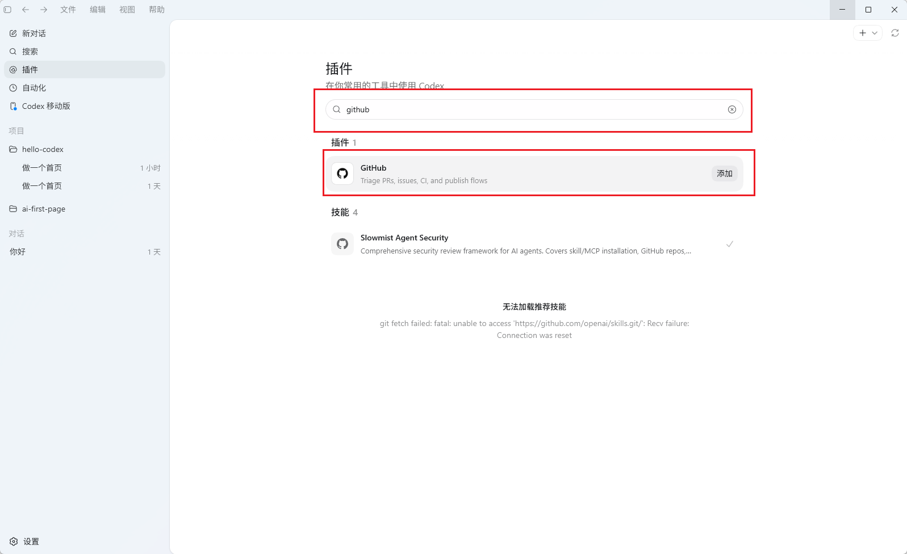
</p>

##### 点开插件详情

<p align="center">
  
</p>

##### 点击 Add to Codex 或添加按钮

<p align="center">
  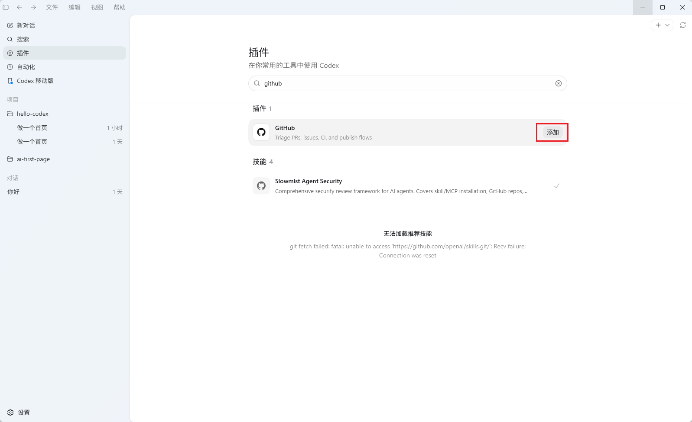
</p>

##### 安装完成后，新开一个 thread 使用

<p align="center">
  
</p>

#### 在 Codex CLI 里怎么安装插件

进入项目目录后，先启动 Codex：

```text
codex
```

然后在 Codex CLI 里输入：

```text
/plugins
```

打开插件列表后，可以：

| 操作 | 说明 |
| --- | --- |
| 搜索插件 | 找你需要的插件 |
| 查看详情 | 看插件能做什么、需要什么权限 |
| Install plugin | 安装插件 |
| Uninstall plugin | 卸载插件 |
| Space | 对已安装插件启用或停用 |

#### 常见插件和能力方向

插件目录会随着 Codex 版本、工作区和账号权限变化。下面不是固定排名，而是常见能力方向，实际可安装内容以你当前 Codex 插件页显示为准。

| 类型 | 包含插件 | 适合做什么 |
| --- | --- | --- |
| 浏览器与电脑操作 | Chrome、Computer Use | 网页测试、自动点击、软件操作 |
| 代码与项目协作 | GitHub | 管理仓库、修 bug、创建 PR |
| 前端与设计 | Build Web Apps、Figma | 生成网页、设计稿转代码 |
| 办公交付 | Documents、Presentations、Spreadsheets | 文档、PPT、表格分析 |
| 视频生成 | HyperFrames、Remotion | 用代码或 HTML 生成视频 |

| 序号 | 插件 / 能力 | 主要作用 | 简单来说 |
| --- | --- | --- | --- |
| 1 | Chrome | 让 Codex 直接操作浏览器 | 可以打开网页、点击按钮、检查页面效果、测试网页功能 |
| 2 | GitHub | 代码仓库管理与协作 | 让 Codex 读取仓库、处理 issue、改代码、创建 PR |
| 3 | Computer Use | 让 Codex 操作电脑 | 像人一样看屏幕、点按钮、操作软件，权限比较高 |
| 4 | Build Web Apps | 一句话生成前端网页应用 | 输入需求，生成网页、小工具、落地页、Demo |
| 5 | Figma | 设计稿转代码与原型设计 | 把 Figma 设计稿变成前端页面，适合 UI 开发 |
| 6 | Documents | AI 帮你交付正式文档 | 生成 README、项目说明、教程文档、产品文档 |
| 7 | Presentations | AI 生成高质量 PPT | 根据内容生成汇报、课程、产品介绍、方案型 PPT |
| 8 | Spreadsheets | AI 数据分析与表格处理 | 帮你整理 Excel、分析数据、生成表格结论 |
| 9 | HyperFrames | HTML 直接生成视频 | 用网页/HTML 结构生成视频内容 |
| 10 | Remotion | 用代码生成高质量视频 | 用 React/代码方式生成更专业的视频 |

### Skill

给 Codex 准备的一套「固定工作方法」。

Codex 本身会读代码、改代码、运行命令。

但如果你经常让它做同一类任务，比如写 README、做代码 Review、生成网页、整理文档，就可以把这套流程做成 Skill。

#### 什么是 Skill

| 概念 | 简单来说 |
| --- | --- |
| Skill | 一套固定工作方法 |
| Prompt | 这一次任务的提示词 |
| Workflow | 做事流程 |
| Template | 固定模板 |
| Instruction | 给 Codex 的长期规则 |
| Resource | Skill 里附带的参考资料 |
| Script | Skill 里可选的自动化脚本 |

比如你每次都想让 Codex 写 README，并且 README 必须包含：

```text
项目介绍
安装步骤
启动命令
文件结构
常见问题
```

那就可以做一个 README Skill。

以后你不用每次重新解释规则，只要调用这个 Skill，Codex 就会按这套流程写。

---

#### Skill 还是 MCP？什么时候用哪个

插件、Skill、MCP 的整体区别，见前面「插件、Skill、MCP 三者关系」总表。这里只解决最常见的纠结：一个需求到底该用 Skill 还是 MCP。

记住一句话：**「怎么做」的问题用 Skill，「连接什么工具」的问题用 MCP。**

| 你的需求 | 用 Skill 还是 MCP |
| --- | --- |
| 写 README、固定文档输出格式 | Skill |
| 做代码 Review、UI Review | Skill |
| 生成落地页、把修 bug 流程标准化 | Skill |
| 查最新开发文档、新版本 API | MCP |
| 连接数据库 | MCP |
| 读取 Figma 设计稿 | MCP |
| 读取 GitHub issue / PR | MCP |
| 连接 Notion、内部知识库、公司内部工具 | MCP |

#### Skill 和普通提示词有什么区别

只做一次的任务 = 直接写提示词 经常重复做的任务 = 适合做 Skill

| 对比维度 | 普通提示词 | Skill |
| --- | --- | --- |
| 使用方式 | 每次手动输入 | 保存成固定能力 |
| 稳定性 | 容易漏要求 | 更稳定 |
| 适合场景 | 临时任务 | 重复任务 |
| 复用性 | 低 | 高 |
| 内容结构 | 一段提示词 | 指令、模板、资料、脚本 |
| 适合谁 | 所有人 | 经常重复做同类任务的人 |

#### Skill 适合什么时候用

| 情况 | 是否适合做 Skill |
| --- | --- |
| 同一类任务经常重复做 | 适合 |
| 每次都要写一堆规则 | 适合 |
| 想让 Codex 输出更稳定 | 适合 |
| 团队里多人要用同一套流程 | 适合 |
| 一次性小任务 | 不一定需要 |
| 临时改一句文案 | 不需要 |
| 只是问一个概念 | 不需要 |

#### Skill 通常包含什么

| 内容 | 作用 |
| --- | --- |
| instructions | 告诉 Codex 怎么做 |
| resources | 放参考资料、模板、标准 |
| scripts | 可选脚本，用来自动处理任务 |
| examples | 示例输入和示例输出 |
| checklist | 检查清单，防止漏步骤 |

#### Skill 的基本结构

一个简单 Skill 可以这样写：

```text
# Skill 名称

## 适用场景
这个 Skill 适合用来做什么。

## 工作目标
Codex 最终要交付什么结果。

## 工作流程
1. 先分析输入内容
2. 再确认任务类型
3. 然后按固定步骤处理
4. 最后输出结果和检查清单

## 输出格式
规定 Codex 最后应该怎么输出。

## 注意事项
哪些事情不能做，哪些风险要提醒。
```

比如 README Skill：

```text
# README 生成 Skill

## 适用场景
用于根据当前项目生成 README 文档。

## 工作目标
输出一份结构清晰、适合新手阅读的 README。

## 工作流程
1. 阅读项目结构
2. 查看 package.json 或主要入口文件
3. 判断项目类型
4. 生成项目介绍
5. 补充安装步骤和启动命令
6. 说明文件结构
7. 输出常见问题

## 输出格式
使用 Markdown 格式。

## 注意事项
不要编造不存在的功能。
不确定的地方要明确标注。
```

#### 在 Codex App 里怎么添加 Skill

在 Codex App 里添加 Skill，可以分成两种情况：

```text
1. 使用已有 Skill
2. 创建自己的 Skill
```

##### 使用已有 Skill

在插件里面的技能可以看到系统推荐的一些Skill

<p align="center">
  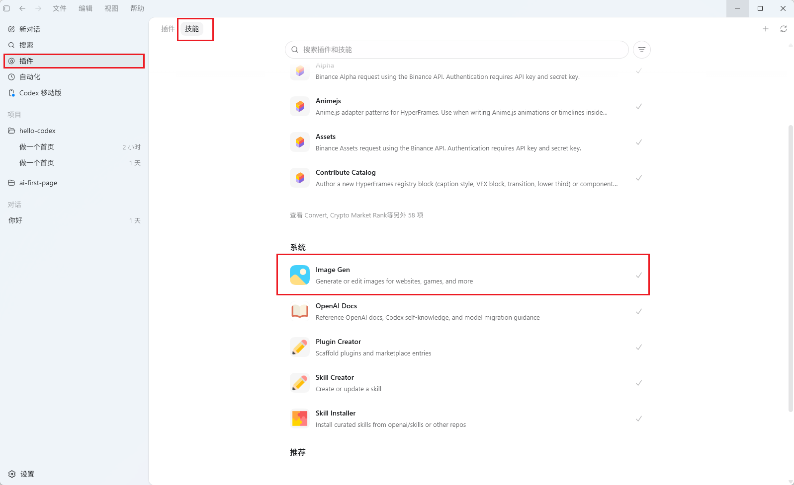
</p>

##### 创建自己的 Skill

如果你想自己创建一个 Skill，可以在 Codex App 的 thread 里使用：

```text
$skill-creator
```

它相当于一个 Skill 创建助手，会帮你把一套重复流程整理成 Skill。

操作步骤：

| 步骤 | 操作 |
| --- | --- |
| 1 | 打开 Codex App |
| 2 | 选择一个项目 |
| 3 | 新建一个 thread |
| 4 | 输入 `$skill-creator` |
| 5 | 告诉它你想创建什么 Skill |
| 6 | 提供使用场景、规则、示例输出 |
| 7 | 让 Codex 生成 Skill 文件 |
| 8 | 检查生成结果 |
| 9 | 之后在新 thread 里使用这个 Skill |

示例提示词：

```text
$skill-creator

请帮我创建一个 README Skill。

这个 Skill 的作用：
根据当前项目自动生成适合小白阅读的 README。

触发场景：
当我说“生成 README”“写项目说明”“整理项目文档”时使用。

工作流程：
1. 先阅读项目结构
2. 查看 package.json、README、入口文件
3. 判断项目类型
4. 生成项目简介
5. 写安装步骤
6. 写启动命令
7. 说明主要文件夹作用
8. 补充常见问题
9. 不确定的地方不要编造

输出格式：
使用 Markdown。

必须包含：
- 项目简介
- 功能特点
- 安装步骤
- 启动命令
- 文件结构
- 常见问题
- 后续优化方向
```

##### 推荐安装的 Skill

| Skill / 项目 | 主要作用 | GitHub 地址 |
| --- | --- | --- |
| Superpowers | 给 Coding Agent 加一整套“软件开发方法论”：先澄清需求、写规格、做实现计划，再按 TDD / 任务拆分推进开发。适合 Codex、Claude Code、Cursor、Gemini CLI 等工程型 Agent。 | <https://github.com/obra/superpowers> |
| skill-creator | 创建 Skill 的辅助 Skill。Codex 内置或可用的 Skill 以你当前环境显示为准；不同来源的同名 Skill 可能实现不同。 | 以当前 Codex Skill 列表为准 |
| baoyu-skills | 宝玉整理的一组实用 Skills，偏内容创作和日常效率：小红书图文、文章配图、漫画、公众号发布、X/微博发布、网页转 Markdown、YouTube 字幕、AI 生图等。仓库说明里写的是给 Claude Code、Codex 等 AI Agents 提效用，并建议按需安装。 | <https://github.com/JimLiu/baoyu-skills> |
| Agent Reach | 给 Agent 装“联网能力”：读网页、YouTube、RSS、GitHub、Twitter/X、B站、Reddit、小红书、LinkedIn 等，还带诊断和多后端路由。简单说就是让本地 Agent 能更方便地搜网、读平台内容。 | <https://github.com/Panniantong/Agent-Reach> |
| find-skills | “找 Skill 的 Skill”。当你问“有没有某某功能的 Skill”时，它会帮你搜索、发现、安装 Agent Skills；底层配合 npx skills find / add / check / update 使用。 | <https://github.com/vercel-labs/skills/tree/main/skills/find-skills> |

#### 在 Codex CLI 里怎么添加 Skill

在 Codex CLI 里添加 Skill，主要有 3 种方式：

```text
1. 使用已有 Skill
2. 用 $skill-creator 创建 Skill
3. 手动创建 SKILL.md 文件
```

##### 添加 Skill 的 3 种方式

| 方式 | 适合谁 | 简单来说 | 推荐程度 |
| --- | --- | --- | --- |
| 使用已有 Skill | 刚入门用户 | 直接调用现成技能 | 推荐 |
| `$skill-creator` 创建 | 想把提示词变成 Skill 的人 | 让 Codex 帮你整理 Skill | 最推荐 |
| 手动创建 `SKILL.md` | 熟悉文件结构的人 | 自己写 Skill 文件 | 进阶 |

---

###### 方式一：使用已有 Skill

进入项目目录后，先启动 Codex CLI：

```text
cd 项目目录
codex
```

进入 Codex CLI 后，可以输入：

```text
/skills
```

或者直接输入：

```text
$
```

Codex 会显示当前可用的 Skill。

如果你已经知道 Skill 名称，也可以直接在任务里点名使用：

```text
请使用 $readme-skill，根据当前项目生成 README。
```

或者：

```text
$ui-review-skill 请检查当前首页的视觉问题，并给出修改建议。
```

---

###### 已有 Skill 的使用方式

| 用法 | 示例 | 适合场景 |
| --- | --- | --- |
| /skills | 打开 Skill 列表 | 不知道有哪些 Skill 时 |
| 输入 $ | 快速选择 Skill | 想快速调用时 |
| `$skill-name` | `$readme-skill` | 明确知道 Skill 名称时 |
| 自然语言描述 | 请用 README Skill 写项目说明 | 不确定具体名称时 |

---

###### 方式二：用 `$skill-creator` 创建 Skill

如果你想把一套重复流程保存成 Skill，可以用：

```text
$skill-creator
```

它相当于一个 Skill 创建助手，会问你：

| 问题 | 目的 |
| --- | --- |
| 这个 Skill 是做什么的 | 明确用途 |
| 什么时候触发 | 写清楚适用场景 |
| 要不要包含脚本 | 判断是否只是指令型 Skill |
| 输出格式是什么 | 保证结果稳定 |
| 有哪些限制 | 避免乱改、乱编、乱执行 |

---

###### `$skill-creator` 使用流程

| 步骤 | 操作 | 目的 |
| --- | --- | --- |
| 1 | 进入项目目录 | 确保 Skill 生成在正确项目里 |
| 2 | 运行 `codex` | 打开 Codex CLI |
| 3 | 输入 `$skill-creator` | 启动 Skill 创建助手 |
| 4 | 描述 Skill 用途 | 告诉它要做什么 |
| 5 | 补充触发场景 | 告诉它什么时候用 |
| 6 | 补充工作流程 | 固定 Codex 的执行步骤 |
| 7 | 补充输出格式 | 保证结果稳定 |
| 8 | 检查生成结果 | 确认 `SKILL.md` 是否合理 |
| 9 | 重新打开或继续使用 | 测试 Skill 是否生效 |

---

###### `$skill-creator` 示例提示词

```text
$skill-creator

请帮我创建一个 README Skill。

这个 Skill 的作用：
根据当前项目自动生成一份适合小白阅读的 README。

触发场景：
当我说“生成 README”“写项目说明”“整理项目文档”“写安装教程”时使用。

工作流程：
1. 先阅读项目结构
2. 查看 package.json、README、入口文件
3. 判断项目类型
4. 生成项目简介
5. 写安装步骤
6. 写启动命令
7. 说明主要文件夹作用
8. 补充常见问题
9. 不确定的地方不要编造

输出格式：
使用 Markdown。

必须包含：
- 项目简介
- 功能特点
- 安装步骤
- 启动命令
- 文件结构
- 常见问题
- 后续优化方向

注意事项：
不要编造不存在的功能。
不要读取或输出 API Key、密码、token、私钥。
```

---

###### 方式三：手动创建 Skill 文件

Skill 本质上是一个文件夹，里面必须有一个：

```text
SKILL.md
```

最简单的结构是：

```text
.agents
└── skills
    └── readme-skill
        └── SKILL.md
```

也可以放脚本、参考资料和资源文件：

```text
.agents
└── skills
    └── readme-skill
        ├── SKILL.md
        ├── scripts
        ├── references
        └── assets
```

---

###### Skill 文件结构说明

| 文件 / 文件夹 | 是否必须 | 作用 |
| --- | --- | --- |
| `SKILL.md` | 必须 | 写 Skill 的名称、描述和具体指令 |
| scripts/ | 可选 | 放可执行脚本 |
| references/ | 可选 | 放参考文档、标准、说明 |
| assets/ | 可选 | 放模板、图片、资源文件 |

---

###### 一个最简单的 `SKILL.md` 示例

```text
---
name: readme-skill
description: 当用户需要生成 README、项目说明、安装教程、启动步骤时使用。
---

你是一个 README 文档生成助手。

任务：
根据当前项目生成一份适合新手阅读的 README。

工作流程：
1. 阅读项目结构
2. 查看 package.json、README、入口文件
3. 判断项目类型
4. 生成项目介绍
5. 写安装步骤
6. 写启动命令
7. 说明文件结构
8. 补充常见问题
9. 不确定的地方不要编造

输出格式：
使用 Markdown。

必须包含：
- 项目简介
- 功能特点
- 安装步骤
- 启动命令
- 文件结构
- 常见问题
- 后续优化方向
```

#### 添加 Skill 后怎么使用

添加 Skill 后，有两种常见用法：

| 用法 | 示例 |
| --- | --- |
| 明确指定 Skill | 请使用 `$readme-skill` 生成 README |
| 让 Codex 自动判断 | 帮我写一份项目 README |

如果 Skill 的 description 写得清楚，Codex 会更容易自动判断什么时候该用它。

比如：

```text
description: 当用户需要生成 README、项目说明、安装教程、启动步骤时使用。
```

这个描述就很清楚。

不建议写得太模糊：

```text
description: 帮我写东西。
```

这样 Codex 不知道什么时候该调用它。

#### Skill 放在哪里更合适

| 放置位置 | 适合场景 | 简单来说 |
| --- | --- | --- |
| 项目里的 .agents/skills | 只给当前项目用 | 项目专属 Skill |
| 用户级 Skill 目录 | 自己多个项目都想用 | 个人通用 Skill |
| 团队 / 管理员配置 | 团队成员统一使用 | 团队共享 Skill |
| 插件里 | 想打包分发给别人安装 | 正式能力包 |

### MCP

**只有进阶AI编程才需要了解，普通人可以直接跳过**

让 Codex 连接外部工具的接口。

Codex 本身可以读代码、改代码、运行命令。

MCP 的作用是让 Codex 连接更多外部工具、数据源或服务。

#### 什么是 MCP

| 概念 | 简单来说 |
| --- | --- |
| MCP | 连接外部工具的标准接口 |
| MCP Server | 提供工具能力的服务 |
| Tool | Codex 可以调用的具体功能 |
| Config | MCP 的配置文件 |
| STDIO Server | 通过本地命令启动的 MCP 服务 |
| HTTP Server | 通过网址连接的 MCP 服务 |
| Context | 外部工具提供给 Codex 的上下文信息 |

生活化理解：

```text
Codex = 一个会干活的人
MCP = 给他接上不同工具的插座
MCP Server = 插在插座上的工具箱
Tool = 工具箱里的具体工具
```

比如一个文档 MCP，可以让 Codex 读取文档。

一个数据库 MCP，可以让 Codex 查询数据库。

一个设计工具 MCP，可以让 Codex 获取设计稿信息。

---

#### MCP 适合做什么

| 场景 | MCP 可以怎么用 |
| --- | --- |
| 查开发文档 | 连接文档 MCP，让 Codex 查新版本 API |
| 连接数据库 | 让 Codex 查询数据库结构或测试数据 |
| 连接设计工具 | 让 Codex 读取设计稿、组件信息 |
| 连接项目管理工具 | 读取 issue、任务、需求说明 |
| 连接内部系统 | 调用公司内部工具或数据源 |
| 连接知识库 | 让 Codex 根据团队文档工作 |
| 连接自动化工具 | 让 Codex 调用额外脚本或服务 |

小白可以这样判断：

```text
普通写代码，不一定需要 MCP。
需要 Codex 访问外部工具或外部数据时，才考虑 MCP。
```

#### MCP Server 是什么

MCP Server 可以理解成：

给 Codex 提供工具能力的服务。

比如：

| MCP Server 类型 | 能提供什么 |
| --- | --- |
| 文档 MCP | 查询开发文档、API 文档 |
| 数据库 MCP | 查询表结构、读取测试数据 |
| GitHub MCP | 读取 issue、PR、仓库信息 |
| Figma MCP | 读取设计稿信息 |
| Notion MCP | 读取知识库页面 |
| 浏览器 MCP | 访问网页、获取页面信息 |
| 内部工具 MCP | 连接公司自己的系统 |

简单来说：

```text
MCP Server = Codex 可以调用的外部工具服务。
```

#### 在 Codex App 里怎么使用 MCP

##### Codex App 使用 MCP 的基本流程

| 步骤 | 操作 | 简单来说 |
| --- | --- | --- |
| 1 | 打开 Codex App | 进入桌面版 Codex |
| 2 | 进入 Settings | 打开设置 |
| 3 | 找到 MCP servers | 进入 MCP 工具管理区 |
| 4 | 查看 recommended servers | 查看官方或系统推荐的 MCP |
| 5 | 添加 custom server | 添加自己的 MCP server |
| 6 | 按提示完成授权 | 有些 MCP 需要登录外部账号 |
| 7 | 回到项目 thread | 在任务里调用 MCP |
| 8 | 查看结果和权限请求 | 确认 Codex 调用了什么工具 |

<p align="center">
  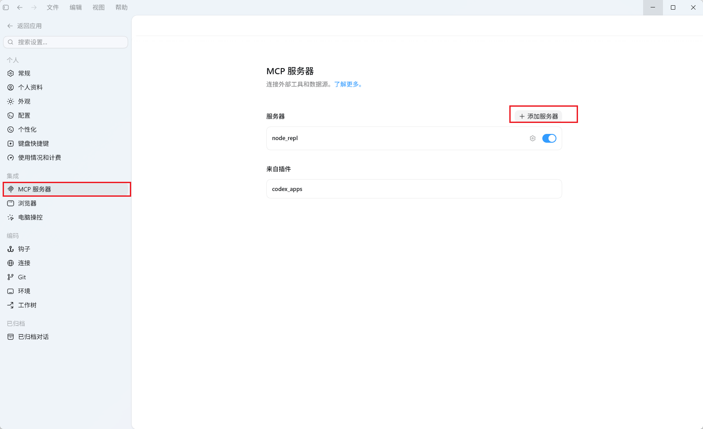
</p>

##### 添加 MCP 时通常需要填什么

| 配置项 | 作用 | 简单来说 |
| --- | --- | --- |
| Name | MCP 名称 | 给这个工具起名字 |
| Command / URL | 启动命令或服务地址 | Codex 通过它连接工具 |
| Type | MCP 类型 | 本地命令型或远程 HTTP 型 |
| Env | 环境变量 | 放 token、配置项等 |
| Auth | 授权方式 | 是否需要登录外部账号 |
| Enabled tools | 启用哪些工具 | 只打开需要的功能 |

<p align="center">
  
</p>

##### 添加 MCP 后怎么使用

添加完成后，回到 Codex App 的 thread，直接描述任务即可。

| 用法 | 示例 |
| --- | --- |
| 直接描述需求 | 请查一下 Next.js App Router 的最新用法 |
| 明确要求使用 MCP | 请使用可用的 MCP 工具查询这个库的文档 |
| 指定某个 MCP | 请用 context7 查询 Next.js 的最新文档 |
| 先查看可用工具 | 当前有哪些 MCP 工具可以用？ |

示例提示词：

```text
请使用可用的 MCP 文档工具，
查询 Next.js App Router 的最新用法，
然后告诉我当前项目应该怎么修改。
```

或者：

```text
请用 Figma MCP 读取这个设计稿，
分析页面结构，并给我生成前端实现计划。
```

#### 在 Codex CLI 里怎么使用 MCP

在 Codex CLI 里使用 MCP，可以理解成：

给终端版 Codex 接入外部工具。

比如：

```text
文档 MCP：让 Codex 查询开发文档
GitHub MCP：让 Codex 读取 issue、PR、仓库信息
Figma MCP：让 Codex 读取设计稿
数据库 MCP：让 Codex 查询数据库结构
```

小白可以这样理解：

```text
Codex CLI = 终端里的 AI 编程助手
MCP = 给 Codex CLI 接外部工具的接口
```

---

##### CLI 使用 MCP 的基本流程

| 步骤 | 操作 | 简单来说 |
| --- | --- | --- |
| 1 | 打开终端 | PowerShell / Terminal |
| 2 | 进入项目目录 | 让 Codex 知道当前项目 |
| 3 | 添加 MCP server | 给 Codex 接入外部工具 |
| 4 | 检查 MCP 是否添加成功 | 确认工具已经可用 |
| 5 | 启动 Codex CLI | 进入 Codex 对话界面 |
| 6 | 用 /mcp 查看工具 | 看当前能用哪些 MCP |
| 7 | 在任务里调用 MCP | 让 Codex 使用外部工具 |
| 8 | 查看结果和权限提示 | 确认是否安全 |

---

##### 常用 MCP 终端命令

| 命令 | 作用 | 简单来说 |
| --- | --- | --- |
| `codex mcp --help` | 查看 MCP 命令帮助 | 不知道怎么用时先看 |
| `codex mcp list` | 查看已配置 MCP server | 看现在接了哪些外部工具 |
| `codex mcp add` | 添加 MCP server | 给 Codex 增加一个外部工具 |
| `codex mcp remove` | 删除 MCP server | 不用了就移除 |
| `codex mcp get` | 查看某个 MCP server 详情 | 看具体配置 |
| `codex mcp login` | 登录需要授权的 MCP | 给某些远程 MCP 授权 |
| `codex mcp logout` | 退出某个 MCP 授权 | 取消连接状态 |
| /mcp | 在 Codex 会话里查看 MCP | 看当前会话能调用哪些工具 |

---

##### 添加 MCP 的基本格式

添加 MCP 的基本命令通常是：

```text
codex mcp add 名称 -- 启动命令
```

简单来说：

```text
名称 = 你给这个 MCP 起的名字
启动命令 = 这个 MCP 怎么启动
```

示例：

```text
codex mcp add context7 -- npx -y @upstash/context7-mcp
```

这条命令可以理解成：

```text
给 Codex 添加一个叫 context7 的 MCP。
它通过 npx 启动 @upstash/context7-mcp 这个工具。
```

---

##### 查看已经添加的 MCP

添加后可以运行：

```text
codex mcp list
```

作用：

```text
查看当前 Codex CLI 已经配置了哪些 MCP server。
```

如果能看到你刚添加的名称，说明配置已经写入。

---

##### 进入 Codex 后查看 MCP

先进入项目目录：

```text
cd 项目目录
```

然后启动 Codex：

```text
codex
```

进入 Codex CLI 后，输入：

```text
/mcp
```

作用：

```text
查看当前会话里可用的 MCP 工具。
```

如果 MCP 没显示，可能是：

| 问题 | 可能原因 |
| --- | --- |
| 没添加成功 | `codex mcp add` 命令失败 |
| MCP 启动失败 | 依赖没装或命令错误 |
| 名称写错 | 调用时写错 server 名 |
| 需要授权 | 还没登录外部服务 |
| 配置没刷新 | 需要重启 Codex CLI |

---

##### 在任务里调用 MCP

配置好 MCP 后，不一定要记复杂命令。

你可以直接在 Codex CLI 里说：

```text
请使用可用的 MCP 工具，查询 Next.js App Router 的最新文档。
```

也可以指定某个 MCP：

```text
请用 context7 查询 Next.js App Router 的最新用法，
然后告诉我当前项目应该怎么修改。
```

如果是 Figma 类 MCP，可以这样说：

```text
请用 Figma MCP 读取这个设计稿，
分析页面结构，并给我生成前端实现计划。
```

如果是 GitHub 类 MCP，可以这样说：

```text
请用 GitHub MCP 查看这个仓库最近的 open issue，
帮我整理出优先级最高的 3 个问题。
```

---

##### MCP 配置文件在哪里

Codex 的 MCP 配置会写进配置文件里。

常见位置是：

```text
~/.codex/config.toml
```

简单来说：

```text
config.toml = Codex 的配置文件
```

里面可能会有类似这样的配置：

```text
[mcp_servers.context7]
command = "npx"
args = ["-y", "@upstash/context7-mcp"]
```

这表示：

```text
有一个 MCP server 叫 context7。
启动命令是 npx -y @upstash/context7-mcp。
```

如果你不熟悉配置文件，前期不要手动乱改。

优先使用：

```text
codex mcp add
codex mcp list
codex mcp remove
```

---

##### 添加远程 MCP

有些 MCP 不是本地命令启动，而是通过网址连接。

这类一般叫远程 MCP / HTTP MCP。

可能会需要：

| 配置项 | 简单来说 |
| --- | --- |
| URL | 远程 MCP 服务地址 |
| Auth | 是否需要登录 |
| Token | 访问凭证 |
| OAuth | 浏览器授权登录 |

如果需要登录，可以使用：

```text
codex mcp login MCP名称
```

不用了可以：

```text
codex mcp logout MCP名称
```

新手建议：

```text
先用不需要复杂授权的文档类 MCP。
后面再尝试需要登录的远程 MCP。
```

---

##### 删除不用的 MCP

如果某个 MCP 不用了，可以删除：

```text
codex mcp remove 名称
```

比如：

```text
codex mcp remove context7
```

删除后再检查：

```text
codex mcp list
```

确认它已经不在列表里。

### 代码管理 （Git 与 GitHub 工作流）

用 Codex 做真实项目时，一定要懂一点 Git 和 GitHub。

小白可以先这样理解：

```text
Git = 本地代码版本管理工具
GitHub = 把代码放到网上协作的平台
Codex = 帮你读代码、改代码、跑命令的 AI 编程助手
```

一句话：

```text
Git 负责记录代码变化。
GitHub 负责远程保存和协作。
Codex 负责帮你完成具体编程任务。
```

#### Git 和 GitHub 有什么区别

| 对比 | Git | GitHub |
| --- | --- | --- |
| 简单来说 | 本地版本管理工具 | 代码云盘 + 协作平台 |
| 主要作用 | 记录代码每次改了什么 | 远程保存代码、团队协作 |
| 使用位置 | 你的电脑里 | 浏览器 / 云端 |
| 核心能力 | commit、branch、diff、merge | repository、issue、pull request |
| 是否必须联网 | 不需要 | 需要 |
| 和 Codex 的关系 | Codex 改完代码后，用 Git 检查和保存 | Codex Web / Cloud 常和 GitHub 配合 |

##### 小白必须先懂的 Git 概念

| 概念 | 简单来说 | 作用 |
| --- | --- | --- |
| Repository | 一个代码仓库 | 存放整个项目 |
| Commit | 一次代码存档 | 记录这次改了什么 |
| Branch | 分支 | 在不影响主线的情况下改代码 |
| Diff | 改动对比 | 看新增、删除、修改了什么 |
| Stage | 暂存区 | 准备把哪些改动保存进 commit |
| Merge | 合并 | 把一个分支的改动合到另一个分支 |
| Conflict | 冲突 | 两边改了同一处代码，需要手动选择 |
| Push | 推送 | 把本地代码上传到 GitHub |
| Pull | 拉取 | 把 GitHub 上的新代码同步到本地 |
| Clone | 克隆 | 从 GitHub 下载一个项目到本地 |

---

##### 小白必须先懂的 GitHub 概念

| 概念 | 简单来说 | 作用 |
| --- | --- | --- |
| Repository | GitHub 上的项目仓库 | 存代码 |
| Issue | 问题 / 需求记录 | 记录 bug、需求、任务 |
| Pull Request / PR | 代码合并申请 | 改完代码后申请合并 |
| Main Branch | 主分支 | 项目的稳定版本 |
| Feature Branch | 功能分支 | 用来开发新功能 |
| Review | 代码检查 | 合并前检查代码 |
| Actions | 自动化流程 | 自动测试、构建、部署 |
| README | 项目说明书 | 告诉别人项目怎么用 |
| .gitignore | 忽略文件清单 | 防止上传无关或敏感文件 |

---

#### 为什么用 Codex 更需要 Git

| 场景 | 为什么需要 Git |
| --- | --- |
| Codex 改了很多代码 | 可以查看具体改了哪里 |
| Codex 改错了 | 可以回退到之前版本 |
| Codex 删除了不该删的内容 | 可以用 Git 找回 |
| 多次让 Codex 修改 | 每次 commit 保存一个阶段 |
| 想让 Codex 大胆试方案 | 用 branch 或 worktree 隔离风险 |
| 要把项目放到 GitHub | 需要 push 到远程仓库 |
| 团队协作 | 需要 PR、review、merge |

一句话：

```text
没有 Git，Codex 改错了你很难回退。
有了 Git，Codex 可以放心试，你可以随时检查和恢复。
```

---

#### 如何在 Codex 中使用 Git

| 步骤 | 操作 | 目的 |
| --- | --- | --- |
| 1 | 初始化 Git | 让项目开始被 Git 管理 |
| 2 | 写好 .gitignore | 防止上传垃圾文件和密钥 |
| 3 | 先 commit 一次 | 保存干净版本 |
| 4 | 新建分支 | 给 Codex 一个安全实验区 |
| 5 | 让 Codex 修改代码 | 完成具体任务 |
| 6 | 查看 diff | 检查 Codex 改了什么 |
| 7 | 运行项目 / 构建 | 确认没出错 |
| 8 | 满意后 commit | 保存这次修改 |
| 9 | push 到 GitHub | 上传远程仓库 |
| 10 | 创建 PR | 合并前再检查一次 |

##### 在 Codex 对话框中输入：把项目初始化成一个 Git 工程，并排除不需要的文件

<p align="center">
  
</p>

---

##### Codex 会帮我们直接写好 .gitignore 文件

<p align="center">
  
</p>

#### 如何在 Codex 中使用 GitHub

##### 使用前需要准备什么

| 准备项 | 作用 | 简单来说 |
| --- | --- | --- |
| GitHub 账号 | 保存远程代码 | 代码云盘账号 |
| Git | 本地版本管理 | 记录代码变化 |
| GitHub 仓库 | 放项目代码 | 一个远程项目文件夹 |
| 本地项目 | Codex 要修改的代码 | 电脑里的项目文件夹 |
| GitHub 登录权限 | 允许 push / PR | 证明这是你的仓库 |
| .gitignore | 防止上传无关文件 | 不上传垃圾文件和密钥 |

##### 标准上传流程

| 步骤 | 操作 | 目的 |
| --- | --- | --- |
| 1 | 在 GitHub 新建仓库 | 创建一个远程项目空间 |
| 2 | 复制仓库地址 | 后面要连接本地项目 |
| 3 | 将地址复制给 Codex | 让 Codex 知道要上传到哪个仓库 |
| 4 | 推送到 GitHub | 正式上传代码 |

###### 创建 GitHub 仓库

<p align="center">
  
</p>

###### 复制仓库地址

<p align="center">
  
</p>

###### 将地址复制给 Codex

<p align="center">
  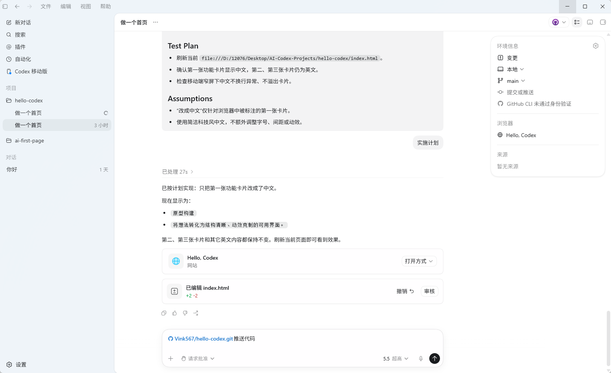
</p>

###### 推送到 GitHub

#### 代码回滚

##### 修改代码

先让 AI 修改一下代码

<p align="center">
  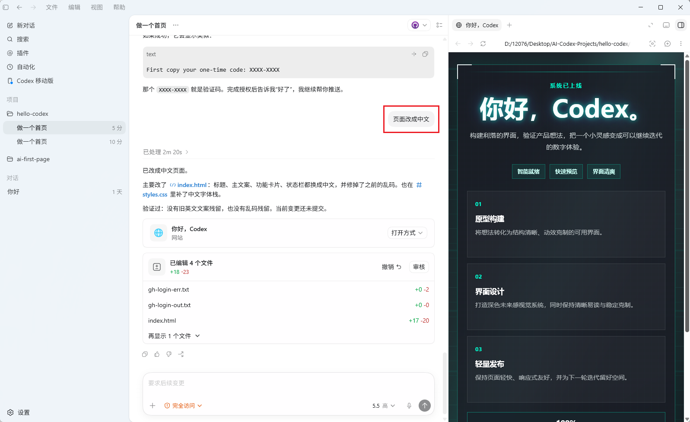
</p>

##### 提交到 Git，保存好当前版本

<p align="center">
  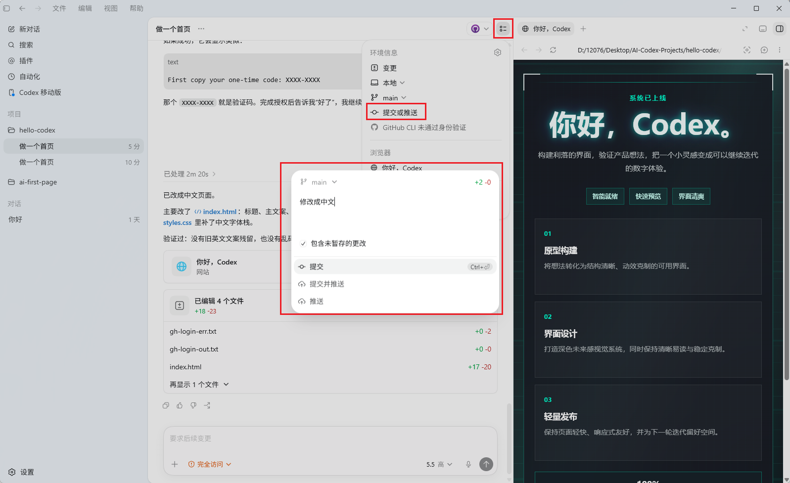
</p>

##### 继续修改代码

<p align="center">
  
</p>

##### 打开 IDE 查看代码并且回退代码

先打开 IDE 查看代码

<p align="center">
  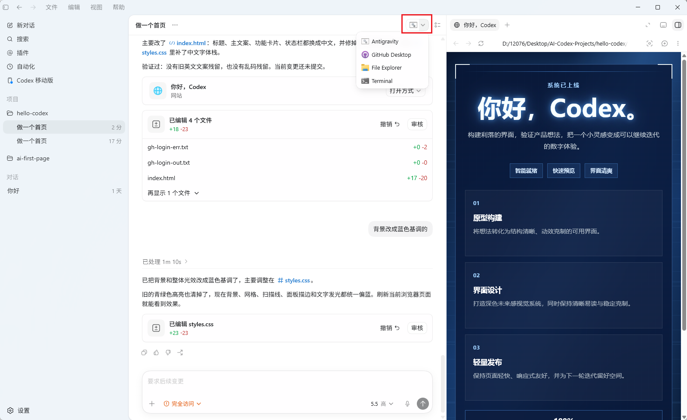
</p>

##### 复制版本号

<p align="center">
  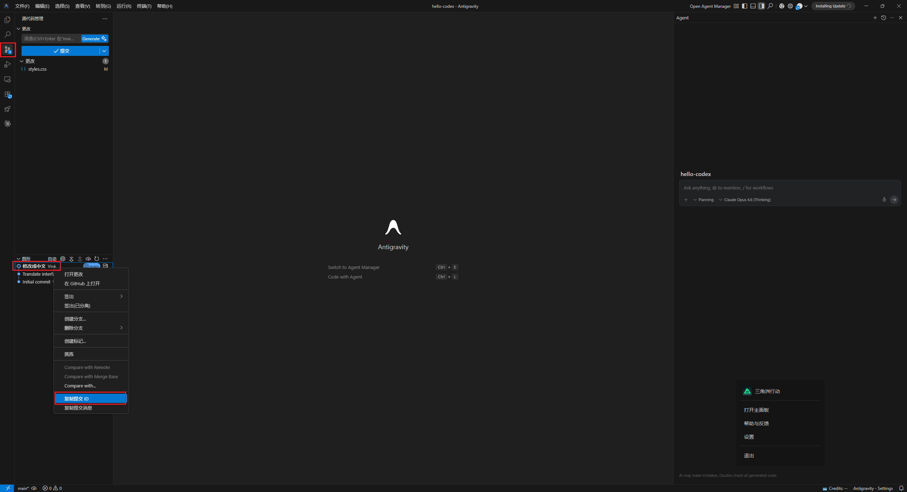
</p>

##### 复制给 Codex，让它回退代码到指定版本

<p align="center">
  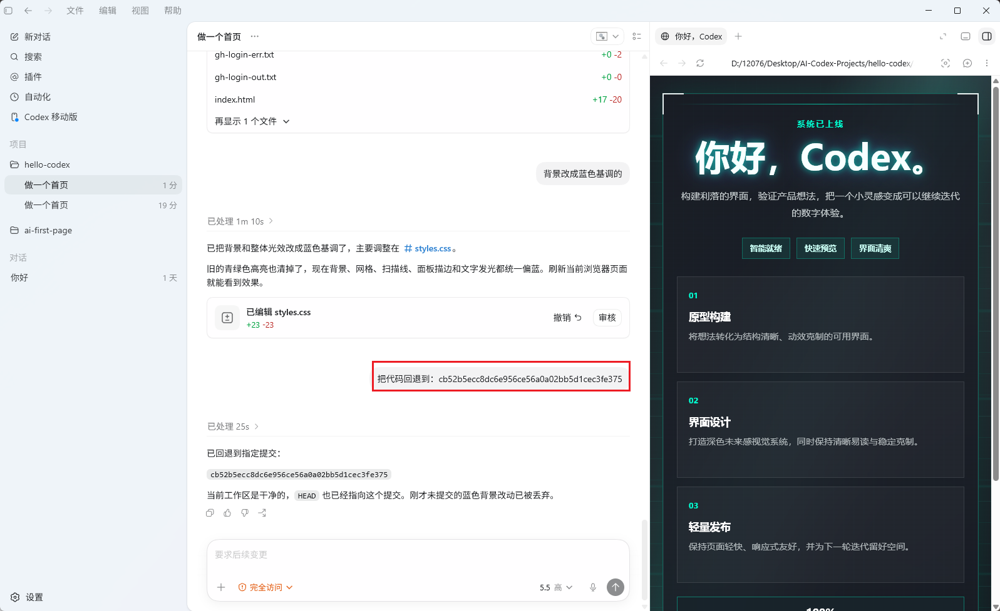
</p>

#### Git Worktree

给同一个 Git 项目，额外开一个独立工作副本。

相当于一个草稿本，效果满意后再合并回正式项目。

##### 为什么需要 Worktree

普通 Git 分支虽然可以切换，但每次只能在一个文件夹里操作一个分支。

Worktree 的好处是：

| 场景 | Worktree 的作用 |
| --- | --- |
| 想让 Codex 大胆改代码 | 给它单独开一个副本 |
| 不想影响当前项目 | 主项目保持不动 |
| 想同时做多个任务 | 每个任务一个 worktree |
| 想比较多个方案 | 方案 A / B / C 分开放 |
| 改坏了不想要 | 直接丢掉 worktree |
| 做大改动 / 重构 | 降低污染主项目的风险 |

##### 创建 Worktree

<p align="center">
  
</p>

<p align="center">
  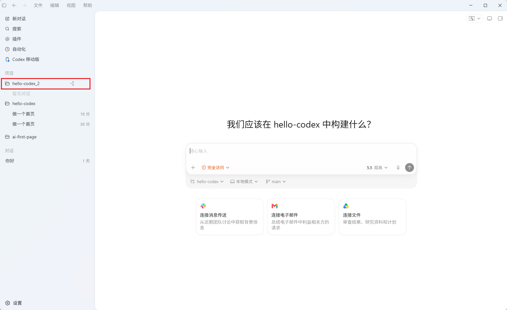
</p>

##### 使用分支进行任务

<p align="center">
  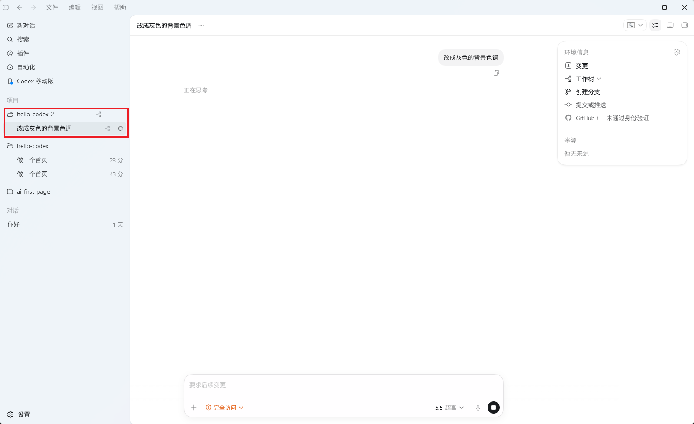
</p>

##### 合并回主干

检查效果满意后，就可以合并回主干，并把这个分支删除。

<p align="center">
  
</p>

### 云端运行

Codex 的云端任务适合在你不方便一直开着本地电脑时继续处理工作；如果你的账号和客户端支持移动端入口，也可以在外出时查看或推进部分任务。

```text
把代码任务交给 Codex，让它在云端环境里自己跑。
```

小白可以这样理解：

| 模式 | 运行位置 | 简单来说 |
| --- | --- | --- |
| Local | 你的电脑本地项目 | Codex 直接改你电脑里的代码 |
| Worktree | 你的电脑本地副本 | Codex 在安全副本里改代码 |
| Cloud | OpenAI 云端环境 | Codex 在云端拉取 GitHub 仓库并处理任务 |

#### Codex 云端运行是什么

Codex 云端运行，本质上是：

| 内容 | 说明 |
| --- | --- |
| 运行环境 | 云端容器 |
| 代码来源 | GitHub 仓库 |
| 工作方式 | Codex 在云端读取、修改、运行、验证代码 |
| 最终结果 | 生成修改结果、diff，必要时创建 PR |
| 适合任务 | 修 bug、改功能、写文档、代码 review、处理 issue |
| 不适合任务 | 本地私密文件、没有上传 GitHub 的项目、高风险生产操作 |

---

#### 云端运行和本地运行的区别

| 对比 | 本地运行 Local / Worktree | 云端运行 Cloud |
| --- | --- | --- |
| 代码位置 | 你电脑里 | GitHub 仓库 |
| 运行位置 | 你的电脑 | 云端容器 |
| 是否占用电脑 | 会占用 | 基本不占用 |
| 是否需要 GitHub | 不一定 | 通常需要 |
| 是否适合后台任务 | 一般 | 很适合 |
| 是否适合并行任务 | 一般 | 很适合 |
| 权限风险 | 主要是本机文件权限 | 主要是仓库、环境变量、网络权限 |
| 适合新手吗 | 更适合先学 | 学会 GitHub 后再用 |

#### 云端运行操作步骤

##### 推送代码到GitHub上面

<p align="center">
  
</p>

##### 打开Codex Web

<p align="center">
  
</p>

<p align="center">
  
</p>

##### 选择我们要修改的仓库

选择好过后直接让Codex给我们工作就行了

<p align="center">
  
</p>

##### 修改完成后上传到 GitHub 仓库

<p align="center">
  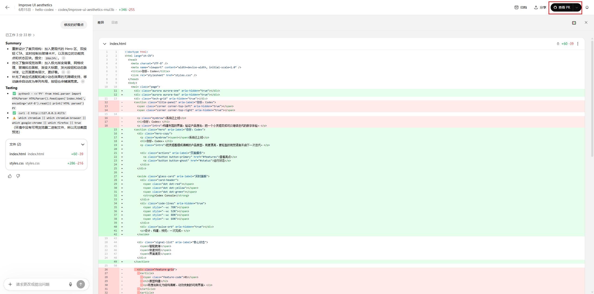
</p>

<p align="center">
  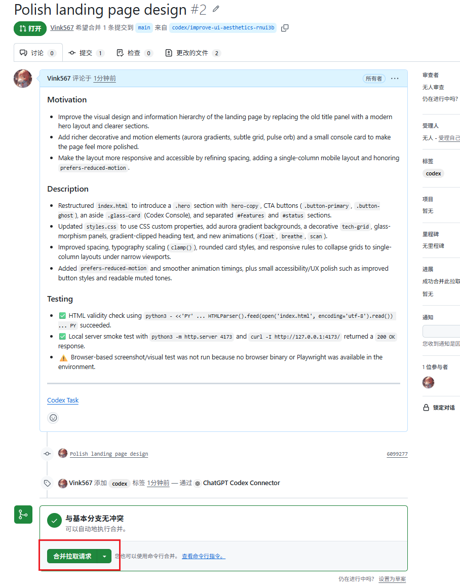
</p>

##### 本地修改前先同步 GitHub 仓库里的最新代码

如果云端任务已经把修改推回 GitHub，本地继续开发前要先同步最新代码，避免在旧版本上继续修改导致冲突。具体是 Codex 自动帮你应用变更，还是你手动 `git pull` / `codex apply`，取决于当前入口和任务类型。

<p align="center">
  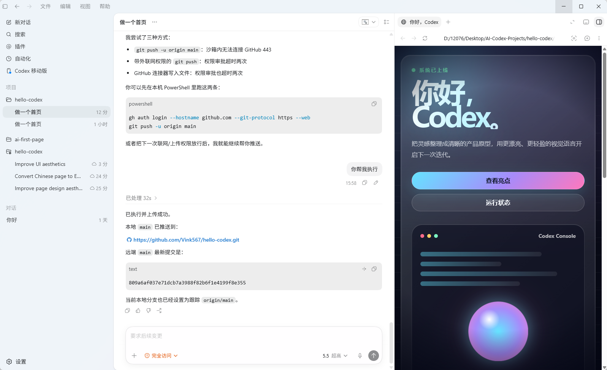
</p>

### 记忆系统

让 Codex 记住一些长期有用的信息，方便以后继续工作。

#### 项目级AGENTS.md

```text
写给 Codex 看的项目规则说明书。
```

小白可以这样理解：

| 文件 | 主要读者 | 作用 |
| --- | --- | --- |
| README.md | 人 | 告诉人这个项目是什么、怎么安装、怎么使用 |
| AGENTS.md | Codex / AI Agent | 告诉 AI 在这个项目里应该怎么工作 |
| .gitignore | Git | 告诉 Git 哪些文件不要上传 |

##### AGENTS.md 放在哪里

| 放置位置 | 作用范围 | 简单来说 |
| --- | --- | --- |
| 项目根目录 AGENTS.md | 整个项目 | 当前项目的总规则 |
| 子目录里的 AGENTS.md | 当前子目录及相关任务 | 某个模块的专属规则 |
| 用户级 `~/.codex/AGENTS.md` | 你所有项目 | 个人通用规则 |
| 项目级 AGENTS.md + 用户级 AGENTS.md | 叠加生效 | 个人习惯 + 当前项目规则 |

##### 如何写 AGENTS.md

可以直接交给AI来写，让AI总结这个项目的核心内容制作成 AGENTS.md

###### 前端项目 AGENTS.md 模板

```text
# AGENTS.md

## 项目说明

这是一个前端网页项目，用于构建产品页面、工具页面或个人作品展示页面。

## 技术栈

- React
- Vite
- Tailwind CSS
- JavaScript / TypeScript

## 常用命令

- 安装依赖：`npm install`
- 启动项目：`npm run dev`
- 构建项目：`npm run build`

## 项目结构

- `src/`：主要源代码
- `src/components/`：通用组件
- `src/pages/`：页面文件
- `src/assets/`：图片、图标等静态资源
- `public/`：公开静态文件

## 代码规范

- 优先使用 React 函数组件
- 优先使用 Tailwind CSS 写样式
- 不要引入 Bootstrap
- 不要大范围重构无关代码
- 修改时保持文件结构清晰
- 中文文案要自然、简洁、适合普通用户阅读

## UI 规则

- 页面要有清晰的信息层级
- 按钮、卡片、标题、留白要统一
- 移动端要基本可用
- 不要过度渐变、阴影和 AI 模板感
- 优先做真实产品感，而不是 Demo 感

## 禁止事项

- 不要修改 `.env`、`.env.local`
- 不要输出 API Key、token、密码
- 不要删除已有核心功能
- 不要随意新增大型依赖
- 不要直接改动和当前任务无关的文件

## 完成任务后

每次修改完成后，请输出：

1. 修改了哪些文件
2. 每个文件改了什么
3. 为什么这样改
4. 是否需要运行 `npm run build`
5. 提醒我检查 diff
```

###### 好的 AGENTS.md 有什么特点

| 特点 | 说明 |
| --- | --- |
| 具体 | 写清楚技术栈、命令、目录 |
| 简洁 | 不要写成长篇废话 |
| 可执行 | Codex 看了知道怎么做 |
| 有限制 | 明确哪些文件不能碰 |
| 有验证 | 写清楚运行什么命令检查 |
| 有完成标准 | 让 Codex 知道交付什么 |
| 可维护 | 项目变化后及时更新 |

#### 全局级AGENTS.md

##### 打开Codex的设置，找到个性化

<p align="center">
  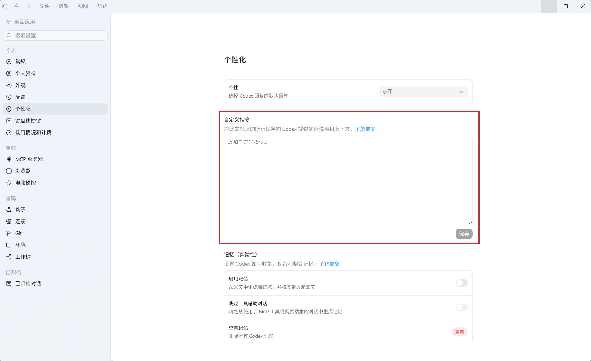
</p>

##### 输入指令，这里的指令会作为你的个人通用偏好影响后续 Codex 会话

使用AI编程的时候最怕AI乱删东西，可以用以下指令

禁止批量删除文件或目录。

不要使用：

- `del /s`
- `rd /s`
- `rmdir /s`
- `Remove-Item -Recurse`
- `rm -rf`

需要删除文件时，只能一次删除一个明确路径的文件。

正确示例：

```powershell
Remove-Item "C:\path\to\file.txt"
```

如果需要批量删除文件，应停止操作，并向用户请求，让用户手动删除。

## 第四篇：标准工作流

### 从需求到交付的完整链路

很多人刚开始用 Codex，会直接一句话丢给它：

> 帮我做一个网站。
> 帮我改这个功能。
> 帮我优化这个项目。

这样不是不行，但很容易出现一个问题：
**AI 改得很快，但你不知道它到底改了什么，也不知道能不能放心交付。**

所以真正稳定的方式，不是让 Codex 一口气乱改，而是按照一套固定工作流来推进。

你可以把它理解成：

> 需求不是直接变成交付物，中间必须经过“理解、计划、修改、验证、检查、验收”这几步。

#### 标准六步法

| 步骤 | 名称 | 简单来说 | 目的 |
| --- | --- | --- | --- |
| 1 | 需求拆解 | 先让 Codex 知道要做的项目是什么 | 避免不了解结构就乱改 |
| 2 | 制定计划 | 先列出要做什么，确认后再动手 | 避免一步改太多、方向跑偏 |
| 3 | 小步实现 | 一次只改一小块 | 降低出错概率，方便回滚 |
| 4 | 测试 | 改完后运行检查并手动验证 | 确认代码没有明显报错 |
| 5 | 代码审查 | 看 diff，检查改得对不对、有没有风险 | 防止 AI 改到不该改的地方 |
| 6 | 提交与复盘 | 提交代码并沉淀经验 | AI 负责执行，人负责拍板 |

##### 第一步：需求拆解

在让 Codex 修改项目之前，第一件事不是写代码，而是先拆需求。

很多人用 Codex 容易翻车，不是因为 Codex 不会写代码，而是因为一开始需求没说清楚。

比如你只说：

> 帮我优化首页。

Codex 可能会理解成：

- 改 UI
- 改文案
- 改布局
- 改组件结构
- 改路由
- 甚至顺手删掉一些它觉得“没用”的代码

所以在正式动手前，应该先把需求拆成几个关键问题。

###### 背景是什么

先说明这个任务为什么要做。

| 问题 | 示例 |
| --- | --- |
| 现在项目处于什么阶段 | 这是一个已经上线的官网页面 |
| 当前遇到什么情况 | 首页转化率低，用户不知道产品卖点 |
| 为什么现在要改 | 准备发布新版，需要优化首屏表达 |
| 这个需求属于什么类型 | UI 优化 / Bug 修复 / 新功能 / 重构 |

###### 要解决什么问题

需求要尽量具体，不要只写“优化”“美化”“改好一点”。

| 模糊说法 | 更清楚的说法 |
| --- | --- |
| 优化首页 | 优化首页首屏标题、副标题和 CTA 按钮 |
| 页面不好看 | 调整卡片间距、字体层级和按钮样式 |
| 登录有问题 | 修复点击登录按钮后没有跳转的问题 |
| 做一个后台 | 新增用户列表页，包含搜索、筛选和分页 |

好的需求应该能回答：

> 这次到底要解决哪一个具体问题？

示例：

```text
这次主要解决三个问题：
1. 首屏标题表达不清楚
2. CTA 按钮不明显
3. 移动端首屏内容太拥挤
```

###### 哪些文件可能相关

如果你知道大概文件位置，最好提前告诉 Codex。

这样可以减少它全项目乱找、乱改的概率。

| 场景 | 可能相关文件 |
| --- | --- |
| 改首页 | app/page.tsx、pages/index.tsx、components/Hero.tsx |
| 改样式 | globals.css、tailwind.config.js、相关组件文件 |
| 改登录 | login/page.tsx、auth.ts、middleware.ts |
| 改接口 | api 目录、server 目录、lib 目录 |
| 改文案 | 页面组件、配置文件、i18n 文件 |

###### 哪些功能不能动

这一点非常重要。

Codex 很容易为了完成当前任务，顺手改掉其他地方。

所以要提前告诉它：

| 不能动的内容 | 说明 |
| --- | --- |
| 登录逻辑 | 只改 UI，不改认证流程 |
| 接口地址 | 不要改 API 请求路径 |
| 数据结构 | 不要改数据库字段 |
| 路由结构 | 不要改已有页面路径 |
| 已有组件 | 除非必要，不要大规模重构 |
| 依赖版本 | 不要随便升级或新增依赖 |

这一步的核心是给 Codex 画边界。

---

###### 什么结果算完成

不要只说“做完就行”，要告诉 Codex 什么叫完成。

| 需求类型 | 完成标准 |
| --- | --- |
| UI 优化 | 页面视觉明显改善，移动端不乱 |
| Bug 修复 | 原来的报错消失，相关功能可正常使用 |
| 新功能 | 用户能完整走通操作流程 |
| 性能优化 | 构建正常，页面加载没有明显变慢 |
| 文案优化 | 标题、副标题、按钮文案更清楚 |

示例：

```text
完成标准：
1. 首页首屏能清楚表达产品用途
2. CTA 按钮更明显
3. 移动端显示正常
4. 不影响其他页面
5. 项目可以正常运行和构建
```

###### 需要哪些测试

改完之后不能只看 Codex 说“完成了”，还要提前说明需要怎么验证。

| 测试类型 | 适用场景 |
| --- | --- |
| 页面预览 | UI 修改、页面布局调整 |
| 控制台检查 | 前端页面、交互功能 |
| 构建测试 | Next.js、React、Vue 项目 |
| 单元测试 | 有测试文件的项目 |
| 手动流程测试 | 登录、支付、表单、上传等流程 |
| 移动端测试 | 响应式页面、小红书首图、移动网页 |

---

###### 有哪些风险

需求拆解时，还要提前让 Codex 判断风险。

这样它不会一边改一边乱试。

| 风险 | 说明 |
| --- | --- |
| 影响范围过大 | 小需求被改成大重构 |
| 样式污染 | 改了全局 CSS，影响其他页面 |
| 依赖风险 | 新增不必要依赖，项目变复杂 |
| 逻辑风险 | 为了修一个问题，改坏其他流程 |
| 数据风险 | 改接口、字段、数据库相关内容 |
| 兼容风险 | 桌面端正常，移动端出问题 |

###### 需求拆解提示词模板

实际使用 Codex 时，可以直接复制这段：

```text
请先帮我做需求拆解，不要立刻修改代码。

需求：
【这里写你的需求】

请按下面结构分析：

1. 背景是什么
- 当前项目大概是什么
- 为什么要做这个需求
- 这个需求属于新功能、Bug 修复、UI 优化，还是重构

2. 要解决什么问题
- 当前具体问题是什么
- 本次要解决到什么程度
- 哪些内容不是本次范围

3. 哪些文件可能相关
- 请根据项目结构判断可能涉及哪些文件
- 先列出来，不要直接修改

4. 哪些功能不能动
- 不要改哪些逻辑
- 不要动哪些接口
- 不要影响哪些页面或组件

5. 什么结果算完成
- 功能完成标准
- 页面完成标准
- 代码完成标准

6. 需要哪些测试
- 需要运行什么命令
- 需要手动检查哪些页面
- 需要重点验证哪些流程

7. 有哪些风险
- 可能影响哪些功能
- 是否有样式污染风险
- 是否有重构过度风险
- 是否有新增依赖风险

最后，请给我一个简短的执行建议：
- 建议先做哪一步
- 是否需要我确认后再修改
```

##### 第二步：让 Codex 制定计划

需求拆解完成后，不要马上让 Codex 写代码。

这一步要让 Codex 先制定计划。

你可以把它理解成：

> 先让 AI 说清楚它准备怎么做，再决定要不要让它动手。

很多项目翻车，不是因为 Codex 不会改，而是因为它一上来就开始改。

等你发现方向不对时，它可能已经改了很多文件，回头检查和回滚都很麻烦。

所以第二步的核心是：

> 先计划，后执行。
> 先确认，后修改。

###### 先不要写代码

这一点要写在提示词最前面。

因为 Codex 的默认倾向是：看到需求后直接开始解决问题。

但在真实项目里，直接改代码风险很高。

| 直接写代码的问题 | 可能后果 |
| --- | --- |
| 没理解项目结构 | 改错文件 |
| 没确认需求边界 | 做了不该做的功能 |
| 没判断影响范围 | 误伤旧功能 |
| 没列测试方式 | 改完不知道怎么验收 |
| 一次改太多 | 出错后不好回滚 |

示例提示词：

```text
先不要写代码，也不要修改任何文件。
请先根据当前需求和项目结构，制定一个修改计划。
等我确认后，再开始执行。
```

###### 开启计划模式

可以参考前文 Codex App 基础使用里的「计划模式」小节。实际使用时，也可以直接在 Codex CLI 或 App 输入 `/plan`，先让 Codex 输出计划，再决定是否执行。

##### 第三步：小步实现

计划确认后，才进入真正的代码修改阶段。

但这里有一个非常重要的原则：

> 不要让 Codex 一次性把所有东西都改完。

很多人用 Codex 翻车，就是因为一上来就让它“全部实现”。

结果它可能会同时改页面、改组件、改样式、改接口、改配置，最后项目虽然看起来变了，但你很难判断到底哪里出了问题。

所以更稳定的方式是：

> 一次只改一个功能点。
> 改完一小步，就检查一小步。

###### 一次只改一个功能点

小步实现的核心是控制修改范围。

比如你要优化首页，不要一次性说：

```text
请帮我优化整个首页。
```

更推荐拆成这样：

| 步骤 | 修改内容 |
| --- | --- |
| 第一步 | 只优化首屏标题和副标题 |
| 第二步 | 只调整 CTA 按钮 |
| 第三步 | 只优化移动端布局 |
| 第四步 | 只补充产品卖点卡片 |
| 第五步 | 只处理最终样式细节 |

这样每一步都很清楚，出问题也容易定位。

###### 不要让 Codex 顺手重构无关代码

Codex 有时候会觉得某些代码“不够优雅”，然后顺手帮你重构。

但真实项目里，顺手重构是很危险的。

| Codex 的顺手操作 | 可能带来的问题 |
| --- | --- |
| 重命名组件 | 导致引用路径出错 |
| 拆分文件 | 增加维护成本 |
| 改全局样式 | 影响其他页面 |
| 优化旧逻辑 | 破坏原本可用功能 |
| 升级依赖 | 引发兼容问题 |
| 删除它认为无用的代码 | 实际可能是业务逻辑 |

所以在小步实现时，要明确限制：

```text
本次只实现当前功能点。
不要顺手重构无关代码。
不要修改命名、目录结构、依赖版本和全局配置。
如果你发现代码可以优化，请先记录为建议，不要直接修改。
```

这句话很重要。

Codex 可以提建议，但不能私自扩大改动范围。

---

###### 不要接受大面积无解释修改

如果 Codex 一次性改了很多文件，而且没有解释清楚原因，就要暂停。

尤其是看到这些情况时，要提高警惕：

| 情况 | 处理方式 |
| --- | --- |
| 改动文件数量突然很多 | 要求解释每个文件为什么改 |
| 删除了大量代码 | 要求说明删除原因 |
| 新增了不认识的依赖 | 要求说明必要性 |
| 修改了配置文件 | 要求说明影响范围 |
| 改了和需求无关的页面 | 要求回退无关修改 |
| 代码风格大变 | 要求保持原项目风格 |

###### 遇到不确定先停下来问

小步实现不是让 Codex 什么都问，而是遇到关键不确定时必须停下来。

比如：

| 不确定情况 | 为什么要停 |
| --- | --- |
| 不确定该改哪个文件 | 防止改错位置 |
| 不确定业务规则 | 防止逻辑做错 |
| 不确定是否能删旧代码 | 防止误删功能 |
| 不确定是否新增依赖 | 防止项目复杂化 |
| 不确定接口含义 | 防止影响数据 |
| 不确定测试失败原因 | 防止越修越乱 |

可以提前给 Codex 加这条规则：

```text
如果你遇到以下情况，请先停下来问我，不要自行决定：

1. 不确定该改哪个文件
2. 不确定是否要删除旧代码
3. 不确定是否要新增依赖
4. 不确定业务逻辑应该怎么处理
5. 不确定测试失败原因
6. 发现需要超出原计划的修改
```

###### 小步实现提示词模板

实际使用时，可以直接复制下面这段：

```text
请开始小步实现。

当前只执行第【1】步：
【这里写本次只做的一个功能点】

要求：
1. 一次只改这个功能点
2. 只修改和当前功能直接相关的文件
3. 不要顺手重构无关代码
4. 不要修改目录结构
5. 不要新增不必要依赖
6. 不要删除已有功能
7. 不要改计划外的文件

修改完成后请停止，并输出：

1. 本次修改了哪些文件
2. 每个文件改了什么
3. 为什么这些修改是必要的
4. 有没有改到计划外内容
5. 有没有潜在风险
6. 下一步建议做什么

注意：
如果遇到不确定的地方，请先停下来问我，不要自行决定。
```

##### 第四步：测试

Codex 完成小步修改后，不能马上进入下一步，必须先测试。

很多人用 Codex 最大的问题是：

> AI 说完成了，但项目其实没跑通。
> 页面看起来正常，但某些功能已经坏了。
> 当前功能修好了，旧功能却被影响了。

所以测试的核心是：**不是相信 Codex 说「完成」，而是用结果证明它真的完成。**

下面这张表覆盖了一次完整测试要做的事，按从快到慢的顺序执行即可：

| 测试类型 | 作用 | 常见命令 | 重点 |
| --- | --- | --- | --- |
| 单元测试 | 检查函数、组件、模块是否正常 | `npm test` / `pnpm test` / `yarn test` | 失败先说明原因，不要直接改代码 |
| 类型检查 | TypeScript 项目提前发现类型错误 | `npm run typecheck` / `tsc --noEmit` | 没有该命令就明确说明 |
| lint | 检查代码规范问题（未使用变量、import 顺序、Hook 用法等） | `npm run lint` | 区分本次新增问题和项目原有问题 |
| 构建 | 本地能打开不代表能上线，构建才说明能打包 | `npm run build` / `pnpm build` | 失败先总结报错和影响范围 |
| 手动测试 | UI、表单、登录、支付、上传必须手动点一遍 | —— | 按用户操作路径逐步验证 |
| 浏览器测试 | 终端看不出来的页面/控制台/接口问题 | —— | 看页面显示、Console 报错、Network、移动端 |
| 回归测试 | 不只测新功能，还要测旧功能有没有被改坏 | —— | 列出本次修改可能影响的旧页面和组件 |

> 两个提醒：很多老项目本身就有 lint 或类型问题，不要让 Codex 把历史问题都顺手重构；回归测试是最容易被小白忽略的一步——改了首页按钮，也可能影响复用同一组件的其他页面。

手动测试时，可以让 Codex 把验证步骤列成「操作—预期结果」表格，例如：

| 步骤 | 操作 | 预期结果 |
| --- | --- | --- |
| 1 | 打开首页 | 页面正常加载 |
| 2 | 点击 CTA 按钮 | 跳转到注册页 |
| 3 | 缩小到手机宽度 | 页面不变形 |
| 4 | 打开控制台 | 没有明显红色报错 |

###### 测试阶段提示词模板

实际使用时，可以直接复制这段：

```text
请对本次修改进行测试，不要继续新增功能。

请按下面顺序执行或说明：

1. 单元测试
- 项目是否有单元测试
- 如果有，请运行测试命令
- 如果失败，请说明失败原因

2. 类型检查
- 项目是否有 typecheck 命令
- 如果有，请运行
- 如果没有，请说明

3. lint
- 运行 lint 检查
- 区分本次新增问题和项目原有问题

4. 构建
- 运行 build 命令
- 如果失败，请说明报错原因和影响范围

5. 手动测试
- 列出需要手动测试的页面
- 列出用户操作步骤
- 列出每一步预期结果

6. 浏览器测试
- 检查页面显示
- 检查控制台报错
- 检查移动端布局
- 检查关键按钮和交互

7. 回归测试
- 检查本次修改是否影响旧功能
- 列出可能受影响的页面、组件和流程

最后请输出测试总结：
- 哪些测试通过了
- 哪些测试失败了
- 失败原因是什么
- 是否可以进入下一步
- 是否需要先修复问题
```

##### 第五步：代码审查

测试通过后，不代表这次修改就可以直接交付。

还需要做代码审查。

代码审查可以理解成：

> 不只是看代码能不能跑，还要看代码改得对不对、稳不稳、有没有风险。

Codex 写代码很快，但它也可能出现这些问题：

| 常见问题 | 说明 |
| --- | --- |
| 功能能跑，但逻辑不对 | 表面正常，真实业务流程有问题 |
| 改动太大 | 为了一个小需求，改了很多无关代码 |
| 误删旧逻辑 | 删除了看似没用、实际有用的代码 |
| 忽略边界条件 | 正常输入能用，异常输入就崩 |
| 安全问题 | 暴露密钥、权限判断错误、输入未校验 |
| 风格不统一 | 新代码和原项目写法不一致 |
| 可维护性差 | 临时写死、硬编码、后续不好改 |

所以代码审查不是可选项，而是 Codex 工作流里的关键一步。

---

###### 两轮审查：Codex 自审 + 人工审查

第一轮先让 Codex 自查刚才的修改（目的不是完全相信它，而是让它先暴露明显问题），最好让它输出成表格：

| 检查项 | 结果 | 说明 |
| --- | --- | --- |
| 是否改到计划外文件 | 否 | 只修改了首页相关组件 |
| 是否新增依赖 | 否 | 没有修改 package.json |
| 是否删除旧逻辑 | 否 | 原有按钮跳转逻辑保留 |
| 是否存在风险 | 有 | 移动端按钮间距还需人工确认 |

第二轮人工审查。最终交付的人是你，不是 Codex。不要求每行都看懂，但要重点看 diff 的这几处：

| 审查重点 | 要看什么 |
| --- | --- |
| 文件范围 | 是否只改了该改的文件 |
| 修改 / 删除内容 | 是否符合计划、有没有删掉旧功能 |
| 命名和结构 | 是否和原项目风格一致 |
| 业务逻辑 | 是否符合真实需求（能跑 ≠ 逻辑对） |
| 测试结果 | 是否真的跑过测试 |

涉及登录、支付、权限、数据库、鉴权等重要代码，建议再用第二个模型做交叉审查——一个模型写，另一个模型专门挑错（只改文案、轻微样式一般不必）。但第二个模型的建议同样不能全盘接受，它帮你发现问题，不替你做最终决定。

###### 重点盯四类高风险问题

下面四类是 Codex 最容易出问题、也最该重点审的地方：

| 类别 | 常见问题 | 审查要点 |
| --- | --- | --- |
| 边界条件 | 正常输入能用、异常输入就崩 | 空数据、接口失败、未登录、权限不足、移动端尺寸、重复点击 |
| 安全问题 | 涉及用户/接口/权限/支付/上传/数据库时 | 是否暴露密钥 token、权限判断是否缺失、输入是否校验、是否泄露敏感信息、接口是否有鉴权 |
| 是否误删 | 看似没用、实际有用的代码被删 | 重点看 diff 的删除内容；旧组件、注释、兼容代码、fallback、配置项都可能仍被依赖 |
| 业务逻辑 | 代码能跑但逻辑错（跳错页、价格算错、越权） | 正常路径、异常路径、权限判断、是否覆盖了旧业务规则 |

看到大段删除但 Codex 没解释清楚，就不要直接接受。

###### 代码审查提示词模板

实际使用时，可以直接复制这一段：

```text
请对本次修改做代码审查，不要继续写代码。

请按下面结构审查：

1. Codex 自审
- 本次是否只改了计划内文件
- 是否有无关重构
- 是否有新增依赖
- 是否有硬编码
- 是否有误删旧逻辑

2. 修改范围审查
- 修改了哪些文件
- 每个文件为什么要改
- 是否存在计划外修改
- 是否有大面积无解释修改

3. 边界条件审查
- 空数据如何处理
- 接口失败如何处理
- 用户未登录如何处理
- 权限不足如何处理
- 重复点击如何处理
- 移动端是否可能异常

4. 安全问题审查
- 是否暴露密钥、token、账号密码
- 是否影响权限判断
- 是否缺少输入校验
- 是否可能泄露敏感信息
- 是否修改了接口鉴权逻辑

5. 删除内容审查
- 删除了哪些代码
- 删除原因是什么
- 是否确认没有其他地方依赖
- 是否可能影响旧功能

6. 业务逻辑审查
- 是否符合需求
- 正常流程是否正确
- 异常流程是否正确
- 是否影响旧业务规则
- 是否有不确定的业务假设

7. 审查结论
请最后给出结论：
- 可以继续
- 需要小修
- 需要回退部分修改
- 需要重新制定计划

注意：
只审查，不要继续修改代码。
如果发现问题，请先说明问题和建议，等我确认后再改。
```

##### 第六步：提交与复盘

代码测试通过、审查完成后，最后一步不是简单地说“完成了”。

真正完整的 Codex 工作流，还需要做两件事：

> 第一，把这次修改正式提交。
> 第二，把这次经验沉淀下来。

很多人用 Codex 只做到“代码能跑”，但没有提交说明、没有 PR 描述、没有记录问题、没有更新文档。

这样短期看没问题，长期就会出现一个麻烦：

> 每次都像第一次做。
> 每次都要重新解释。
> 每次都重复踩坑。

所以第六步的核心是：

> 交付不是结束，复盘才是下一次效率提升的开始。

###### 生成 commit

当这次修改已经通过测试和审查后，就可以让 Codex 帮你生成 commit。

commit 不是随便写一句“update”就行，而是要说明这次到底改了什么。

好的 commit 应该能回答：

| 问题 | 说明 |
| --- | --- |
| 改了什么 | 本次提交的主要内容 |
| 为什么改 | 对应什么需求或问题 |
| 影响哪里 | 涉及哪些模块、页面或功能 |
| 是否通过测试 | 是否构建、lint、测试通过 |

常见 commit message 格式：

```text
feat: add user profile page
fix: resolve login redirect issue
style: improve homepage responsive layout
refactor: simplify product card component
docs: update setup guide
```

如果是中文项目，也可以写成：

```text
feat: 新增用户资料页
fix: 修复登录后跳转异常
style: 优化首页移动端布局
docs: 更新项目使用说明
```

###### 写 PR

如果项目使用 GitHub、GitLab 或团队协作流程，提交后通常还要写 PR。

PR 的作用不是“走形式”，而是让别人快速知道：

| PR 要说明什么 | 作用 |
| --- | --- |
| 这次做了什么 | 方便 reviewer 快速理解 |
| 为什么要做 | 说明需求背景 |
| 改了哪些地方 | 降低审查成本 |
| 怎么测试 | 证明不是随便改 |
| 有什么风险 | 提前暴露不确定点 |
| 需要重点看哪里 | 引导 reviewer 审查重点 |

一个好的 PR 描述可以这样写：

```text
## 本次修改

- 优化首页首屏标题、副标题和 CTA 按钮
- 调整移动端首屏布局
- 保留原有跳转逻辑，没有修改接口和路由

## 测试结果

- npm run lint 通过
- npm run build 通过
- 手动检查首页桌面端和移动端显示正常
- 点击 CTA 按钮跳转正常

## 风险说明

- 本次涉及首页样式调整，需要重点确认移动端显示
- 没有新增依赖
- 没有修改登录、接口、数据库逻辑
```

###### 记录问题

复盘时，要把这次过程中遇到的问题记录下来。

这一步非常重要。

因为 Codex 工作流里，真正有价值的不是“这次做完了”，而是：

> 下次遇到类似问题，可以少走弯路。

需要记录的问题包括：

| 问题类型 | 示例 |
| --- | --- |
| 需求问题 | 一开始需求描述不够清楚 |
| 计划问题 | Codex 计划里漏掉了移动端 |
| 修改问题 | Codex 顺手改了无关组件 |
| 测试问题 | 项目没有 typecheck 命令 |
| 审查问题 | 发现它误删了 fallback 逻辑 |
| 沟通问题 | 提示词没有明确“不要新增依赖” |

记录格式可以很简单：

```text
本次问题记录：

1. 问题：Codex 一开始想修改全局样式
   原因：需求里没有明确限制“只改首页”
   解决：补充提示词，要求只修改首页相关文件

2. 问题：移动端测试遗漏
   原因：计划阶段没有列移动端验收标准
   解决：以后在测试清单里固定加入移动端检查

3. 问题：PR 描述不够清楚
   原因：没有提前记录测试结果
   解决：每次测试后直接生成测试总结
```

###### 总结 Prompt

如果这次使用的提示词效果不错，就应该把它沉淀下来。

这一步的目的很简单：

> 好用的 Prompt，不要每次重新写。

比如这次你发现下面这句话很有用：

```text
不要顺手重构无关代码。
如果发现需要超出计划的修改，请先停下来问我。
```

那就应该记录下来，以后作为固定规则使用。

可以整理成表格：

| 有效 Prompt | 适用场景 | 为什么有效 |
| --- | --- | --- |
| 先不要写代码，先制定计划 | 所有复杂需求 | 防止 Codex 直接乱改 |
| 一次只改一个功能点 | 多步骤任务 | 降低出错和回滚成本 |
| 不要顺手重构无关代码 | 老项目维护 | 防止改动范围扩大 |
| 修改完成后总结 diff | 每次修改后 | 方便人工审查 |
| 不确定先停下来问 | 业务逻辑不清楚时 | 防止 AI 自作主张 |

###### 更新 AGENTS.md

如果某些规则以后每次都要遵守，就不要只写在聊天里，最好更新到项目级 `AGENTS.md`。

`AGENTS.md` 可以理解成：

> 写给 Codex 的项目规则说明书。

它可以告诉 Codex：

| 内容 | 作用 |
| --- | --- |
| 项目怎么运行 | 让 Codex 知道启动、测试、构建命令 |
| 代码风格是什么 | 避免生成不符合项目风格的代码 |
| 哪些目录不能动 | 防止误改核心文件 |
| 修改前要怎么做 | 固定“先计划后执行” |
| 测试要求是什么 | 改完必须跑哪些检查 |
| 提交要求是什么 | commit 和 PR 怎么写 |

示例内容：

```text
# AGENTS.md

## 工作规则

- 修改前必须先阅读项目结构。
- 修改前必须先制定计划，不要直接写代码。
- 一次只实现一个功能点。
- 不要顺手重构无关代码。
- 不要新增不必要依赖。
- 不确定业务逻辑时，先提问，不要自行决定。

## 测试要求

每次修改后至少检查：

- npm run lint
- npm run build
- 相关页面手动测试
- 浏览器控制台是否有报错
- 移动端布局是否正常

## 提交要求

提交前需要说明：

- 修改了哪些文件
- 每个文件改了什么
- 测试是否通过
- 是否有风险或未完成事项
```

###### 更新项目文档

除了 `AGENTS.md`，如果这次修改影响了项目使用方式，也要更新项目文档。

比如：

| 修改内容 | 需要更新的文档 |
| --- | --- |
| 新增功能 | README、功能说明 |
| 新增环境变量 | .env.example、部署文档 |
| 新增命令 | README、开发指南 |
| 修改接口 | API 文档 |
| 修改部署流程 | 部署说明 |
| 修改配置 | 配置说明 |
| 新增组件 | 组件使用说明 |

文档更新不是为了好看，而是为了避免以后忘记。

常见文档包括：

| 文件 | 作用 |
| --- | --- |
| README.md | 项目介绍、启动方式、常用命令 |
| .env.example | 环境变量示例 |
| docs/ | 详细项目文档 |
| CHANGELOG.md | 版本更新记录 |
| AGENTS.md | Codex 工作规则 |
| CONTRIBUTING.md | 团队协作规范 |

###### 提交与复盘提示词模板

实际使用时，可以直接复制下面这段：

```text
请进入提交与复盘阶段，不要继续新增功能。

请按下面结构输出：

1. Commit 建议
- 生成一个合适的 commit message
- 使用 conventional commit 格式
- 不要夸大本次修改范围

2. PR 描述
请生成 PR 内容，包括：
- 本次修改
- 修改原因
- 涉及文件
- 测试结果
- 风险说明
- reviewer 需要重点看的地方

3. 问题记录
请复盘本次过程：
- 遇到了哪些问题
- 原因是什么
- 如何解决
- 下次如何避免

4. Prompt 总结
请总结：
- 哪些 Prompt 有效
- 为什么有效
- 适合什么场景复用
- 是否建议加入 AGENTS.md

5. AGENTS.md 更新建议
请输出适合加入 AGENTS.md 的长期规则：
- 修改前规则
- 修改中规则
- 测试规则
- 提交规则

6. 项目文档更新建议
请判断是否需要更新：
- README.md
- .env.example
- docs/
- CHANGELOG.md
- 其他项目文档

最后请给出交付结论：
- 是否可以提交
- 是否可以发 PR
- 是否还有未完成事项
- 是否有需要人工确认的风险
```

### Codex 任务模板库

前面讲的是 Codex 的标准工作流。

这一节直接放一些常用模板，方便以后复制使用。

这些模板的作用是：

> 不用每次重新想 Prompt，直接按场景复制，然后填入自己的需求。

#### 读项目模板

这个模板适合在刚打开一个新项目时使用。

尤其是你第一次让 Codex 接触某个项目，不要一上来就让它改代码。

更稳的方式是：先让它读项目，输出一份项目理解报告。

这样你可以先判断：

| 检查点 | 作用 |
| --- | --- |
| Codex 是否看懂项目 | 防止一上来改错文件 |
| 技术栈是否判断正确 | 确认它知道项目用的是什么框架 |
| 启动方式是否清楚 | 后面测试和运行更顺 |
| 核心模块是否找对 | 后续修改不会乱找方向 |
| 风险是否提前暴露 | 避免误改核心逻辑 |

##### 读项目模板（可直接复制）

```text
请先不要修改任何代码。

请阅读当前项目，并输出一份项目理解报告，包括：

1. 技术栈
- 项目使用了哪些主要技术
- 前端/后端/数据库/构建工具分别是什么
- 是否使用 TypeScript、Tailwind、框架或组件库

2. 目录结构
- 主要目录分别负责什么
- 页面、组件、工具函数、接口、配置文件分别在哪里
- 哪些目录是核心目录，哪些目录不建议随便改

3. 启动方式
- 项目如何安装依赖
- 项目如何本地启动
- 是否需要环境变量
- 如果 README 里有说明，请优先参考 README

4. 测试命令
- 项目是否有 test 命令
- 是否有 lint 命令
- 是否有 typecheck 命令
- 是否有 build 命令
- 如果没有相关命令，请明确说明

5. 核心模块
- 项目的核心功能模块有哪些
- 每个模块大概负责什么
- 如果后续要修改功能，应该优先查看哪些文件

6. 后续修改风险
- 哪些文件或目录改动风险较高
- 哪些逻辑不能随便改
- 是否存在全局样式、全局配置、鉴权、接口、数据库等高风险区域
- 后续修改时需要特别注意什么

请只输出项目理解报告，不要修改代码。
输出完成后等待我确认。
```

#### 修 Bug 模板

我遇到一个 bug：

- 【现象】
- 【复现步骤】
- 【期望结果】
- 【实际结果】
- 【相关文件/页面】

请先定位原因，不要直接修改。

先给出：

1. 可能原因
2. 需要查看的文件
3. 修复方案
4. 风险点
等我确认后再改代码。

#### 加功能模板

我想新增一个功能：

- 【功能描述】
- 【入口位置】
- 【交互流程】
- 【视觉要求】
- 【数据来源】
- 【验收标准】

请先阅读相关代码，给出实现计划。

不要改无关文件。

实现后请运行测试并总结 diff。

#### 前端页面模板

请根据下面要求实现一个页面：

- 【页面用途】
- 【目标用户】
- 【视觉风格】
- 【模块结构】
- 【中文文案】
- 【响应式要求】
- 【不要出现的问题】

请先给出组件拆分方案，再开始实现。

#### 代码审查模板

请审查当前分支相对 main 的 diff。

重点检查：

1. 潜在 bug
2. 边界条件
3. 安全风险
4. 类型问题
5. 性能问题
6. 是否有无关修改
7. 测试是否充分
请不要直接修改代码，先输出 review 报告。

#### 重构模板

请重构以下模块：

【模块路径】

目标是：

1. 提高可读性
2. 减少重复代码
3. 保持现有行为不变
4. 不改变公共 API
5. 不引入新依赖
请先写重构计划，并说明如何验证行为一致。

#### 写测试模板

请为以下功能补充测试：

- 【功能描述】
- 【相关文件】
- 【边界情况】

要求：

1. 不改业务逻辑
2. 覆盖正常路径
3. 覆盖异常路径
4. 覆盖边界条件
5. 运行测试并报告结果。

#### 写文档模板

请根据当前项目生成文档：

1. 项目简介
2. 安装方式
3. 启动方式
4. 环境变量说明
5. 常用命令
6. 目录结构
7. 开发注意事项
8. 常见问题
请不要编造不存在的命令，必须基于项目文件判断。

---

## 第五篇：实战案例库

### 实战案例一：制作一个宠物零食售卖的前端页面网站

从零开始制作可发布在网上的前端网页

#### 在本地创建一个文件夹，命名为 Pet treats

选择好创建的文件夹

<p align="center">
  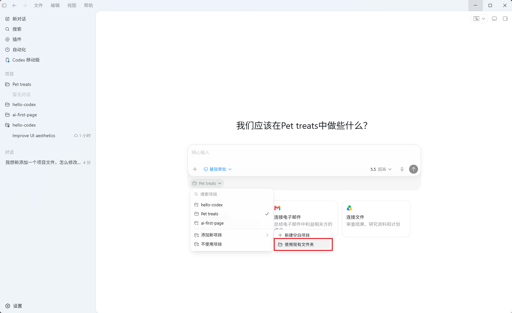
</p>

#### 开启计划模式

生成初步项目计划，检查没问题后直接执行

<p align="center">
  
</p>

#### 打开 index.html 文件进行预览

<p align="center">
  
</p>

#### 创建 Git 仓库

创建 Git仓库进行代码管理，方便后续的更新和维护

<p align="center">
  
</p>

#### 优化细节更改

直接使用注释在页面进行细节修改

<p align="center">
  
</p>

增加月销量

<p align="center">
  
</p>

#### 新增功能

新增热销榜

<p align="center">
  
</p>

#### 推送更新的代码

检查没有任何问题过后推送更新的代码

<p align="center">
  
</p>

#### 上传到 GitHub 仓库

##### 新建一个仓库

<p align="center">
  
</p>

<p align="center">
  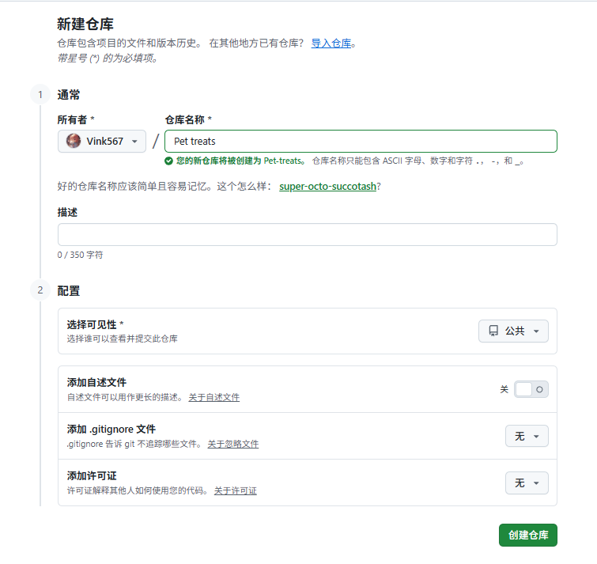
</p>

---

##### 复制对应仓库链接

<p align="center">
  
</p>

##### 让 Codex 将代码上传到 GitHub 仓库

<p align="center">
  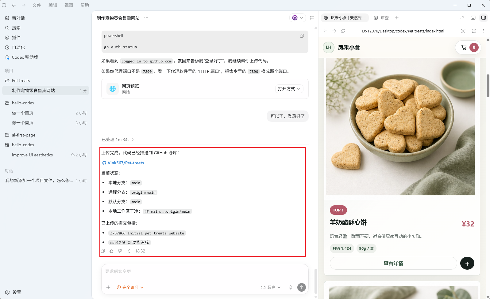
</p>

<p align="center">
  
</p>

##### 通过GitHub Pages 发布网页，让其他人也能访问到

在设置里面找到 pages 然后点击保存

等待几分钟

<p align="center">
  
</p>

等待几分钟，就会出现一条链接。这个链接可以让别人访问到你的网页。

需要注意的是，GitHub Pages 适合托管静态网站，比如 HTML、CSS、JavaScript 和静态资源；它不适合运行需要后端服务器、数据库或敏感交易的业务逻辑。

<p align="center">
  
</p>

##### 打开网页查看做好的项目

不同地区和网络环境访问 GitHub Pages 的稳定性可能不同，如果打不开，可以先换网络或稍等部署完成后再试。

<https://vink567.github.io/Pet-treats/>

<p align="center">
  
</p>

### 实战案例二：给宠物零食网站增加功能和优化页面

#### 新建用户登录注册页面

用户购买的时候需要填写自己的地址信息，这个时候就需要一个个人的登录账号来保存这些信息了

<p align="center">
  
</p>

#### 创建不同宠物分类，并在宠物分类下进行食品分类

依旧先用计划模式，看看AI是否理解了你的需求

<p align="center">
  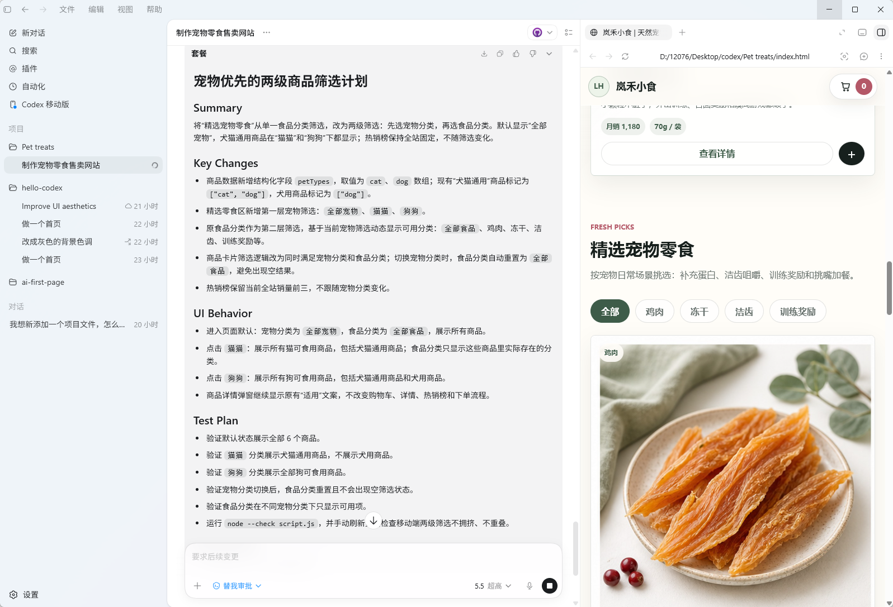
</p>

#### 使用注释功能优化细节

<p align="center">
  
</p>

<p align="center">
  
</p>

#### 选择食品加入购物车后，点击购买时候需要提示确认地址

<p align="center">
  
</p>

#### 提交到 Git 保存代码

<p align="center">
  
</p>

### 实战案例三：制作宠物零食的管理后台

#### 依旧先使用计划模式

<p align="center">
  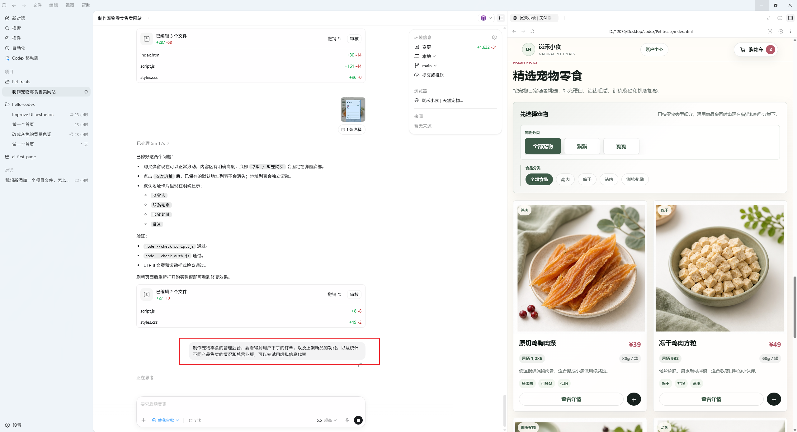
</p>

<p align="center">
  
</p>

#### 检查效果

<p align="center">
  
</p>

#### 提交到 Git 保存代码

<p align="center">
  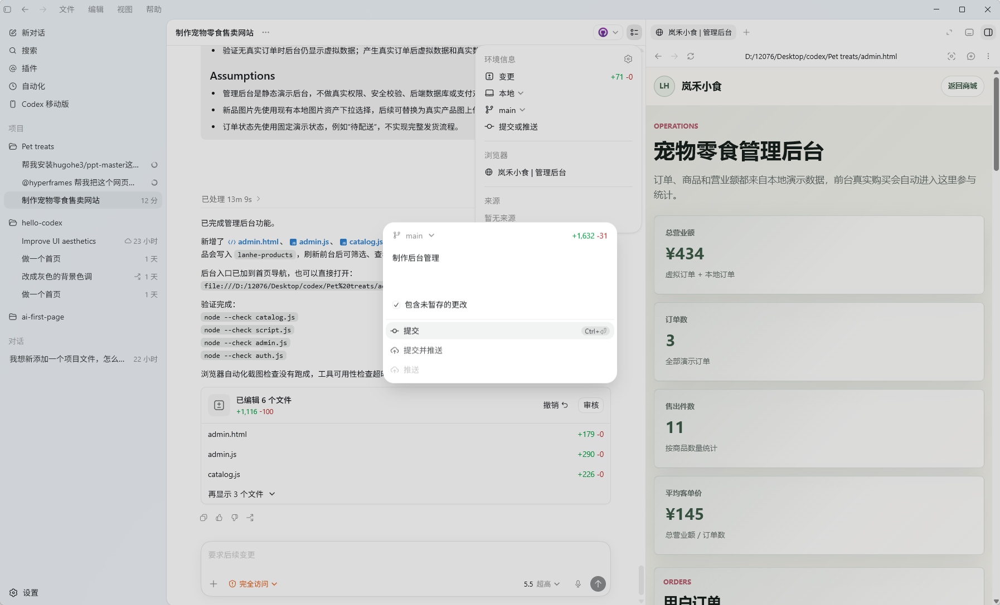
</p>

### 实战案例四：制作宠物零食品牌招商 PPT

#### 安装 PPT Skill

这里我安装的是我之前测评过的一个 PPT Skill，直接把 GitHub 上对应的 Skill 地址发给 Codex 让它安装就行了

<p align="center">
  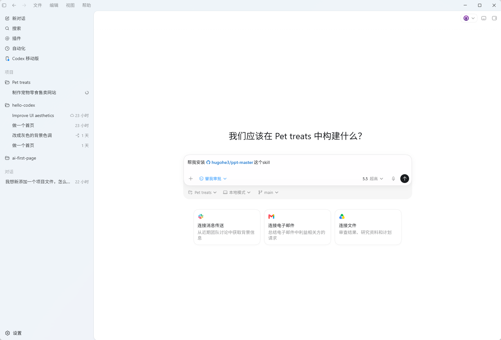
</p>

#### 使用「/」选择对应的 Skill

<p align="center">
  
</p>

#### 检查最终的结果

Codex 最终生成了一份完整的招商 PPT。成品已上传到云端，点击下面的链接即可下载查看：

[⬇ 下载招商 PPT](https://r2notes.bozhouai.com/images/codex-orange-book/pet-treats-investment-deck.pptx)

<p align="center">
  
</p>

### 实战案例五：制作宠物零食宣传视频

#### 安装视频插件

这里使用的是 HyperFrames 这个插件

<p align="center">
  
</p>

---

#### 计划生成视频

<p align="center">
  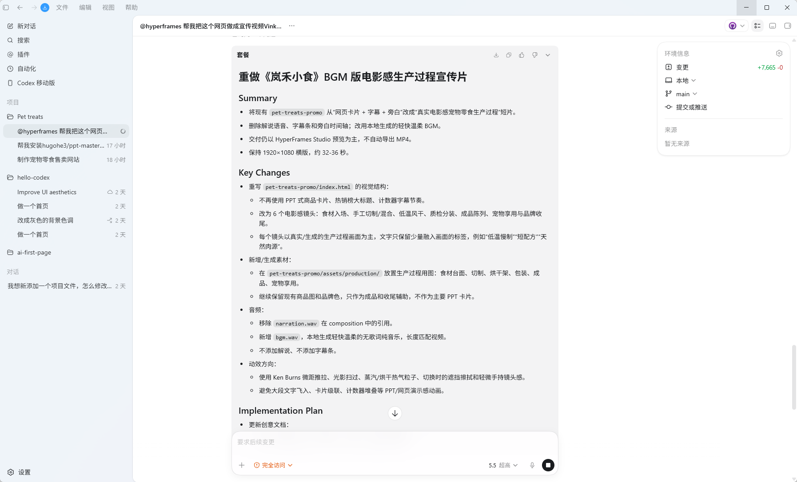
</p>

#### 效果预览

成品是一条宠物零食的宣传视频。完整视频已上传到云端，点击下面的链接即可在浏览器直接播放：

[▶ 在线观看演示视频](https://r2notes.bozhouai.com/images/codex-orange-book/pet-treats-promo.mp4)

## 附录

### 附录 A：第三方模型接入

> 本节介绍第三方模型接入的非官方思路，并以 CC Switch + DeepSeek 为例。它不属于 OpenAI 官方功能，模型兼容性、稳定性、隐私和费用规则以对应第三方工具与模型服务商为准。

#### 什么是 CC Switch

它不是 Claude Code 本体，也不是 Codex 本体，而是一个第三方开源桌面工具，用来统一管理不同 Agent 工具。

简单说：

> **以前你要手动改 Claude Code、Codex、Gemini CLI 的配置文件。**
> **现在 CC Switch 给你做成一个可视化面板，一键切换。**

它最核心的用途有 3 个：

| 功能 | 简单来说 |
| --- | --- |
| Provider 切换 | 比如从官方 Claude API 切到某个中转 API，或者切到另一个模型服务 |
| MCP 统一管理 | 不用分别给 Claude Code、Codex、Gemini 配 MCP |
| Skills 管理 | 可以从 GitHub 或 ZIP 安装 Skill，并同步到不同 AI 编程工具 |

**如果你需要在多个 Agent 工具和模型之间切换，CC Switch 可以作为一个进阶选项。**

#### 下载 CC Switch

首先进入官网：<https://ccswitch.io/zh/>

点击下载后会跳转到对应的下载页面，往下滑找到对应的版本点击下载即可

<p align="center">
  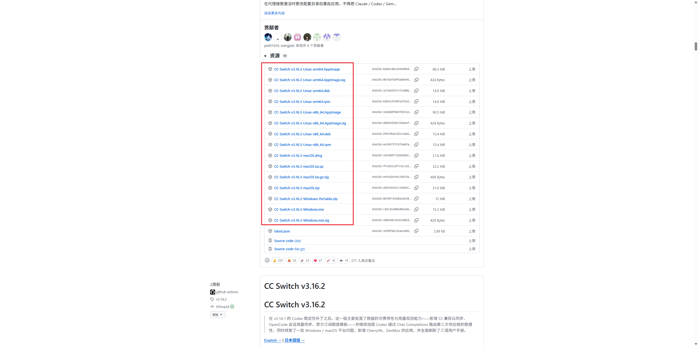
</p>

#### 接入三方模型

##### 这里以 DeepSeek 为例

###### 首先找到 DeepSeek 的官网，创建 api key

<p align="center">
  
</p>

###### 打开 cc switch

点击添加模型

<p align="center">
  
</p>

将刚刚创建的 API key 复制到这里来

<p align="center">
  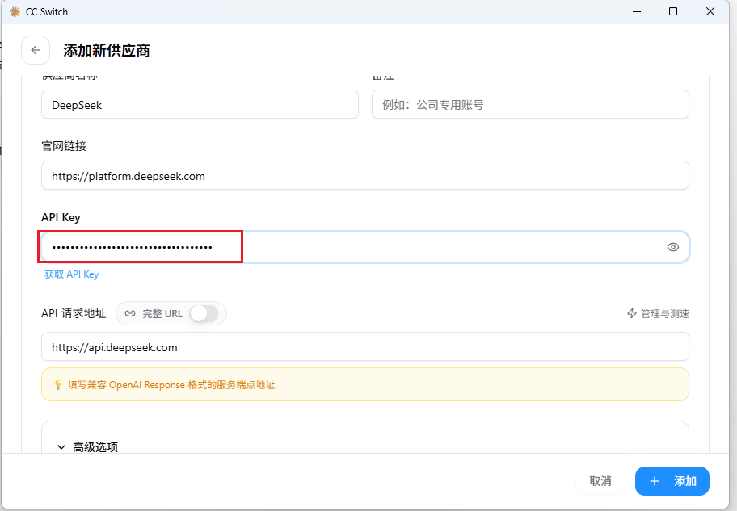
</p>

开启本地路由映射

<p align="center">
  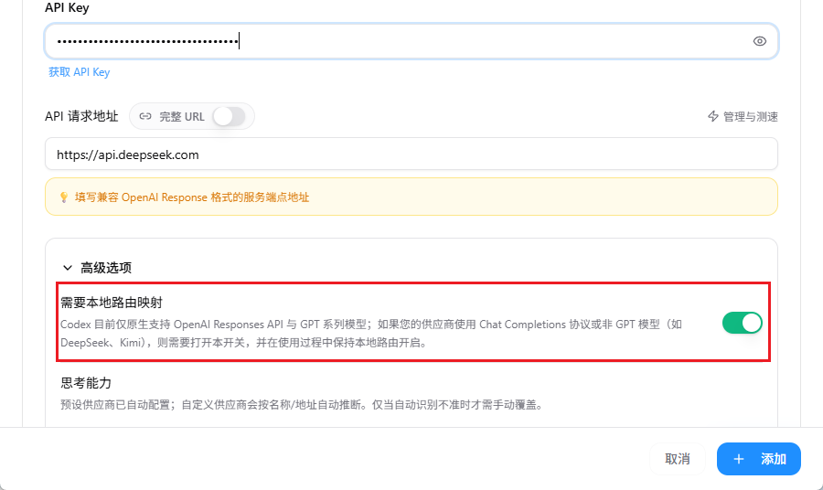
</p>

然后点击添加

<p align="center">
  
</p>

进入设置，将路由全部打开

<p align="center">
  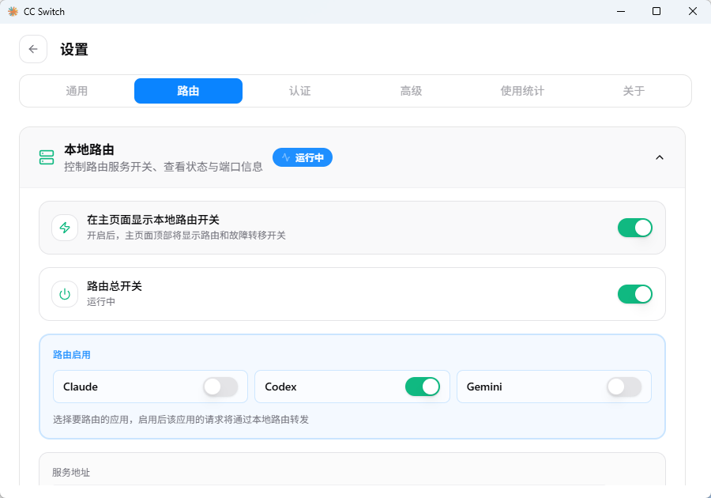
</p>

点击启用

<p align="center">
  
</p>

如果 CC Switch 的路由、模型服务和 Codex 侧配置都兼容，这时再打开 Codex，就有可能通过这套非官方路由使用 DeepSeek 等第三方模型。

这类方式不属于 OpenAI 官方功能。能否正常使用、模型能力、上下文长度、工具调用兼容性、费用和隐私规则，都要以 CC Switch、模型服务商和你自己的配置为准。重要项目建议先用测试仓库验证，不要直接在生产项目里试。
